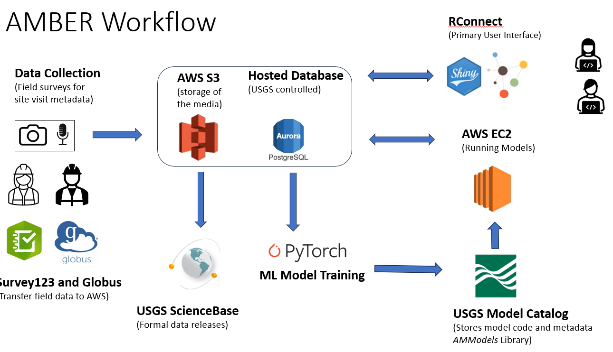

```{r setup, include=FALSE}
source('includes.R')
shiny::addResourcePath("figs", system.file("extdata/figs", package = "AMMonitor"))
```

## {width=100px} AMMonitor

We'll begin this tutorial by reviewing the big picture.

Amid climate change and rapidly shifting land uses, effective methods for monitoring wildlife are critical to support scientifically-informed resource management decisions. As such, monitoring is motivated by ecological hypotheses or natural resource management objectives. The practice of using Autonomous Monitoring Units (AMUs) such as trail cameras or audio recorders to monitor wildlife species has grown immensely in the past decade, with monitoring projects spanning species from birds, to bats, amphibians, insects, terrestrial mammals, and marine mammals.

AMUs can be deployed for long periods of time to collect massive amounts of audio and photographic data. However, the data management requirements can be immense, leaving researchers buried under terabytes of data.  Without a comprehensive framework for efficiently moving from raw data collection to results and analysis, monitoring programs are limited in their capacity to characterize ecological processes and inform management decisions in a timely manner.

**AMMonitor** stands for "monitoring for adaptive management" and is an R package of the same name. It an analysis ecosystem (R + SQLite + media storage) that seamlessly incorporates wildlife monitoring data, species distribution modeling, and decision tools.  The analysis ecosystem is characterized by:

1.	Continuous stream of data collection on a variety of wildlife taxa.  Autonomous monitoring units (AMUs) such as trail cameras or audio recorders allow the remote capture of digital files that form the backbone of wildlife monitoring.  AMUs can be deployed at small or large scales, over short or long-time frames, and are inexpensive relative to human-based surveys.

2.	Standardized yet flexible data and metadata infrastructure.  Because many terabytes of monitoring data are collected by AMUs, the data management requirements of an AMU-based monitoring effort are immense.  A standardized data infrastructure is critical to store files with strict metadata standards that can be easily incorporated into open access repositories. 

3.	Rapid analysis.  Vast quantities of AMU data may be collected in a short amount of time, rendering manual inspection of files for target wildlife species impractical.  Accordingly, machine learning (ML) algorithms can be used to automatically detect wildlife species in recordings and photos, avoiding the time-consuming task of manual annotation. ML outputs can be seamlessly incorporated into species distribution models, updated as new data are collected via continuous monitoring. 

Each *AMMonitor* project utilizes the same approach, keyed to Figure 1:

```{r bookpng, eval = T, echo = F, fig.align='center', out.width = "90%", fig.cap = "*Figure 1. The adaptive management cycle employed by AMMonitor.*", out.extra='style="background-color: #999999; padding:10px; display: inline-block;"'}
knitr::include_graphics('www/wheel.png')
```


(A) Wildlife data are collected by AMUs such as trail cameras and audio recorders to monitor mammals, birds, insects, amphibians, and bats;  

(B) R functions upload media files to a local machine or to the cloud, with an option of permanent archiving in the USGS ScienceBase repository; 

(C) Media files can be tagged by humans and/or analyzed with machine learning models that automate the species detection process (e.g., there is a 0.65 probability that a white-tailed deer is in this image or a 0.8 probability that this audio signal was issued by a Black-capped Chickadee); 

(D) Raw and post-processed data are maintained in the project’s SQLite database; 

(E) R functions and scripts permit rapid, reproducible analyses of species distribution models and resulting maps, regularly updated along with metadata as new data are analyzed;  

(F) These products can be the building blocks of a decision support tool, continually updated as knowledge evolves, enabling decisions to be made with the most current information. 

> &#128073;&#127997; Each *AMMonitor* project monitors wildlife for their own purposes (hopefully codified in the objectives table). Some groups may focus on monitoring a particular taxa, while other groups may be interested in monitoring a given class (e.g., birds versus herps versus insects versus mammals), and still others may be interested in monitoring overall biodiversity.  

For any given *AMMonitor* project, raw monitoring files such as recordings and photos are collected and stored either locally or in the cloud. All other data, including photo and recording metadata, are stored within a SQLite database.  AMMonitor functions/apps can be used to import data, build models, tag and verify labels made by both humans and machines.  Each PI is responsible for archiving the final results as they wish (Figure 2).


```{r , eval = T, echo = F, fig.align = 'center', out.width = "90%", fig.cap = "*Figure 2.*", out.extra='style="background-color: #999999; padding:5px; display: inline-block;"'}
knitr::include_graphics('www/localStorage.PNG')
```


## AMBER

An alternative to the "go-it-alone" option is a collaborative model in which users partner with the USGS AMBER network (Alliance for Monitoring Biodiversity and Ecosystems Remotely), allowing the pooling of multiple *AMMonitor* projects into a collaborative framework.  

```{r , eval = T, echo = F, fig.align = 'center', out.width = "90%", fig.cap = "*Figure 3.*", out.extra='style="background-color: #999999; padding:5px; display: inline-block;"'}
knitr::include_graphics('www/partnership.PNG')
```


Such collaborations are win-win for both collaborators and for wildlife, hopefully leading to more robust monitoring data that leads to more informed management practices. 

- Collaborators make use of USGS workflows for streamlining data collection in AWS (Amazon Web Services).
- The *AMMonitor* database is converted to a "served" (Postgres) database where multiple users may log in securely to work with the database simultaneously.  Roles identify the privileges each user has with respect to the database.
- The online tagger permits many users to tag or verify records from media that is stored in AWS.
- USGS has the capacity to analyze media files with existing machine learning models.  These include BirdNET  for avian vocalizations (Cornell Lab of Ornithology), MegaDetector/CameraTraps  (Microsoft Corporation, AI for Earth) and MLWIC  for trail camera imagery, Tabak et al. for bat vocalizations , and Multi_Species_Bioacoustic_Classification  (Microsoft Corporation, AI for Earth) for all vocalizing taxa.   
- USGS can make use of tagged media to develop new, improved machine learning models, which hopefully increase the reliability of AI predictions.  


> &#128073;&#127996; The acronym "AMBER" signifies the collaborative alliance dedicated to monitoring biodiversity and ecosystems remotely. It draws inspiration from amber, which has preserved ancient life forms, representing the effort to preserve and understand present-day ecosystems through remote monitoring.  


> &#128073;&#127998; AMBER is a bottom-up collaboration because we understand that users of *AMMonitor* develop and maintain a monitoring program for their own unique purposes.  Any collaborator can join the partnership, which is done via a formal collaborative agreement.  When the collaboration ends, all media files and an updated SQLite database is returned to the collaborator for individual work. This is an alternative to a top-down collaboration, where funding, objectives, etc. comes from the top.

## The USGS workflow

As mentioned, joining AMBER requires a formal collaborative agreement that does several things:

1. It establishes the rules for sharing data that are mutually decided upon.
2. It defines the fees required by USGS to run and manage the workflow.
3. Establishes requirements for public data releases, described in the "sciencebase" tutorial.

Once an agreement is finalized, USGS's first step is to convert the SQLite database to a Postgres database that is hosted on AWS, and to provide user accounts for database access (this allows multiple users to interact with the database at the same time, unlike the SQLite database).  The AMMonitor Shiny interface then connects to that database, and collaborators access that interface via the web through USGS's Posit Connect portal.  

The AMBER workflow is described in Figure 3. The workflow makes use of **Survey123** for field visits, **Globus** for file transfer, **AWS S3** for media storage, **ScienceBase** for data releases, **AWS Postgres** for served database, **PyTorch** and other machine learning models for model development, the **USGS Model Catalog** for archiving and releasing models, **AWS EC2** for analyzing files with machine learning models, and **USGS Posit Connect** as the primary user interface.

```{r , eval = T, echo = F, fig.align = 'center', out.width = "90%", fig.cap = "*Figure 3.*", out.extra='style="background-color: #999999; padding:5px; display: inline-block;"'}

```

Users will largely work with the same Shiny interace that is part of *AMMonitor.*  The main difference is that the data stream is maintained by USGS.


## Data releases

As part of the AMBER collaborative agreement, the project's data and media files are anonymized to protect personally identifiable information and released to the public domain in an official data release. This is like a publication, allowing anyone to access and download the files. This is useful for agencies who receive FOI requests, but also useful for scientists to expand the impact of their efforts.  

The data release process is described fully in the "sciencebase" tutorial.

```{r , eval = FALSE}
learnr::run_tutorial(
  name = "sciencebase", 
  package = "AMMonitor"
)
```


## More information

AMBER is hosted through the USGS Science Analytics and Synthesis program, and is run by USGS scientists and affiliates with the USGS Vermont Cooperative Fish and Wildlife Research Unit and the National Park Service.

For more information, please contact any of the USGS scientists affiliated with the *AMMonitor* package.


## Tutorial Summary

In this tutorial, we introduced the Alliance for Monitoring Biodiversity and Ecosystems Remotely (AMBER).  It provides a means of receiving services from USGS to assist the data management of your monitoring project and making your media files and associated data to a accessible and available through an official data release.  

A list of other *AMMonitor* tutorials is given below.

```{r }
learnr::available_tutorials(package = "AMMonitor")

```


> &#128073;&#127997; A final FYI:  If you'd like a pdf of this document, use the browser "print" function (right-click, print) to print to pdf.  If you want to include quiz questions and R exercises, make sure to provide answers to them before printing.

## References

Kahl, S., C. M. Wood, M. Eibl, M., & H. Klinck. 2021. BirdNET: A deep learning solution for avian diversity monitoring. Ecological Informatics, 61, 101236.

GitHub - microsoft/CameraTraps: Tools for training and running detectors and classifiers for wildlife images collected from motion-triggered cameras. https://github.com/Microsoft/CameraTraps

Tabak, M., M. Norouzzadeh, et. al.  2018.  Machine learning to classify animal species in camera trap images: Applications in ecology.  Methods in Ecology and Evolution 10:585-590.

Tabak, M., K. Murray, et al. 2022. Automated classification of bat echolocation calls recordings with artificial intelligence. Ecological Informatics 68:101526.

https://github.com/microsoft/Multi_Species_Bioacoustic_Classification

