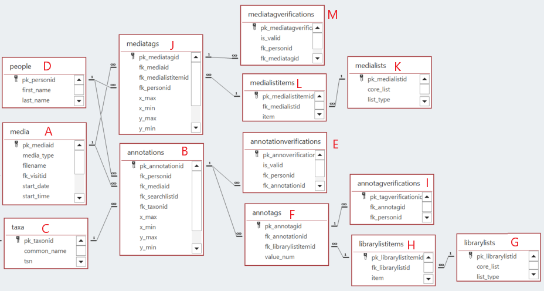
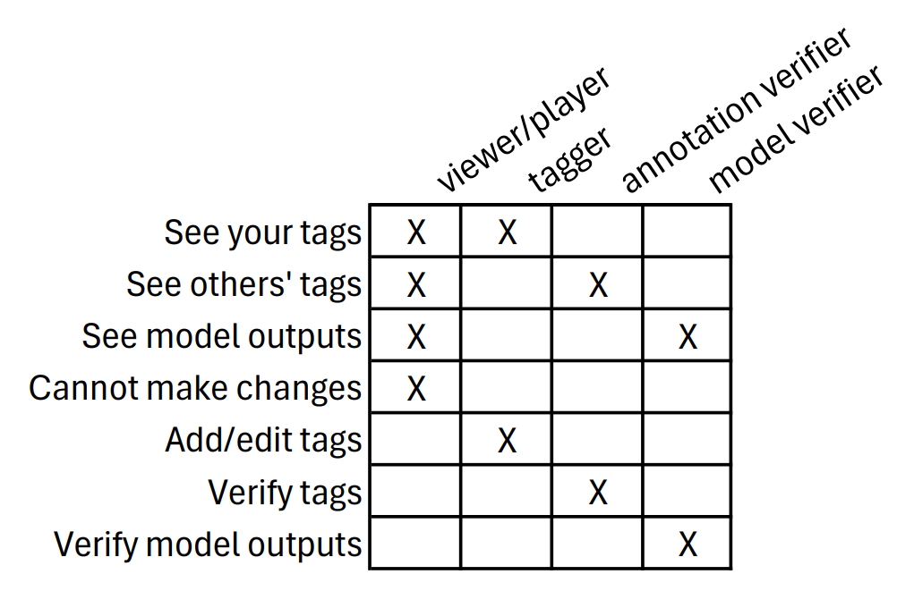
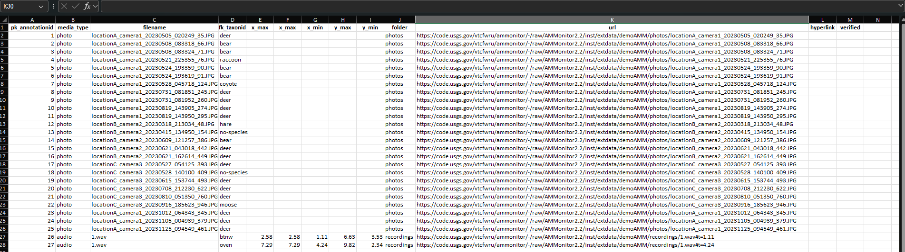
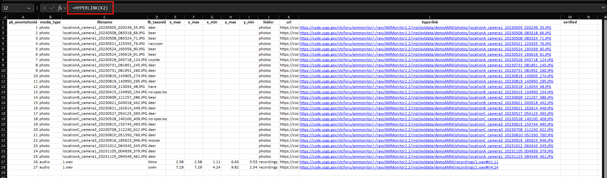
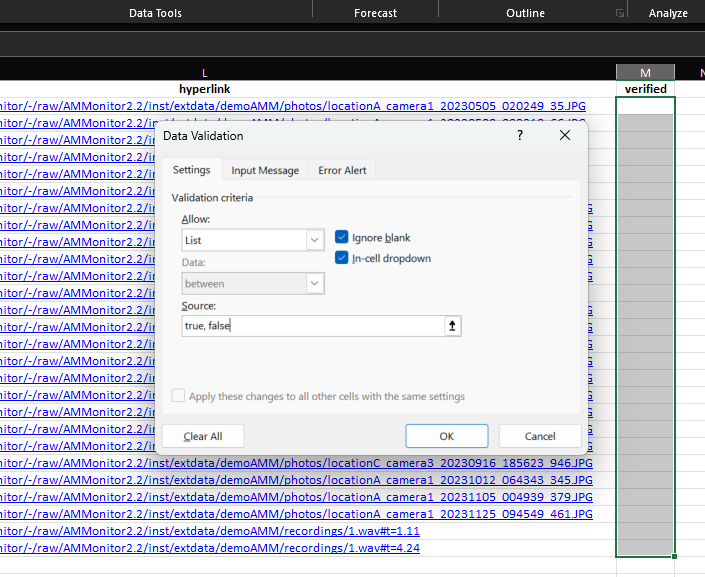
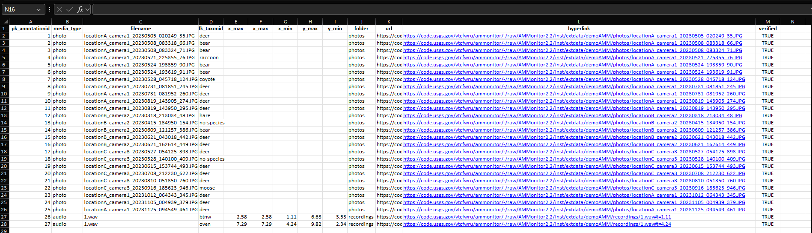
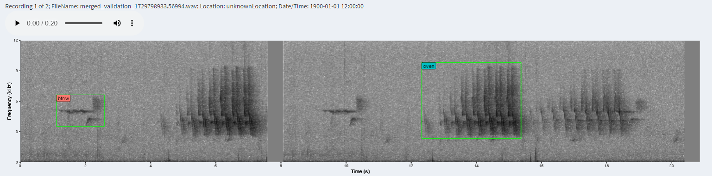

```{r setup, include=FALSE}
source('includes.R')
shiny::addResourcePath("figs", system.file("extdata/figs", package = "AMMonitor"))
```

## {width="100px"} Annotations

In the *AMMonitor* system, raw monitoring files such as recordings and photos are collected by Autonomous Monitoring Units (AMUs).  The captured raw monitoring files are stored either locally or in the cloud, and presumably contain taxonomic targets of conservation or management interest. 

To translate media files into meaningful information that informs conservation and management, we must first label these media files so we may interpret what they represent. The process of data labeling, or tagging, is the act of categorizing images based on the taxa or some other characteristics (we'll use the terms "label" and "tag" interchangeably). *AMMonitor* supports labels produced organically via human labeling or artificially via computer models. 

We use the term "annotations" to denote human-labeled tags of media files (e.g., "there is a moose in this photo" or "there is a chickadee in minute 2.2 of this recording"). Annotations can be further described with adjectives, which we refer to as "annotags" (such as age or sex of the moose or chickadee). 

Media-level tags are analogous to annotations, but pertain to the entire media file itself (such as marking files of interest or identifying corrupted files) or to a non-taxonomic label (e.g., "there is a vehicle in this image"). 

Once labels are applied by a person on the monitoring team, they can be verified (confirmed as correct or incorrect) by a second person, allowing an assessment of tagger performance.

The primary way to add, modify, and verify labels is through the *AMMonitor* Shiny interface "Photo and Audio Tools".  This interface connects directly to the *AMMonitor* database and stores information across several database tables, described in the next section.  

The remainder of this tutorial discusses the data structure of how labels are stored in AMMonitor. Then, we discuss the Photo and Audio Tools, including a video walk-through.

## Tutorial setup

A few tasks are required before we dig into the nuts and bolts of tagging.  

First, we'll need a demo *AMMonitor* project for this tutorial. As with all other tutorials, we used the `ammCreateMiniDemo()` function to create a small demo project named "demoAMM" that is pulled into the tutorial itself, with the file path stored as the R object, "demo_fp." This filepath is stored on your machine and can be found by running the following code:

```{r demofp}
demo_fp
```

The database is already present in the demo project, as shown below:

```{r}
list.files(file.path(demo_fp, "database"))
```

As you can see, the demo database is named "demo.sqlite". Let's set the connection now:

```{r, echo = TRUE, eval = TRUE}
# set a database connection by pointing to the database filepath
conx <- dbSetCon(paste0(demo_fp, "/database/demo.sqlite"))

# look at the class of the connection object
class(conx)
```

Once a connection is made, you can use many functions from the *DBI* package [@DBI] or from *AMMonitor* to work with the database.  For example, DBI's  `dbListTables()` is used below to return an  alphabetical listing of each table in the database.

```{r listtables, exercise = TRUE}
# use DBI's dbListTables function to list all tables
DBI::dbListTables(conn = conx)
```

A good number of these tables store data related to media annotations and verifications, described in the next section. 

## Annotations and related tables 

Several of the tables in an *AMMonitor* SQLite database are dedicated to human-applied tags. The figure below shows the relationships between the **annotations** table (and related tables *annotags*, *librarylists*, *librarylistitems*, *annotationverifications* and *annotagverifications*) and the **mediatags** table (accompanied by the *medialists*, and *medialistitems*, and *mediaverifications* tables). Recall that the primary key of each table is indicated by the tiny key symbol, and the lines between the tables identify the type of relationship. For example, one record in the *annotations* table may be associated with many records in the *annotags* table (the relationship shown is called a "one-to-many" relationship).

```{r er_diagram, eval = T, echo = F, fig.align='center', out.width = "100%", fig.cap = "*Figure 1. Database schema diagram showing relationships between AMMonitor database tables related to the annotations grouping.*", out.extra='style="background-color: #999999; padding:5px; display: inline-block;"'}

```

**Annotations** (Fig 1B) are labels describing the presence (or absence) of taxa in a media  file (audio or image). Each annotation references the person who performed the labeling (from the people table, Fig 1D), the taxon being specified (from the taxa table, Fig 1C), and the media file (from the media table, Fig 1A). The x- and y- min/max fields are used to create bounding boxes around a target signal. For photos, these represent the normalized upperbound and lowerbound x- and y-values of the target signal. For recordings, the x- min/max represents the start/end of the signal (seconds) and y- min/max represent the upper and lower frequency of the target signal (kHz). When left blank, the location of the target signal within the media file is considered to be unspecified, such as when a tag applies to the entire image that contains a moose. We use the "no-species" taxon to indicate the absence of any taxa of interest. 

> &#128073;&#127998; Thus, the *annotations* table deals with taxonomic labels only.  All non-taxonomic labels are stored in the *mediatags* table.

> &#128073;&#127995; The "no-species" label indicates that no target taxa were detected within a media file.

Let's look at the annotations that come with the demo database:

```{r annotations, exercise = TRUE}
DBI::dbReadTable(conx, "annotations")
```

Here, we can see that "bbaggins" made 27 annotations, one for each of the 25 photos and two for the single recording that were collected by the Middle Earth monitoring team. Most of the images contain deer or bear, but he noted that some media did not contain any taxa and labeled them with "no-species".

Because the bounding box fields (x- and y- min/max columns) are empty for the photo annotations, we can assume that these labels apply to the entire image without localizing where in the image the specified taxa are.  

> &#128073;&#127997; The *fk_searchlistid* column offers a way to specify a list of target taxa that were considered when labeling the data.  This is especially useful for "no-species" entries when the tagger is focused on only a subset of possible monitoring targets; it confirms no-detections of a given suite of taxa, but doesn't exclude the possibility that other taxa may be present. We will discuss this column later in the tutorial.

The *annotags* table provides a way to add descriptors to **existing annotations**. These descriptors are referenced from the *librarylistitems* table and may pertain to a specific taxon or taxon group. The best way to illustrate this is to look at the *librarylists* and *librarylistitems* tables.

<p class = instructions>
Select an entry from the *librarylists* table from the dropdown below, and inspect its corresponding items (and definitions) stored in the *librarylistitems* table: 
</p>

```{r librarylistitems_function, echo = FALSE}
lib_list_ids <- unique(librarylists$pk_librarylistid)
  
selectInput("select_liblistid", label = h3("Select Library List ID"), 
    choices = lib_list_ids, 
    selected = 'age_class')
    
fluidRow(tableOutput("libitems"))
```
  
```{r librarylistitems_function1, context = "server"}
output$libitems <- renderTable(
  expr = {
  liblist_id <- input$select_liblistid

  libitems <- subset(librarylistitems, fk_librarylistid == liblist_id, c(3,4))},
  bordered = TRUE,
  striped = TRUE,
  hover = TRUE,
  width = "100%"
)
```

Now that you've seen a few library lists and their list items, let's look at the *librarylists* table in more depth, as it is a crucial table in labeling in *AMMonitor*.

```{r}
DBI::dbReadTable(con = conx, name = "librarylists")
```

Please scroll to view the entire table!  We will take some time to walk through this important table:

- **pk_librarylistid** = the name of the library list. Here, you can see entries such as "age_class", "behavior", "vocalization_type", and "fur_color". 
- **core_list**  = a 0/1 entry indicating whether the library list is a core list (built-in with AMMonitor) or a user defined list.  We will illustrate how to add your own lists later in the tutorial.  Don't delete the core lists!
- **list_type** = an entry that controls how the annotags are displayed in the Shiny tagging application *and* are stored in the database. For example, the library list "age_class" will appear as a dropdown in the Shiny app, and will be stored as characters, whereas the library list "individuals" will allow users to enter a number in the Shiny app, and the result will be stored as a number. 
- **description**  = a description of the library list.
- **photos** = a 0/1 entry indicating whether this library list applies to photo tagging.
- **recordings** = a 0/1 entry indicating whether this library list applies to audio tagging.
- **videos** = a 0/1 entry indicating whether this library list applies to video tagging.  Video tagging is not yet supported.
- **fk_taxonid** = identifies a taxon from the *taxa* table that the library list applies to, for any taxa that share the same value at the given taxon's rank (species, genus, family, etc.). For example, the library list named "fur_condition" has an **fk_taxonid** of "moose", a taxon which has a **taxon_rank** of "species". This means that the library list will be valid for any taxa whose **rank_species** value matches that of "moose" (*Alces alces*). The library list named "age_class" has a **fk_taxonid** of "animal sp.", a taxon which has a **taxon_rank** of "kingdom". This means that the library list will be valid for all taxa whose **rank_kingdom** value matches that of "animal sp." (*Animalia*).
- **taxa_list** =  an alternative approach to the **fk_taxonid** for limiting which taxa a library list applies to when the taxonomic hierarchy is not suitable.  For example, the library list named "fur_color" is a dropdown list with entries "brown", "molting", or "white". The Middle Earth monitoring team wishes this library list to be applicable for "hare" and "weasel sp." only.  Both of these taxa can have fur color that varies in winter vs. summer. Instead of creating this list twice (e.g., "hare_fur_color" and "weasel_fur_color"), you can create  a special kind of *librarylist* called a "taxon list" for storing a list of taxa that contains a mix of entries from the *taxa* table.  The "fur_color_taxa_list" is an example of this, as indicated by the entry of 1 in the column **taxon_list**. Note, there is no foreign key reference to the taxa table, so referential integrity of taxon lists is not enforced by the database (i.e., the database technically allows *librarylistitems* in a taxon list that are not in the *taxa* table); rather, it is enforced through the Shiny tagger application. 
- **fk_child_librarylistid** =  the paired library list if a **taxa_list** is specified.  For example, the library list named "fur_color" identifies "fur_color_taxa_list" as its paired library list, indicating the list of taxa for which this tag is suitable.  

>&#128073;&#127997; Remember:  Either the **fk_taxonid** or **taxa_list** columns should be specified (never both). 

>&#128073;&#127996;The *librarylist* and *librarylistitems* tables give an *AMMonitor* user a lot of control over how tagging options are displayed in the Shiny tagger. Database managers should take some time to thoroughly understand these two tables and their entries.

>&#128073;&#127999; The demo database also includes the library list named  "md_list", containing items "no-species", "human", and "vehicle".  Thus, while a libraryl ist is expected to contain taxonomic targets, it can also include non-taxonomic targets as well. This specific list is used to reference the types of animals and objects that can be classified by a model called MegaDetector [@beery2019efficient], which scans images and identifies animals, people, and vehicles. This will be discussed further in the *models* tutorial.

## Mediatags and related tables 

**Mediatags** are just like annotations, except instead of referencing a taxon, they reference a non-taxon related characteristic from the *medialistitems* table. 

```{r er_diagram2, eval = T, echo = F, fig.align='center', out.width = "100%", fig.cap = "*Figure 2. Database schema diagram showing relationships between AMMonitor database tables related to the annotations grouping.*", out.extra='style="background-color: #999999; padding:5px; display: inline-block;"'}

```

The *mediatags* table (Fig 2J) stores media-level tags, while the *medialistitems* table stores all the non-taxonomic labels that can be applied to media (Fig 2L). Each medialistitem is contained in a medialist (from the *medialists* table, Fig 2K) that groups together related labels. The medialist specifies what type(s) of media (photos, recordings, and/or videos) the label grouping can be used for.  Let's look at the *medialists* and their accompanying *medialistitems* now:

<p class = instructions>
The *AMMonitor* database comes with several "core" *medialists* for commonly used attributes. We recommended that these not be altered to maintain consistency across databases. Explore the core medialists using the drop down menus.
</p>

```{r, echo = FALSE}

selectInput("medialist", "Select medialist", choices = medialists$pk_medialistid)
h3("Selected medialist:")
tableOutput("medialist_info")
h3("Associated medialistitems")
tableOutput("medialistitem_info")
```

```{r, context="server"}

output$medialist_info <- renderTable(
  medialists[medialists$pk_medialistid == input$medialist,]
)

output$medialistitem_info <- renderTable(
  DBI::dbGetQuery(
    conx, 
    paste0(
      "SELECT * FROM medialistitems WHERE fk_medialistid = '",
      input$medialist,
      "';"
    )
  )
)

```

For example, the medialist named "media_checkboxes" is a checkbox list that allows a user to flag a media file as a "highlight" or as "corrupted".  The medialist named "photo_non-taxa_bbox" is a bbox_list that allows a tagger to draw a bounding box around vehicles within a photo.

Medialists support multiple datatypes, including categorical and numeric labels. Datatype is specified using the *list_type* column which has the following options:

-   **dropdown_list**: Represents categorical data. In the tagging application, the user will select just one option from a drop-down list.

-   **numeric_list**: Represents numeric data. In the tagging application, the user will type a number into a text box.

-   **checkbox_list**: Represents logical data. In the tagging application, the user can select labels using a checkbox. Only when the box is checked will a new mediatag be added (i.e., leaving a checkbox blank will not create a new mediatag).

-  **bbox_list**: Represents objects that may be present in media that are not taxa (i.e., you could put a bounding box around it). Examples include vehicles in an image or the sound of a train whistle in a recording. 


```{r quiz1, echo = FALSE}

quiz(
  question("Which  medialists are of type numeric_list?",
  answer("The sample rate of a recording.", correct = TRUE),
  answer("Whether a vehicle is present in a photo."),
  answer("Precipitation type (none, rain, or snow)."),
  answer("The size of a file (in MB).", correct = TRUE),
  allow_retry = TRUE,
  message = "In the tagging application, the user will type a number into a text box. The database stores these tags as numbers."
  ),
  
  question("Which  medialists are of type checkbox_list?",
  answer("Indicating that a media file should be highlighted for being of exceptional quality.", correct = TRUE),
  answer("Snow cover (0%, 25%, 50%, 75%, 100%)"),
  answer("Whether a media file is corrupted.", correct = TRUE),
  answer("The height (in pixels) of an image file."),
  allow_retry = TRUE,
  message = "In the tagging application, the user can apply labels by checking a checkbox.  These are stored in the database as numbers (1 = checked).  Non-checked boxes are not stored in the database."
  ),
  
  question("Which medialists are of type dropdown_list?",
  answer("Whether a vehicle is present in a photo."),
  answer("Image file format (jpg, jpeg, png)", correct = TRUE),
  answer("Duration of a recording (seconds)"),
  answer("Wind noise level (low, medium, high)", correct = TRUE),
  allow_retry = TRUE,
  message = "Dropdown lists are used in the tagging application, where a user can select one item from the list. These are stored as characters in the database."
  )
)

```

The above drop-downs and quiz questions highlight the different kinds of non-taxon specific characteristics that come built-in with *AMMonitor* and how to create new ones to tag media data.


## Verifications

The *AMMonitor* database supports verifications of *annotations*, *annotags*, and *mediatags* in three *verifications* tables (*annotationverifications* (Fig 3E), *annotagverifications* (Fig 3I), and *mediaverifications* (Fig 3M). Verification allows a person (referenced from the *people* table) to either "Agree" or "Disagree" with a label.

```{r er_diagram3, eval = T, echo = F, fig.align='center', out.width = "100%", fig.cap = "*Figure 3. Database schema diagram showing relationships between AMMonitor database tables related to the annotations grouping.*", out.extra='style="background-color: #999999; padding:5px; display: inline-block;"'}

```

We will illustrate how verifications can be added via the Shiny tagging app in another section.


## Built-in queries

The data stored in the *annotations*, *annotags*, and *mediatags* table are not very readable, due to the fact that the tags reference primary keys (autonumbers) from the *librarylistitems* and *medialistitems* tables. 

To create more readable summaries, *AMMonitor* comes with several built-in queries that may be of interest.  To help find queries related to annotations, use the `help.search()` function, and specify "concept" as the fields argument, like this:

```{r qry, exercise = TRUE}
help.search(
  package = "AMMonitor", 
  pattern = "annotations", 
  fields = "concept"
)
```

Once you find a potential query of interest, please read the helpfiles of the returned queries; running the examples will illustrate exactly what each query returns.  

For example, the query `qryAnnotations()` will return counts of annotations for each taxa, and will further provide a count of the verifications.

```{r}
AMMonitor::qryAnnotations(conx, disconnect = FALSE)
```

Another query (`qryCheckTags()`) returns all annotations and mediatags for a given media. Let's try it out on media with ID = 1, using the default settings:

```{r}
AMMonitor::qryCheckTags(
  con = conx,
  mediaid = 1
)
```

Thus, mediaid = 1 was tagged by "bbaggins" as a "deer". 

The same approach can be used to identify queries related to mediatags. 

```{r qry2, exercise = TRUE}
help.search(
  package = "AMMonitor", 
  pattern = "mediatags", 
  fields = "concept"
)
```

You can revisit these queries after you add some of your own tags in the Shiny tagger, coming up next.

## The Shiny tagger 


The AMMonitor Photo and Audio Tools provide a user-friendly way to label data stored in an AMMonitor database. Each media type has four tools: (1) viewer/player; (2) tagger; (3) annotation verification; and (4) model verification. 

The Photo and Audio Tools have various scopes based on their intended purpose. In the viewer and player, you can see all annotations, annotags, and mediatags but cannot add, edit, or verify any labels (viewer/player mode is read-only). When using the tagger, the scope of tags you can see is limited to only tags produced by the currently logged-in user. This is done to avoid introducing confirmation bias (i.e., I see that Bilbo has identified this image as having a moose, and he is an expert, so there must be a moose in the image). The annotation verifier only shows tags created by other users, to avoid a user verifying their own labels. The scope and function of each tool is shown in Figure 4. 

```{r features_table, eval = T, echo = F, fig.align='center', out.width = "100%", fig.cap = "*Figure 4. Scope and function of each of the AMMonitor photo/audio tools.*", out.extra='style="background-color: #999999; padding:5px; width:50%; display: inline-block;"'}

```

There's a lot going on under the hood in the Shiny Photo and Audio Tools!  To help keep things straight, we created cheat sheets for using these tools to their fullest potential. 

 - <A HREF="www/Photo-Cheat-Sheets.pdf" target="_blank">Photo Cheat Sheets</A> 
 - <A HREF="www/Audio-Cheat-Sheets.pdf" target="_blank">Audio Cheat Sheets</A>
 
Cheat sheets make a great reference to have open while working with the media tools, but we've also provided video tutorials to get you started:

 - <A HREF="https://www.youtube.com/watch?v=bNlmGHEx3do" target="_blank">Photo Viewer</A> 
 - <A HREF="https://www.youtube.com/watch?v=wz6KvP6d2iI" target="_blank">Photo Tagger</A>
 - <A HREF="https://www.youtube.com/watch?v=IuTTQle2Jh0" target="_blank">Photo Verifiers</A>
 - <A HREF="https://www.youtube.com/watch?v=Xqj7KjLv5Vg" target="_blank">Audio Player</A> 
 - <A HREF="https://www.youtube.com/watch?v=-zxi2EI0TzA" target="_blank">Audio Tagger</A>
 - <A HREF="https://www.youtube.com/watch?v=43BuqpJBAbA" target="_blank">Audio Verifiers</A>

The remainder of this section is intended to supplement the video and cheat sheet  resources.


### Settings

The *AMMonitor* directory structure includes a "settings" folder for storing information used to specify default settings for the Shiny app. Each setting is stored as a text file where the file name indicates the setting name and the file contents specify the desired setting. 

#### **default_user.txt**

A default user can be specified to be selected by default when connecting to the database through the Shiny app. Let's see who the default user is set to for our demo database:

```{r, eval = T}
# Read the settings file for setting the default user
readLines(file.path(demo_fp, "settings", "default_user.txt"))

```

We can see the setting value "sgamgee" that references a **pk_personid** from the *people* table. Therefore, "sgamgee" will appear by default in the text input on the main login screen when the app is first launched. The value of this setting must match a **pk_personid**. 

#### **audio_path.txt and image_path.txt**

>&#128073;&#127997; For a more in-depth discussion of the media file storage options, and how to properly use the "image_path" and "audio_path" settings, see the media tutorial: `learnr::run_tutorial('media', package = "AMMonitor")`

The audio_path and image_path settings allow the user to specify an image or recording directory path/URL. The filepath column in the media table can be left blank if these settings are used, and a filepath for the media will be formed by appending the file name to the provided directory path or URL. The directory path should reference the folder on your computer where the images/recordings are saved. When media are stored in the cloud, a URL prefix can be provided instead of local paths to a directory, so long as the complete URL to the media can be formed by appending the file name to the URL prefix. It is expected that any web authentication that may be necessary to render the media file in a web browser from a URL is handled by the user, outside of the *AMMonitor* framework. Let's check how the audio and photo paths are configured for the demo database:

```{r, eval = T}
# Read the settings file for setting the audio path
cat('Audio Path:', readLines(file.path(demo_fp, "settings", "audio_path.txt")))
# Read the settings file for setting the image path
cat('Image Path:', readLines(file.path(demo_fp, "settings","image_path.txt")))

```

#### **autosave_rate.txt and cache_size.txt**

*AMMonitor* includes several settings to optimize performance when deployed with a served (vs. serverless) database. Both these settings offer ways of reducing the frequency of database transactions that are required.  For *AMMonitor* SQLite users, it's safe to stick with the default settings (as detailed below).  The USGS AMBER network (**A**lliance for **M**onitoring **B**iodiversity **R**emotely) translates the SQLite database into a served Postgres database so that multiple users can use the database simultaneously, where these two settings are important.  See the "amber" tutorial if interested.

The cache size setting specifies the number of media files for which metadata is stored in memory. Increasing this value will increase the memory requirements of the app, but decrease the frequency of database queries. The autosave rate setting specifies the number of new labels after which all changes will be written to the database. Setting the autosave rate to 1 will update the database after each new label is created and is appropriate for SQLite. For a deployed database, increasing the autosave rate will decrease the frequency of database transactions but increase the number of labels that will be made before they are written to the database. Regardless of the autosave rate, the user can always save manually with the "Save labels" button, which is clickable only when unsaved changes are present. Both the cache_size and autosave_rate default to 50, but adding settings files will override the default. When creating a new database, settings files are automatically added that set the cache size to 1000000 and autosave rate to 1 using "settings" since most users will have a SQLite deployment of AMMonitor.

```{r, eval = T}
# Read the settings file for setting the autosave rate
cat('Autosave rate:', readLines(file.path(demo_fp, "settings", "autosave_rate.txt")))
# Read the settings file for setting the cache size
cat('Cache size:', readLines(file.path(demo_fp, "settings", "cache_size.txt")))

```

### Recommended workflow

A monitoring project will naturally cycle through stages of data collection, data labeling, and label verification. These stages may overlap for ongoing projects and proper management of a labeling effort is required to ensure labeling is accurate, efficient, and complete. Use the Image/Audio filters to subset media files into quantifiable units. For trail camera imagery, filtering by "visit" works well because your eye will adjust to the consistent background throughout a visit, making it easier to pick up on differences between consecutive photos and spot animals. Users can also filter by date range, location, and taxon. There is a filter that can be used to exclude any media files that were either tagged by the currently logged-in user or tagged by any user, which is helpful for isolating media files that have not yet been labeled.

After data are labeled, they can be verified. Verification is commonly performed by taxon (i.e., a moose expert verifies all images labeled as moose). The taxa filters can be used to display only media files containing the specified taxon. Similarly to the tagger, you can exclude media files based on their verification status when using the verifier to help ensure completion.

## Verifications with Spreadsheets

Data stored in an AMMonitor database can also be verified outside of the Shiny app using an Excel spreadsheet. This approach can be helpful if you have a short list of media that you'd like a specific person to verify, or similar small scale applications. AMMonitor provides two functions to support this verification process: verifyExcelCreate(), which produces a verification spreadsheet, and verifyExcelImport(), which adds verifications from a completed spreadsheet to the database.

We'll start by looking at the verifyExcelCreate() function:

```{r verify_create_help, exercise = TRUE}

# Look at the help file for verifyExcelCreate()
help("verifyExcelCreate")

```

To create a verification spreadsheet, we need to tell the function which media files we would like included and where they're stored. Additionally, we need to define whether annotations or model outputs will be verified and where to save the resulting spreadsheet. In this example, let's say that we're interested in verifying annotations made on photos in our demo database. We can retrieve the media IDs from the database.

```{r}

# Look at the media table to identify media IDs for verification
DBI::dbReadTable(conx, "media")

```

Media IDs 1 to 25 are all images, so we'll include them in our verification spreadsheet. We'll use the media included with the AMMonitor demo for this example, which are also available through the AMMonitor repository. We'll write a verification spreadsheet for annotation to our demo directory.

<p class=instructions>
If you'd like to follow along with your own spreadsheet, you can open a new session of R by going to Session | New Session. Run the code below to create the verification spreadsheet. You can follow along with future code blocks and screenshots to walk through the process alongside this tutorial.
</p>

```{r, eval = FALSE, echo = TRUE}

# Create the verification spreadsheet
verifyExcelCreate(
  con = conx,
  media_ids = 1:25,
  media_root_path = 
    "https://code.usgs.gov/vtcfwru/ammonitor/-/raw/AMMonitor2.2/inst/extdata/demoAMM",
  verify_what = "annotations",
  outfile_path = file.path(demo_fp, "verify_me.xlsx"),
  disconnect = FALSE
)

```

The resulting spreadsheet will look like this:

```{r, echo = FALSE, fig.align = 'center', out.width = "100%", fig.cap = "The verification spreadsheet output by verifyExcelCreate", out.extra='style="background-color: #999999; padding:5px; width:90%; display: inline-block;"'}

```

Note that each row contains an annotation ID, file name, and taxon ID along with a URL to the image. To make the images easy to access, go to the empty "hyperlink" column and enter =HYPERLINK(URL cell), then drag this formula down to fill the column. This will transform the provided URLs clickable hyperlinks to each media file.

```{r, echo = FALSE, fig.align = 'center', out.width = "100%", fig.cap = "The verification spreadsheet with hyperlinks. Note the formula in the red box.", out.extra='style="background-color: #999999; padding:5px; width:90%; display: inline-block;"'}

```

The last column, "verify", is used to label each annotation as correct (true) or incorrect (false). If you'd like to avoid potential typos or other issues, you can set data validation on the verification column to only allow true and false entries. You can find the data validation option under the "Data" tab in "Data Tools" section and configure it like so:

```{r, echo = FALSE, fig.align = 'center', out.width = "100%", fig.cap = "Setting data validation on the verify column so it only allows true or false", out.extra='style="background-color: #999999; padding:5px; width:90%; display: inline-block;"'}

```

Now, the spreadsheet should only allows entries of "true" or "false" in the verify column, with a drop down list of options. At this point, the spreadsheet would be ready to distribute to your verifier! For demonstration purposes, let's assume that we've reviewed all of these annotations and determined that they're correct. We'll fill in the verify column with "true." Note that, if a verifier is ever uncertain, the verify column can be left blank to neither agree or disagree with an annotation or model output.

```{r, echo = FALSE, fig.align = 'center', out.width = "100%", fig.cap = "A completed verification spreadsheet", out.extra='style="background-color: #999999; padding:5px; width:90%; display: inline-block;"'}

```

Now, we can import the completed spreadsheet into the database! Let's take a look at the verifyExcelImport() function:

```{r verify_import_help, exercise = TRUE}

# Look at the help file for verifyExcelImport()
help("verifyExcelImport")

```

For this function, we need to provide a file path to the completed excel file, what type of tags were verified, and the person who verified them. In this case, let's say that Gandalf has reviewed these annotations.

```{r, echo = TRUE, eval = FALSE}

# Import the verifications as Gandalf
verifyExcelImport(
  con = conx,
  excel_file = file.path(demo_fp, "verify_me.xlsx"),
  verified_what = "annotations",
  person_id = "gandalf",
  disconnect = FALSE
)

```

If all has gone well, you should get a message telling you the verifications have been added to the database! Let's look at the annotation verifications table to confirm.

```{r, eval = FALSE, echo = TRUE}

# Make sure the new verifications have been added to the database
DBI::dbReadTable(conx, "annotationverifications")

```

This workflow can be useful for small scale verification tasks, or projects where the database and app may not be easily accessible to all users at once. Notably, only the media files need to be hosted online for this method; all verification can be done otherwise independently and added to the database by a single person when completed.

## Merged audio files

Monitoring projects often require reviewing a random sample of annotations across many media files. When working with audio files, an annotation may represent a small portion of a much larger recording (such as a single Ovenbird song in a 10-minute recording). Loading or downloading (in the case of recordings stored in the cloud) long recordings to access short clips can create inefficiencies in the verification workflow. 

To expedite this process, selected annotations can be merged into a single audio file using the `mergedAudioCreate()` function. This function produces a single audio file consisting of the annotated sections of the original audio files for quick and easy review. The merged audio file will be listed in the database with its own entry in the media table and will be associated with a special visit with **visit_type** "merged-verification". Once verification of the annotations on the merged audio file have been completed, they can be reassigned to the original annotations and media files. 

Let's take a look at this function now:

```{r audio_create_help, eval = FALSE, exercise = TRUE}
# Look at the help file for the mergedAudioCreate function
help("mergedAudioCreate")
```

To demonstrate how this function works, let's walk through an example using the demo database. Gandalf, an expert ornithologist, has agreed to review annotations of bird species for the Middle Earth monitoring team. They'd like to provide a merged audio file of bird annotations for him to review. First, they'll need to identify what annotations to include from the annotations table.

```{r audio_anno_table, exercise = TRUE}
# Take a look at the annotations table
DBI::dbReadTable(conx, "annotations")
```

You'll need to scroll to the end to find two bird annotations: one for a Black-throated Green Warbler (btnw) and one for an Ovenbird (oven). We'll store these annotation IDs to tell the `mergedAudioCreate()` function what clips to use.

```{r prepare-anno-ids}
# store the annotation IDs to be merged into one audio file
annotation_ids <- 26:27
```

Now, we're ready to create a merged audio file! The `mergedAudioCreate()` function provides a variety of options to customize the resulting audio file, such as how much of a buffer to include around each annotation (**buffer_before** and **buffer_after**), how much silence to include between clips (**buffer_btwn**), and the **sample_rate** of the recording. For our purposes, we can use the default values and simply provide a database connection and filepath to the AMMonitor project, along with the previously specified annotation IDs.

```{r audio_create, exercise = TRUE}
# Create a merged audio file from the bird annotations
mergedAudioCreate(
  con = conx,
  annotation_ids = annotation_ids,
  ammPath = demo_fp
)
```

We've now created a merged audio file! We can find it in both the media and visits tables (you'll need to scroll to the end):
```{r audio_media_table, exercise = TRUE}
# Look at the updated media table:
DBI::dbReadTable(conx, "media")
```

```{r audio_visits_table, exercise = TRUE}
# Look at the updated visits table:
DBI::dbReadTable(conx, "visits")
```

The merged media file is given a placeholder date of "1900-01-01", and the visit is labeled as a "merged-verification" visit. These traits can be used to differentiate a merged media file from regular media.

> &#128073;&#127998; Any time a merged audio file is created, a visit entry is created with it. Do not associate any other files with that visit, as this may cause errors when trying to remove the merged audio file.

To look at the merged media file itself, launch the Shiny app. 

<p class=instructions>
Open a new session of R by going to Session | New Session (so that two instances of R are running on your machine). Then, run the following commands in the new session's console, which uses `ammCreateMiniDemo()` to create the lightweight demo AMMonitor project and `launchApp()` to launch the app.  
</p>

```{r, eval = FALSE}
# load AMMonitor
library(AMMonitor)

# create a demo AMMonitor project in a temporary directory (to be deleted)
demo_fp <- ammCreateMiniDemo(filepath = tempdir())

# set a database connection by pointing to the database filepath
conx <- dbSetCon(paste0(demo_fp, "/database/demo.sqlite"))

# Create a merged audio file from the bird annotations
mergedAudioCreate(
  con = conx,
  annotation_ids = 26:27,
  ammPath = demo_fp,
  disconnect = TRUE
)

# launch the Shiny application
launchApp(demo_fp)
```

Select "galdalf" as the user and connect to the database, then click on "Audio Tools" in the left menu. Select "Annotation Verifications." The merged audio file should be the first one to appear. You may want to zoom out to see multiple clips (by increasing the spectrogram length in the "Recording Filters & Settings"), or look at Figure 5 below:

```{r mergedaudioimage, eval = T, echo = F, fig.align='center', out.width = "100%", fig.cap = "*Figure 5. An example of a merged audio file. Note the empty gray buffers of silence in between the clips.*", out.extra='style="background-color: #999999; padding:5px; display: inline-block;"'}

```

Note the gray bars (representing silence) separating the clips containing annotations, as well as the audio buffers surrounding the sound of interest. These are the settings defined by the **buffer** arguments of the function.

Now, let's say that Gandalf has finished verifying these annotations, and the Middle Earth monitoring team needs to transfer his verifications to the original annotations and media files. For this task, we'll use the `mergedAudioRemove()` function:

```{r help_audio_remove, eval = FALSE, exercise = TRUE}
# Check the help file for mergedAudioRemove
help("mergedAudioRemove")
```

Similar to `mergedAudioCreate()`, this function requires a database connection (**con**), a media or visit ID (**mediaID** or **visitID**), and the file path of the AMMonitor project (**ammPath**). The function will transfer all verifications to the original annotations, remove the merged media and associated records from the database, and delete the merged media file.

First, we'll simulate some verifications from Gandalf to demonstrate. We'll assume that he confirmed both annotations:

```{r append_data, exercise = TRUE}
DBI::dbAppendTable(
  conn = conx,
  name = "annotationverifications",
  value = data.frame(
    pk_annoverificationid = NA,
    is_valid = 1,
    fk_personid = "gandalf",
    fk_annotationid = 28:29,
    timestamp = format(Sys.time(), "%Y-%m-%d %H:%M:%S")
    )
  )   
```

Now, we can run `mergedAudioRemove()` to transfer these annotations to the original media. We'll need to provide the media ID or visit ID of the merged media file. For demonstration, we'll use the media ID.

> &#128073;&#127999; Note that you only need to provide a visit ID or a media ID, not both.

```{r audio_remove, exercise = TRUE}
# Remove the merged audio file and associate the verifications with the original annotations
mergedAudioRemove(
  con = conx,
  mediaID = 27,
  ammPath = demo_fp,
  disconnect = FALSE
)
```

The merged audio file has now been removed! Take a look at the annotation verifications table:

```{r audio_anno_ver_table, exercise = TRUE}
DBI::dbReadTable(conx, "annotationverifications")
```

You'll need to scroll to the end and should see two verifications added by Gandalf. They're now associated with the original annotations, 26 and 27.

We can also check the media table to confirm that the merged media file has been removed.

```{r audio_media_2, exercise = TRUE}
DBI::dbReadTable(conx, "media")
```

Merged audio files can be useful in any case where an expert needs to verify a large number of annotations or model outputs across different audio files. See the "Models" tutorial for more details on using these functions with model outputs. It can also be used alongside `dbDistributed()` to deliver the data to the verifier, as explained in the upcoming "dbDistributed" tutorial.

> &#128073;&#127995; The demo database only contains a single recording, but merged audio files can combine annotations or model outputs from across any number of recordings.

## Tutorial summary

In this tutorial, we introduced the annotations table grouping and showed how to use the Audio and Photo Tools to view, add, edit, and verify labels. The next tutorial piggybacks on annotations, discussing how to use the `dbDistributed()` function to facilitate the sharing of data with external collaborators for creating annotations, annotags, verifications, etc. 

```{r , eval = FALSE}
learnr::run_tutorial(
  name = "dbdistributed",
  package = "AMMonitor"
)
```

Then, the *models* tutorial discusses labels created by machine learning models:

```{r , eval = FALSE}
learnr::run_tutorial(
  name = "models",
  package = "AMMonitor"
)
```

A list of other *AMMonitor* tutorials is shown below.  

```{r , eval = T}
learnr::available_tutorials("AMMonitor")
```


>&#128073;&#127997; A final FYI:  If you'd like a pdf of this document, use the browser "print" function (right-click, print) to print to pdf.  If you want to include quiz questions and R exercises, make sure to provide answers to them before printing.

## References
