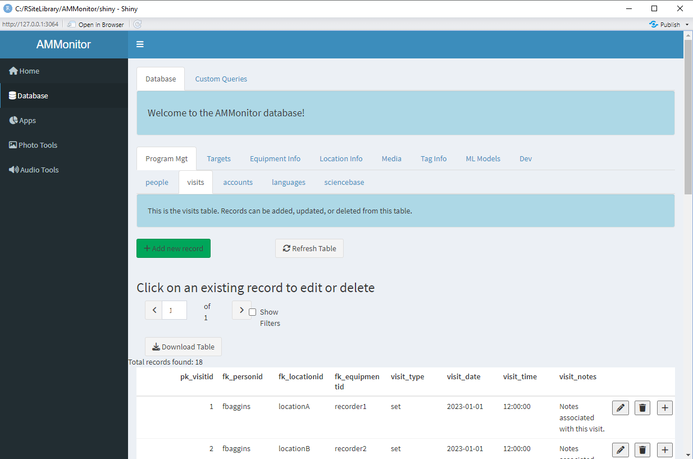

```{r setup, include=FALSE}
source('includes.R')
shiny::addResourcePath("figs", system.file("extdata/figs", package = "AMMonitor"))
```

## {width=100px} Introduction to SQLite

The primary goal of *AMMonitor* is to provide an analysis system that efficiently processes AMU data so that it can be used to address scientific questions or management goals. Autonomous Monitoring Units (AMUs) have the capacity to collect a massive amount of information in a short period of time, requiring that monitoring teams have an effective data management plan in place.

In the *AMMonitor* system, raw monitoring files such as recordings and photos are collected and stored either locally or in the cloud. All other data, including photo and recording metadata, are stored within a SQLite database. SQLite is a self-contained, high-reliability, embedded, full-featured, public-domain, SQL database engine. *AMMonitor* uses the R package RSQLite [@RSQLite] to connect R with the database.

SQLite is a relational database, which is simply a collection of tables that are related in some way. Each table stores specific information, and specific columns in one table may be formally linked to other tables. Information stored in or across tables can be retrieved using a language called SQL, which stands for Structured Query Language. You will learn some basic SQL commands in this chapter.

Often, relational databases are stored on a large server (such as the server at a university or agency) that requires management and oversight by a database administrator. In contrast, a SQLite database does not require a server or administrator. Instead, the entire database is stored as a single file, which may reside on a single computer or in the cloud. The SQLite home page explains: “SQLite is an in-process library that implements a self-contained, serverless, zero-configuration, transactional SQL database engine. The code for SQLite is in the public domain and is thus free for use for any purpose, commercial or private. SQLite is the most widely deployed database in the world with more applications than we can count, including several high-profile projects.”

## The dbCreate function

In *AMMonitor*, the SQLite database is created with the `dbCreate()` function and should be stored in the “database” folder within the main *AMMonitor* project directory.  In setting up a new *AMMonitor* project, the order of operations is to first run `ammCreateDirectories()` and then `dbCreate()`, as shown below.

```{r, eval = FALSE}
# create a new AMMonitor project
my_filepath <- ammCreateDirectories(
  amm_dirname = "myProject", 
  filepath = tempdir()
)

# look at the folders within an AMMonitor project
list.files(my_filepath, recursive = FALSE)

# add the default database
dbCreate(
  new_db_name = "myProject.sqlite", 
  new_db_filepath = paste0(my_filepath, "/database"), 
  db_source = "default"
)
```

The `dbCreate()` function allows you to create an *AMMonitor* database from scratch (the default database), to extend your current database if it gets too large, or to "rehydrate" a database that has been released at ScienceBase.gov. 

To introduce the default database, as with all other tutorials, we use the `ammCreateMiniDemo()` function to create a small demo project named "demoAMM" that is pulled into the tutorial itself, with the file path stored as the R object, "demo_fp". This filepath is stored on your machine and can be found by running the following code:

```{r demofp}
demo_fp
```

As mentioned, the main *AMMonitor* project directory has 16 subdirectories that each serve an intended purpose.  Let's have a look, noting the directory named "database" will house our SQLite database.

```{r demofolders}
# look at the folders within an AMMonitor project
list.files(demo_fp, recursive = FALSE)
```

The database is already present in the demo project, as shown below:
```{r}
list.files(file.path(demo_fp, "database"))
```

As you can see, the demo database is named "demo.sqlite".

> &#128073;&#127995;  This tutorial introduces the *AMMonitor* SQLite database.  The tutorial is quite long and extensive, but provides essential background for data managers. Make sure to complete the "people" tutorial, which illustrates more essential background for working with tables.

## The database in Shiny

Before we dive into the nuts and bolts of database structure, let's look at the demo database via *AMMonitor*'s Shiny interface [@shiny]. As we mentioned in previous tutorials, when you are working on a given tutorial, R is actually running Shiny and listening for commands issued from the tutorial.  As such, it would be difficult to launch the *AMMonitor* Shiny app within the tutorial.  

<p class=instructions>
Instead, to see the database in action through Shiny, open a new session of R by going to Session | New Session (so that two instances of R are running on your machine). Then, run the following commands in the new session's console, which uses `ammCreateMiniDemo()` to create the mini demo AMMonitor project and `launchApp()` to launch the app.  
</p>

```{r, eval = FALSE}
# load AMMonitor
library(AMMonitor)

# create a demo AMMonitor project in a temporary directory (to be deleted)
demo_fp <- ammCreateMiniDemo(filepath = tempdir())

# launch the Shiny application
launchApp(demo_fp)
```

Assume the role of the default user (sgamgee), and connect to the database.  

```{r shinyimage, eval = T, echo = F, fig.align='center', out.width = "100%", fig.cap = "*Figure 1a. Upon launching the app, you are presented with the option to select a user and connect to the database.*", out.extra='style="background-color: #999999; padding:5px; display: inline-block;"'}
knitr::include_graphics('www/shiny0.PNG')
```
 

Then, click on the Database option in the left menu. Here, you will see database tables arranged in different groupings (and populated with demo data).  Now poke around as desired; below is a screenshot of the "visits" table, which is nested within a tab named "Program Mgt".  We'll explore this table in depth in this tutorial as a way of introducing common database concepts.

```{r shinyimage2, eval = T, echo = F, fig.align='center', out.width = "100%", fig.cap = "*Figure 1b. The visits table of the 'demo' database.*", out.extra='style="background-color: #999999; padding:5px; display: inline-block;"'}

```
 
Now that you've seen some of database tables, let's take a deeper dive into relational databases. 

## The database diagram

As mentioned, a relational database is a collection of tables that are linked in some way (Figure 2).

Each small square (n = 45) in the diagram below represents a table, and a few of the columns in each table are listed.  The lines between the squares indicate how columns from one table are linked to columns in a second table. The overall database structure depicted in Figure 2 is organized  to cleanly illustrate table linkages (rather than representing a workflow).  Please note that not all links are shown. 


```{r er, eval = T, echo = F, fig.align='center', out.width = "100%", fig.cap = "*Figure 2. Database schema diagram showing relationships between AMMonitor database tables.*", out.extra='style="background-color: #999999; padding:5px; display: inline-block;"'}
knitr::include_graphics('www/er.png')
```

You can find this image here as well:
```{r eropen, exercise = TRUE}
browseURL(paste0(find.package("AMMonitor"), "/extdata/figs/er.PNG"))
```


We will review each portion of the database in depth, but from a bird's-eye view, the tables are roughly partitioned into 8 groups:

A. The **taxa, objectives, and library grouping** (*taxa*, *languages*, *taxonLanguage*, *library*, and *objectives* tables).  Typically, a wildlife monitoring program is motivated by the need to understand the status and trend of *taxa* of interest.  Taxonomic names are linked to the Integrated Taxonomic Information System (http://www.itis.gov), but may be referred to differently in different *languages*. For example, what we commonly call "moose" in North America is referred to as "moz" by the Abenaki people.  An agency or organization typically establishes management objectives, such as maximizing, minimizing, or maintaining abundance or occupancy at a given level.  

B. The **locations table grouping** (*locations*, *temporals*, *priorities*, and *spatials* tables).  A wildlife monitoring program focuses on monitoring target species at locations.  Temporal data may be associated with these locations, as well as spatial objects that map them.  Locations may also be prioritized for monitoring effort.

C. The **equipment table grouping** (*equipment*, *accounts*, *emodels*, *emodelsettingnames*, *emodelconfignames*, and *emodelconfigvalues* tables).  *AMMonitor* focuses on monitoring wildlife with remotely deployed devices, such as trail cameras, audio recorders, or cell phones.  Each device is tracked in the *equipment* table. Device model information is captured, along with the descriptions of the device's settings.  Devices may also be associated with an account (such as a Google account).

D. The **media capture table grouping** (*people*, *visits*, *media*, and *logs* tables). In a monitoring program, people visit a location to deploy/check/service a monitoring unit.  During these visits, media may be captured on cards, or sent directly to the cloud.  "Virtual" visits occur in the case where devices are connected to a wireless service.  Devices may produce logs that provide metadata on the device performance.

E. The **annotations table grouping** (*annotations*, *annotationverifications*, *mediatags*, *mediatagverifications*, *annotags*, and *tagverifications* tables).  Annotations consist of human-labeled tags of media files in search of target taxa or target signals (e.g., there is a moose in this photo or a chickadee in minute 2.2 in this recording).  Tags can be further described with adjectives (such as age or sex). Tags can also be applied at the media level, such as marking files of interest or identifying corrupted files.  All tags can be verified by a second observer.

F. The **models table grouping** (*models*, *msettingnames*, *mconfignames*, *mconfigvalues*, *modeloutputs*, and *modelverifications* tables).  In *AMMonitor*, models typically come in two general flavors: (1) machine-learning models that inspect monitoring media in search of target taxa or signals, and (2) ecological models that estimate the status and trend of target species. Model runs can be configured by a set of inputs, with configuration values stored in the database.

G. The **analysis table grouping** (*analyses* and *analysisoutputs* tables).  The analyses table consists of a set of R functions that perform a certain action; analyses can be run via a function or through the *AMMonitor* Shiny interface.  The results of an analysis are fully reproducible, and are stored in an RDS file. The *analysisoutputs* table tracks the file names of analyses so that they can be used in automated reporting.

H. The **lists and listitems grouping** (*lists*, *listitems*, *librarylists*, *librarylistitems*, *medialists*, and *medialistitems* tables).  These tables control database dropdowns and all tagging options that can be used to tag media files. We will look at **lists** and **listitems** in the next tutorial.

Last but not least, the *shinytable*, *dbdictionary*, and *sciencebase* tables reside in the upper left corner of the diagram.  These tables define the database structure, the Shiny layout, and provide information needed for a formal data release in the USGS ScienceBase repository.

Though Figure 2 provides an overview of the *AMMonitor* database, the various tables are described in depth in separate tutorials.

## Keys

Keys are an important concept in relational databases. We highlight two types of keys by focusing on four of the database tables shown in Figure 3.  The tables are named *locations*, *equipment*, *visits*, and *people*.  These tables store vital information about a monitoring program, such as the locations of monitoring sites and the AMUs deployed by people during a site visit. 

```{r keys, eval = T, echo = F, fig.align='center', out.width = "100%", fig.cap = "*Figure 3. Database relationship diagram for the locations, equipment, visits, and people tables.*", out.extra='style="background-color: #999999; padding:5px; display: inline-block;"'}
knitr::include_graphics('www/keys.png')
```

### Primary Keys

Each table has a “primary key", which is a column or columns used to identify a unique record (row) in the table. For example, in the *people* table (Figure 3), the column labeled **pk_personid** has a small key symbol next to it, indicating that this column is the table’s primary key. The prefix "pk" in the column name is used in AMMonitor to signal that this column serves as the primary key. You can see that the *people* table has other columns too, such as **first_name ** and **last_name**. Thus, a record (row) in this table may have an entry such as **pk_personid** = “fbaggins”, **first_name** = “Frodo”, and **last_name** = “Baggins”, etc.  We can use R code or SQL commands to retrieve this unique row in the table by simply finding the record where the **pk_personid** column has a value of “fbaggins”. The primary key cannot be duplicated, thus “fbaggins” will always point to Frodo’s record. 

The primary key in the *locations* table is **pk_locationid**; the primary key in the *equipment* table is **pk_equipmentid**, and the primary key in the *visits* table is **pk_visitid**.

Each table must identify a primary key that identifies a particular record.  In some tables, multiple columns compose the primary key as we'll see with the *dbdictionary* table later.  

### Foreign Keys

Foreign keys are used to link two tables together, wherein a foreign key column in one table refers to a primary key column in another table. For example, the *visits* table in Figure 3 has a primary key of **pk_visitid**, but also contains three columns that are "foreign keys", designated by the prefix "fk" (**fk_personid**, **fk_locationid**, **fk_equipmentid**). The visits table associates visits with monitoring sites visited by people who set/check/pull monitoring equipment. Notice the column named **fk_personid** in the *visits* table is connected to the **pk_personid** column in the *people* table, where **pk_personid** is the primary key. Thus, if Frodo Baggins deploys an AMU at a given location on a given date, we can expect to see “fbaggins” listed in the **fk_personid** column of the visits table. If we need to know more about “fbaggins”, we can find his information in the people table by extracting the row associated with this key. Similarly, we can trace entries in **fk_locationid** in the visits table to **pk_locationid** in the locations table, and we can trace entries in **fk_equipmentid** in the visits table to **pk_equipmentid** in the equipment table.

The line that connects the *visits* table with the *people* table indicates the type of relationship the two tables have.  Figure 3 shows a "one-to-many" relationship, meaning that one record in the *people* table can be associated with many records in the *visits* table.  That is, Frodo may make many visits to different monitoring locations to service monitoring units, but each visit (row in the visits table) can only be associated with a single person.

> &#128073;&#127999; When creating a relational database, you can name database columns *almost* anything you wish. However, in *AMMonitor*, we follow the convention of naming columns that are primary keys with a "pk_" prefix and naming columns that are foreign keys with a "fk_" prefix.

The concept of primary keys and foreign keys is essential to relational databases. Primary and foreign keys allow information to be distributed across tables so that the same information is never duplicated, which  helps maintain the integrity of the data collected. We will examine the table relationships as a matter of practice in future tutorials. 

## Working with the database

To work with a database, you must set a connection to it.  For *AMMonitor*, the `dbSetCon()` function is used to create the connection *and to enforce foreign keys*.  Returning to the *visits* table, enforcing the foreign keys means that any entry in this table that references **fk_personid**, **fk_locationid**, or **fk_equipmentid** must be valid entries in their corresponding linked tables.  

> &#128073;&#127997;  When working with *AMMonitor*'s Shiny application, there is no need to set the connection *a priori*; the application will set the connection and enforce the foreign keys.

The `dbSetCon` function has just one argument, which is the filepath to the database. Let's look at what a connection object actually is:

```{r, echo = TRUE, eval = TRUE}
conx <- dbSetCon(paste0(demo_fp, "/database/demo.sqlite"))

# show the connection
conx

# look at the structure of the connection object
str(conx)

```


Hopefully you see that the connection is an R object with class **SQLiteConnection**. This connection allows R to communicate with your SQLite file.

### Package DBI 

 Making a connection to the database is the first step in working with the database.  Once a connection is made, you can use many functions from the *DBI* package [@DBI] or from *AMMonitor* to work with the database.  For example, DBI's  `dbListTables()` is used below, where the connection named "conx" is passed in as an argument to the `dbListTables()` function.  

```{r listtables, exercise = TRUE}
# use DBI's dbListTables function to list all tables
DBI::dbListTables(conn = conx)
```

Here, you can see an alphabetical listing of each table in the database.  

Now let's use *DBI*'s `dbReadTable()` to read the entire *visits* table into R. This table tracks who visited a monitoring station to deploy or check monitoring equipment on a given date. 

```{r readvisits, exercise = TRUE}
# read an entire table into R with dbReadTable
DBI::dbReadTable(conn = conx, name =  "visits")
```


```{r, echo = FALSE}
visits <- DBI::dbReadTable(conn = conx, name =  "visits")
totalvisits <- nrow(visits)
```

Here, `r totalvisits` records (rows) are returned.  In this table, the primary key is a column named **pk_visitid**, and is an automatically generated integer.  Notice the entries for the columns **fk_personid**, **fk_locationid**, and **fk_equipmentid**.  Because we enforced foreign keys, we should expect to see a value of "fbaggins" as a primary key in the *people* table (which we will confirm in the "people" tutorial).

When you are finished working with the database, use *DBI*'s `dbDisconnect()` function to break the connection.

```{r, eval = FALSE}
# disconnect from the database when finished.
dbDisconnect(conn = conx)
```

> &#128073;&#127997;  The routine for working with the database is to set the connection with `dbSetCon()`, then run functions of interest that utilize the connection, and then disconnect from the database with DBI's `dbDisconnect()` function.

## Field names and types

We have more work to do with the database, so let's connect again:

```{r, eval = FALSE}
# set the connection
conx <- dbSetCon(
  file.path(demo_fp, "database", "demo.sqlite")
) 
```

Next, we can use DBI's `dbListFields()` function to return the names of the columns in a given table. 

```{r, eval = T}
DBI::dbListFields(conn = conx, name = "visits")
```

The results indicate that the **visits** table has 9 fields (columns) with column names such as "pk_visitid" and "fk_personid".

> &#128073;&#127998; The fields that come with a default database are known as "core" fields. *AMMonitor* functions work with core fields.

If you know SQL, you can use *DBI*'s `dbGetQuery()` to write custom queries of interest that retrieve information and return it to R.  Here, we send SQL commands to retrieve detailed information about each column in a given table:

```{r, eval = T}
# get info about the visits table
DBI::dbGetQuery(
  conn = conx, 
  statement = "PRAGMA table_info(visits)"
)
```

In the statement argument, the word PRAGMA (from “pragmatic”) is a computer programming directive that tells SQLite how to process input. Here, we are telling SQLite to return information about the *visits* table.  The `dbGetQuery()` function returns a dataframe with critical information:

- **cid** => column id.  Here, we can see the *visits* table has `r ncol(visits)` columns.
- **name** => name of the column.  
- **type** => the type of data stored in the column. These data types are different from R’s datatypes (e.g., character, number, integer, logical) although there is a logical mapping. Because this is a SQLite database, the types designate SQLite datatypes, not R datatypes. Here, notice that columns have types of INTEGER, which represents integer numeric data, VARCHAR(255), which means the columns store characters that are variable in length (up to 255 characters), and TEXT (>255 characters).  Although not used in the **visits** table, REAL is another common datatype in *AMMonitor* tables .  See https://www.sqlite.org/datatype3.html for more information on SQLite data types.
- **notnull** =>  The field notnull indicates whether an entry is required for each column or not (1 = required; 0 = not required). You can see that several fields are required (except for the primary key, which by default is required).
- **dflt_value** => The field dflt_value provides the default value for each column, if specified.
- **pk** => The field pk identifies column(s) that make up the primary key. Every table must have a primary key, overriding the "notnull" value. Here, the column **pk_visitid** is the table's primary key.

>&#128073;&#127995; This information is also stored in the database table *dbdictionary*, a crucial table in an *AMMonitor* database which will be described in the next tutorial.

We can retrieve the foreign key constraints for any given table.  For example, the code below will display foreign key relationships in the *visits* table.  

```{r, eval = T}
# return foreign key information for the visits table
DBI::dbGetQuery(
  conn = conx, 
  statement = "PRAGMA foreign_key_list(visits);"
)

```

The query returns a dataframe with 4 rows, indicating that the visits table has 4 foreign keys. You may need to scroll to see this table fully.  As one example, the column **fk_personID** in the *visits* table maps to the column **pk_personid** in the *people* table. 

The columns **on_update** and **on_delete** are important settings: in *AMMonitor*, most foreign key columns are set to CASCADE on_update and RESTRICT on_delete. If Frodo visits a site to maintain a recording unit or camera (logged in the *visits* table as “fbaggins”), but later “fbaggins” in the people table is updated to “FBaggins” with capital letters, this change will trickle through and update the visits table due to the CASCADE on_update setting. Later on, however, if we wish to delete Frodo from the **people** table, we will be unable to do so without creating a foreign key constraint violation (since references to "fbaggins" from the visits table would no longer be associated with a valid record from the *people* table). First, we would need to update records in the *visits* table and any other tables that refer to "fbaggins" to ensure that deleting "fbaggins" won't affect any other records.  

> &#128073;&#127997; While it is possible to change the **on_update** and **on_delete** settings, we recommend using the default settings to maintain database integrity. If you change these and functions break, we will not be able to assist you in correcting them.


## Adding user columns

Some database managers may wish to add their own user-defined columns to tables, augmenting the core columns.  For example, when making site visits to tend monitoring equipment, users may wish to collect and store information about the status of the unit, such as the battery life, the condition of the unit, the time and date fields stored on the unit itself, or the number of media files on the SD card.

The `dbAddUserCol()` function supports the addition of new, user-defined columns to a *AMMonitor* table, in which the new column's information is passed to the function as a dataframe via the argument, "col_info".

```{r}
# look at the arguments to the dbAddUserCol function
args(dbAddUserCol)
```


Note:  This function also will alternatively accept a filepath to an Excel file that contains the required information, which is useful if there are many user fields to add and if some fields have entries restricted to a list (described in the "dbdictionary" tutorial).  The Excel template  comes with the package and is stored in the "extdata" folder.  This file path can be found with the code: 

```{r}
file.path(find.package("AMMonitor"), "extdata", "dbUserCol.xlsx")
```

We will illustrate the simplest case here, however, and add a single column that does not require a dropdown, and run the function by passing in a dataframe for the "col_info" argument.  

For example, if we wish to add a column named **air_temperature** to the *visits* table, we first establish the column's properties as shown below.  We identify the table as "visits", the new column as "air_temperature", and set the core field to 0 (indicating this is not a core AMMonitor column). We further indicate that this column will hold REAL values (numerics in R).  We further specify minimum and maximum valid entries for this field.  If this column were to store entries from a list (which it doesn't), we would point to the **fk_listid** and make sure that this new list and associated list items were previously added to the database.  Lists and listitems are described in the "dbdictionary" tutorial, coming up next.

Let's create this dataframe now and look at it:

```{r, eval = T}
# create a dataframe that stores column information
new_column <-  data.frame(
  pk_tablename = "visits",
  pk_fieldname = "air_temperature",
  core = 0,
  var_type = "REAL",
  not_null_clause = NA_character_,
  default_value = NA_character_,
  max = -10,
  min = 40,
  fk_listid = NA_character_,
  description = "Air temperature at time of visit in Celsius")

# look at the dataframe
new_column

```

Now, let's add the column and confirm it has been added:

```{r, eval = T}
# add the new column to the visits table
dbAddUserCol(
  con = conx, 
  col_info = new_column,
  disconnect = FALSE
)

```

Once again, we'll use *DBI* functions to query the table structure and look for the new column.

```{r}
# get info about the visits table
DBI::dbGetQuery(
  con = conx, 
  statement = "PRAGMA table_info(visits)"
)
```

You should see the new column "air_temperature" in the returned dataframe.

>&#128073;&#127995;Remember, the PRAGMA calls return information directly from SQLite regarding its tables and fields.  

## Adding user tables

Just as a database manager may wish to add their own user-defined columns to tables, there may be a desire to add entirely new tables to an AMMonitor database. Perhaps a PI wants to add a table to track their grants related to a monitoring project. Or, maybe there is vegetation sampling occurring at monitoring locations that a user wishes to store.

The `dbAddUserTable()` function supports the addition of new, user-defined tables to an *AMMonitor* database. Information about the new table is passed as arguments to the function. Let's take a look:

```{r}
# look at the arguments to the dbAddUserTable function
args(dbAddUserTable)
```

The "table_name" argument defines the table name. Information about each column in the new table is provided either via a dataframe "table_info" or via an excel file, specified by the file path "excel_fp". 

>&#128073;&#127995;Much like with `dbAddUserCol()`, the table info *must* be specified with an excel file if any of it contains fields whose entries are restricted to a list.

The two additional arguments, "primary_tab" and "subtable", are used to populate the "shinytable" table which specifies how the table is displayed in the Shiny database front-end. 

We will look at two examples of adding new tables. First, let's create a dataframe to supply as the "table_info" argument and look at it:

```{r, eval = T}
# Create the new "grants" table; does not have any columns with dropdowns
new_table <-  data.frame(
  pk_fieldname = c("pk_grantid", "grantor", "award_date", "value", "notes"),
  var_type = c("INTEGER", "VARCHAR(255)", "VARCHAR(255)", "REAL", "TEXT"),
  not_null_clause = NA,
  pk = c(1, 0, 0, 0, 0),
  foreign_key_table = NA,
  foreign_key_field = NA,
  on_update = NA,
  on_delete = NA,
  shiny_placeholder = NA,
  shiny_input = c("locked", "text", "date", "numeric", "longtext"),
  default_value = NA,
  fk_listid = NA,
  sb_include = 0,
  min = NA,
  max = NA,
  description = c(
    "Grant ID (auto-number)",
    "Granting agency (i.e., NSF, NIH, etc.)",
    "Date the grant was awarded",
    "Value of grant (in dollars)",
    "Notes about the grant"
    ),
 sort_order = 1:5
 )

# look at the dataframe
new_table

```

Did you notice the similarity between this dataframe and the one used for `dbAddUserCol()`? They both specify how to define new columns in the database! Now, let's use this dataframe to add a new table to the database and confirm it has been added:

```{r, eval = T}
# add the new table to the database
AMMonitor::dbAddUserTable(
 conx, 
 table_name = "grants",
 table_info = new_table,
 primary_tab = "Program Mgt",
 disconnect = FALSE
 )

```

We'll use *DBI* functions to query the table structure.

```{r}
# get info about the new grants table
DBI::dbGetQuery(
  con = conx, 
  statement = "PRAGMA table_info(grants)"
)
```

You should see information on the new table, “grants”, in the returned dataframe.

## Custom Queries

We've already mentioned that you can create a connection to the database with the `dbSetCon()` function and run your own custom queries. But AMMonitor offers several other ways of retrieving data via custom queries using the *Shiny* interface. 

From the "Database" menu option in the AMMonitor app, notice the "Custom Queries" tab at the top of the page. This tab provides an interface for entering a SQL query to execute (Figure 4). The query results will be displayed as a table and can be downloaded as a csv file. If the query fails, an error message will appear indicating the problem (e.g., a syntax error).

```{r custom_queries, eval = T, echo = F, fig.align='center', out.width = "100%", fig.cap = "*Figure 4. Screenshot of the custom query feature, querying the demo database for a tally of all visits aggregated by visit_type.*", out.extra='style="background-color: #999999; padding:5px; display: inline-block;"'}
knitr::include_graphics('www/custom_queries.PNG')
```

If you have queries that you use repeatedly, that you wish to be able to run with different parametrizations, you may try using the "**query_tools**".

The **query_tools** app allows a user to select a query from an extensible list of cached queries, enter parameter values, and then run the query. Queries are loaded into the app from a spreadsheet in the "settings" folder of your AMMonitor project directory. The queries and parameters are stored in separate "sheets". Let's start by taking a look at the "queries" sheet:

```{r, eval = T, echo = T}
# read in custom queries spreadsheet
custom_queries <- readxl::read_xlsx(file.path(demo_fp, "settings/queries.xlsx"), sheet = "queries")

# View the custom queries
reactable::reactable(custom_queries, defaultPageSize = 1)

```

This spreadsheet includes the name of the query, the project (an optional field for grouping queries), a description, and the SQL query statement itself. Adding rows to this spreadsheet will make new queries available through the **query_tools** app. If you'd like to parameterize your query, use placeholders (i.e., `$1`, `$2`, etc.) and define the parameters in the "ags" sheet. Let's take a look at that sheet, below:

```{r, eval = T, echo = T}
# read in parameters spreadsheet
custom_params <- readxl::read_xlsx(file.path(demo_fp, "settings/queries.xlsx"), sheet = "args")

# View the parameters
reactable::reactable(custom_params, defaultPageSize = 1)
```

The first column, "query", references a query by name from the previous sheet. Then, the parameter gets its own name, specified by the "name" column. The "param" column specified the placeholder reference (param 1 would replace `$1` in the query statement). The remaining columns are used to specify how the data are captured using Shiny using a process that mirrors the approach used in the **dbDictionary** table (see the dbDictionary tutorial for more info).

> &#128073;&#127998; Several custom queries are included, but you can edit and add to these by modifying the "queries.xlsx" spreadsheet that is created in your AMMonitor project's "settings" folder.

## Updating a previous AMMonitor version

It is recommended that users use the latest released version of AMMonitor and update their database accordingly. In some new AMMonitor versions, the database schema is slightly altered, and so updating your database will be necessary. The `dbUpdateVersion()` function allows a user to specify the current version of their AMMonitor database and the desired, updated version. 

Note several important caveats before using this function to update your database. First, it is highly recommended that you confirm database integrity before proceeding. You can check the status of your database with the AMMonitor functions `dbCheckCore()`, `dbCheckData()`, and `dbCheckup()`. Second, this function DOES NOT support user columns.

>&#128073;&#127995;  The dbUpdateVersion() function currently works only for converting between AMMonitor database versions 2.1 and 2.2. 

If you have used either the *monitoR* database or the database from the first release of *AMMonitor*, please contact one of the package authors for advice on how to convert your database to the new version. 

## Tutorial summary 

What a long tutorial!  Our intention for this chapter was to introduce you to the *AMMonitor* database. We have covered a short introduction to relational databases, primary and secondary keys, drivers, different ways to create an *AMMonitor* database, the *DBI* package, and the *AMMonitor* Shiny database front-end. 

The last step in this tutorial is to disconnect from the database, and then delete the demo database to free up space on your machine.   

```{r, eval = TRUE}
# disconnect from database
DBI::dbDisconnect(conx)

# delete the demo database
unlink(demo_fp, recursive = TRUE)
```

Next, we continue our introduction to databases by sending you to the "dbdictionary" tutorial. The table *dbdictionary* is one of *AMMonitor*'s database tables. It stores crucial information about the database itself, and additionally controls how tables are laid out in the Shiny interface. It's crucial to understand the nuts and bolts behind this table. We also introduce the very important *lists* and *listitems* tables. 


```{r , eval = FALSE}
learnr::run_tutorial(
  name = "dbdictionary", 
  package = "AMMonitor"
)
```

> &#128073;&#127997; A final FYI:  If you'd like a pdf of this document, use the browser "print" function (right-click, print) to print to pdf.  If you want to include quiz questions and R exercises, make sure to provide answers to them before printing.


## References

Balantic, C., and T. Donovan.  2020. AMMonitor: Remote Monitoring of Biodiversity in an Adaptive Framework with R. Methods in Ecology and Evolution 11: 869–77. https://doi.org/10.1111/2041-210X.13397.

Balantic, C., and T. Donovan.  2021.  AMMonitor: Remote monitoring of biodiversity in an adaptive framework. Version 1.0.0: U.S. Geological Survey software release. Reston, VA. https://doi.org/10.5066/P9669095 


