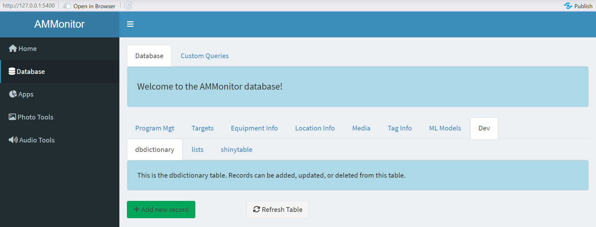

```{r setup, include=FALSE}
source('includes.R')
shiny::addResourcePath("figs", system.file("extdata/figs", package = "AMMonitor"))
```

## {width=100px} Recap of SQLite

Welcome. The focus of this tutorial will be the *dbdictionary*, *shinytable*, *lists*, and *listitems* tables of an *AMMonitor* database.

We begin this tutorial by simply recapping key elements of an *AMMonitor* database.  In the *AMMonitor* system, raw monitoring files such as recordings and photos are collected and stored either locally or in the cloud. All other data, including photo and recording metadata, are stored within a SQLite database. SQLite is a relational database, which is simply a collection of tables that are related in some way. Each table stores specific information, and specific columns in one table may be formally linked to other tables. Information stored in or across tables can be retrieved with *AMMonitor* functions or with a language called SQL, which stands for Structured Query Language. 

For this tutorial, as with all other tutorials, we used the `ammCreateMiniDemo()` function to create a small demo project named "demoAMM" that is pulled into the tutorial itself, with the file path stored as the R object, "demo_fp". This filepath is stored on your machine and can be found by running the following code:

```{r demofp}
demo_fp
```

As mentioned, the main *AMMonitor* project directory has 16 subdirectories that each serve an intended purpose.  Let's have a look, noting the directory named "database" will house our SQLite database.

```{r demofolders}
# look at the folders within an AMMonitor project
list.files(demo_fp, recursive = FALSE)
```

The demo project comes with a database file, as shown below:
```{r}
list.files(file.path(demo_fp, "database"))
```

As you can see, the demo database is named "demo.sqlite". 

To work with the database, we need to establish a connection with the `dbSetCon()` function, which requires a filepath to the database. Behind the scenes, this function uses the *RSQLite* [@RSQLite] package to establish a connection and the DBI package [@DBI] to enforce the key constraints.

```{r, echo = TRUE, eval = TRUE}
# create a connection object
conx <- dbSetCon(paste0(demo_fp, "/database/demo.sqlite"))

# show the connection
conx
```

Once connected, we can use several DBI functions to work with the database. For example the `dbListTables()` function will return a vector of alphabetized table names within a database.

```{r, listtables, exercise = TRUE}
# list the tables in the database
DBI::dbListTables(conx)
```

Look for the tables *dbdictionary*, *shinytable*, *lists*, and *listitems* now.

We can work with the database with R code as above, or through the *AMMonitor* shiny interface.  Let's look at the database through the Shiny lens now.

<p class=instructions>
Open a new session of R by going to Session | New Session (so that two instances of R are running on your machine). Then, run the following commands in the new session's console, which uses `ammCreateMiniDemo()` to create the mini demo AMMonitor project and `launchApp()` to launch the app.  
</p>

```{r, eval = FALSE}
# load AMMonitor
library(AMMonitor)

# create a demo AMMonitor project
demo_fp <- ammCreateMiniDemo(filepath = tempdir())

# launch the shiny application
launchApp(demo_fp)
```

Assume the role of the default user (sgamgee), and connect to the database.  

```{r shinyimage, eval = T, echo = F, fig.align='center', out.width = "100%", fig.cap = "*Figure 1a. Home screen of the AMMonitor Shiny app.*", out.extra='style="background-color: #999999; padding:5px; display: inline-block;"'}
knitr::include_graphics('www/shiny0.PNG')
```
 
Then, click on the Database option in the left menu. Here, you will see database tables arranged in different groupings (and populated with demo data).  Now poke around at will, noting that *dbdictionary*, *shinytable*, *lists*, and *listitems* tables are all nested in the "Dev" tab in the Shiny interface.

```{r shinyimage2, eval = T, echo = F, fig.align='center', out.width = "100%", fig.cap = "*Figure 1b. Database front-end of the AMMonitor Shiny app.*", out.extra='style="background-color: #999999; padding:5px; display: inline-block;"'}

```
 

> &#128073;&#127997;  Remember! When working with *AMMonitor*'s Shiny application, there is no need to set the connection *a priori*; the application will set the connection and enforce the foreign keys.

## SQLite schema

In the "database" tutorial, we used *DBI*'s `dbGetQuery()` to send SQL commands to retrieve detailed information about each column in a given table. For example, here we return information about the *visits* table **from the SQLite point of view**:

```{r pragmavisits, exercise = TRUE, eval = T}
# get info about the people table
DBI::dbGetQuery(
  conn = conx, 
  statement = "PRAGMA table_info(visits)"
)
```

In the statement argument, the word PRAGMA (from “pragmatic”) is a computer programming directive that tells SQLite how to process input. Here, we are telling SQLite to return information about the *visits* table.  The `dbGetQuery()` function returns a dataframe with critical information:

- **cid** => column id.  Here, we can see the *visits* table has `r ncol(visits)` columns.
- **name** => name of the column.  
- **type** => the type of data stored in the column. These data types are different from R’s datatypes (e.g., character, number, integer, logical) although there is a logical mapping. Because this is a SQLite database, the types designate SQLite datatypes, not R datatypes. Here, notice that columns have types of INTEGER, TEXT, VARCHAR(255), which means the columns store characters that are variable in length (up to 255 characters), and TEXT (>255 characters).  Although not used in the **visits** table, REAL is another common datatype in *AMMonitor* tables (storing decimals).
- **notnull** =>  The field notnull indicates whether an entry is required for each column or not (1 = required; 0 = not required). The primary key column is always required, even if its notnull setting is 0.
- **dflt_value** => The field dflt_value provides the default value for each column, if specified.
- **pk** => The field pk identifies column(s) that make up the primary key. Every table must have a primary key, overriding the "notnull" value. Here, the column **pk_visitid** is the table's primary key.

We can retrieve the foreign key constraints for any given table.  For example, the code below will display foreign key relationships in the *visits* table.  

```{r pragmafk, exercise = TRUE, eval = T}
# return foreign key information for the visits table
DBI::dbGetQuery(
  conn = conx, 
  statement = "PRAGMA foreign_key_list(visits);"
)

```

The query returns a dataframe with 4 rows, indicating that the visits table has 4 foreign keys. You may need to scroll to see this table fully.  As one example, the column **fk_personID** in the *visits* table maps to the column **pk_personid** in the *people* table.  The returned dataframe also shows the **on_update** and **on_delete** database rules, which specify how changes to a primary key trickle down through other tables.

> &#128073;&#127998; This information is also stored in the database table *dbdictionary*.  This table provides column information for each and every table in the database.  The dictionary is vital because it provides the "metadata" for the *AMMonitor* database, and it also controls how the database is rendered in Shiny.  

## The dbdictionary table

The *dbdictionary* table is central to *AMMonitor* performance. Each row of the *dbdictionary* table defines and describes a column of the *AMMonitor* database, providing information on each and every table. To introduce this table, let's look at the dictionary associated with the *visits* table only.

```{r}
DBI::dbGetQuery(
  conn = conx, 
  statement = "SELECT * FROM dbdictionary
    WHERE pk_tablename = 'visits';"
)

```

Scrolling will be necessary to see all of the *dbdictionary* columns.

The results indicate that the *dbdictionary* table has 9 columns (confirming what the PRAGMA call returned), and these columns collectively define the structure of the database, how fields should be rendered in Shiny, and limits on acceptable values.  

- The table name is given in the **pk_tablename** column, and the field (column) is given in the **pk_fieldname** column.  Both columns make up the table's primary key (i.e., the primary key is a composite key: to identify a unique record, both the table and column names must be provided to yield a unique record).  
- The field **core** indicates whether a particular column is an *AMMonitor* core column or not. 
- The **var_type**, **not_null_clause**, **pk**, **default_value**, **foreign_key_table**, **foreign_key_field**, **on_update**, and **on_delete** fields provide information used to create the database. These should all look familiar to you by now.
- The **min** and  **max** columns store the acceptable range of values for INTEGER or REAL fields.
- The **description** column provides a description of each column.

> &#128073;&#127998; The dictionary provides metadata for the entire SQLite database in a single table, providing documentation for the database as a whole.  


Let's explore a few more dictionary tables below. 

<p class=instructions>
Take some time now to select several tables from the dictionary, and gain some familiarity with the column names, variable types and descriptions.
</p>

```{r , echo = FALSE, dictionary_function}
dict_tables_unique <- unique(dictionary$pk_tablename)
  
selectInput("select_dict_table", label = h3("Select Table from the Dictionary"), 
  choices = dict_tables_unique, 
  selected = 'visits')

fluidRow(tableOutput('dic_table'))
    
```
  
```{r dictionary_function1, context = "server"}
output$dic_table <- renderTable(
  expr = {
    table_id <- input$select_dict_table
    dic_table <- subset(dictionary, pk_tablename == table_id, select = c(2,4,19))
    colnames(dic_table) <- c("Field Name", "Variable Type", "Description")
    dic_table},
  bordered = TRUE,
  striped = TRUE,
  hover = TRUE,
  width = "100%"
)

```

Other fields in the *dbdictionary* table include the **sort_order**, **shiny_input**, and **fk_listid**, which are introduced in future sections.

The field **sb_include** identifies whether a field in the table should be included in a public data release to ScienceBase. See the "sciencebase" tutorial for more information. 


> &#128073;&#127996;  Because of its central importance, it is crucial to keep the dictionary intact and up to date. Please see the section on database integrity, coming up soon.

## Lists and list items

An important field in the *dbdictionary* table is named **fk_listid**. If a table's field entries are restricted to a list, the name of the list is referenced here.  For example, in the *visits* table, there is a column named *visit_type*.  The dictionary tells us that this column stores characters, and further that the entries are restricted to list items that are stored in a list named "visit_type". 

This brings us to the *lists* and *listitems* tables, which are linked by the columns **pk_listid** and **fk_listid**, respectively.  Let's look at how these tables are structured:

```{r, eval = T}
# list the fields (columns) in the lists table 
DBI::dbGetQuery(
  conn = conx, 
  statement = "PRAGMA table_info(lists)"
)
```

The *lists* table simply stores the name of a list, its description, and whether it is an *AMMonitor* core list or not (1 = core; 0 = user defined list). 

A list contains list items, stored in the *listitems* table.


```{r, eval = T}
# list the fields (columns) in the listitems table 
DBI::dbGetQuery(
  conn = conx, 
  statement = "PRAGMA table_info(listitems)"
)

```

Here, notice that the primary key for this table is an INTEGER (an auto-number).  List items are linked to lists via the column **fk_listid**, and the **items**, **description**, and **sort_order** provide information about the actual items. 

<p class=instructions>
To see lists in action, have a look at the default *lists* and *listitems* tables by selecting a list name in the dropdown below. Start with the "visit_type" list. The *lists* table simply defines a list, while the *listitems* store the acceptable values of a given list. The item id's, names, and descriptions are shown below. 
</p>


```{r listitems_function, echo = FALSE}
listid_unique <- unique(listitems$fk_listid)
  
selectInput("select_listid", label = h3("Select List ID"), 
  choices = listid_unique, 
  selected = "visit_type")

fluidRow(tableOutput('items'))

```
  
```{r listitems_function1, context = "server"}
output$items <- renderTable(
  expr = {
  list_id <- input$select_listid
  items <- subset(listitems, fk_listid == list_id, select = c('pk_listitemid', 'item', 'description'))},
  # items <- subset(listitems, fk_listid == list_id, select = c(1:5))},
  bordered = TRUE,
  striped = TRUE,
  hover = TRUE,
  width = "100%"
)

```

Please look at the "visit_type" list and its corresponding items. The *dbdictionary* table indicates that entries into the field named **visit_type** are restricted to the items in the "visit_type" list. The elements in the list include "set", "check", "pull", or "sync".  We will describe this list in the "visits" tutorial.

> &#128073;&#127995; When a new visit is logged into the visits table, the visit_type can be "set", "check", "pull", or "sync".  The selected **item** is stored in the visits table, not the corresponding **pk_listitemid**.  For example, when making a visit to a monitoring site to set out equipment, the visit_type is logged as "set" rather than pk_listitem = 147.  This was a design choice made by the developers to help with readability; the keys are enforced in the database and by the Shiny application.

> &#128073;&#127997; Lists are quite flexible,  and you can add your own lists if desired.  However, don't delete the default lists or some *AMMonitor* functions may break.  We will be introducing specific lists in future tutorials. Our goal here is to give you the big picture.

Managing *lists* and *listitems* is fairly straight-forward in the *AMMonitor* Shiny application. Let's have a look.

<p class=instructions>
In your second R session, launch the Shiny app if not already launched. Then navigate to the "Dev" menu, and select lists.  See if you can add a new list of your choosing, along with some list items. 
</p>

```{r, eval = FALSE}
# create a demo AMMonitor project
demo_fp <- ammCreateMiniDemo(filepath = tempdir())

# launch the shiny application
launchApp(demo_fp)

```


## The shinytable table

In addition to the **fk_listid** field in the *dbdictionary* table, the  **sort_order** and **shiny_input** dictionary fields control the appearance of the database through *AMMonitor*'s shiny interface.

The short video explains how the *shinytable* table works.


## Database integrity 

If you are the database manager for your **AMMonitor** project, you will want to run three database check functions routinely to make sure invalid entries do not slip through the cracks. 

- `dbCheckup()` - This function checks the SQLite database table-by-table, column-by-column and ensures that the SQLite structure matches what is defined in the *dbdictionary* table.  It also checks for any foreign key violations.

- `dbCheckCore()` - This function checks the core columns in a database and compares them to the default *AMMonitor* database.  Never mess with core columns!

- `dbCheckData()` - Even if a database passes the first two tests, it is possible that errors still exist in the database, such as malformed dates and times, or insensible data entries such as 2021-02-31 as a date.  

Let's run these now on the demo database, noting that each function requires only an open connection to the database at minimum.

> &#128073;&#127995; We use the default function arguments here; please see the function's helpfiles for more details.

```{r checkup, exercise = TRUE}
# check the dbdictionary table against the SQLite schema
dbCheckup(conx)
```

The results show that there are no violations of any kind in the demo database.

```{r checkcore, exercise = TRUE}

# check the core columns against the AMMonitor default core columns
dbCheckCore(conx)
```

The results show there are no mismatches between the demo database's core columns and the *AMMonitor* default core columns.  

```{r checkdata, exercise = TRUE}

# check the data entries in various tables to snoop out potential issues
dbCheckData(conx)
```

The results show that there are no apparent data entry errors for the issues checked by the `dbCheckData()` function.

> &#128073;&#127996;Please see the helpfiles for these functions, which illustrate what the results will yield if problems are discovered.

As mentioned, it is well worth your time to run these functions routinely, even daily!  We have included a sample script that performs these checks, described in the "scripts" tutorial.


## Tutorial summary 

We have introduced several key tables in an *AMMonitor* database, specifically the *dbdictionary*, *lists*, *listitems*, and *shinytable* tables.  We also introduced a handful of integrity checking functions and explored the *AMMonitor* shiny database front-end. 

The last step in this tutorial is to delete the demo database to free up space on your machine.  Remember, this demo comes with the *AMMonitor* package, and each tutorial begins by copying it to your working directory so that you can play with it at will.  

```{r, eval = TRUE}
# disconnect from database
DBI::dbDisconnect(conx)

# delete the demo database
unlink(demo_fp)
```

Next, before getting into the nitty-gritty of each database table, we give you a bird's-eye view of the database and introduce the `dbGetSummaryData()` function as a means of summarizing the database with plots and tables. This big-picture will hopefully provide an appreciation of the kinds of outputs that can be provided from the database.

```{r , eval = FALSE}
learnr::run_tutorial(
  name = "dbsummary", 
  package = "AMMonitor"
)
```

Then, we begin our exploration of the various tables in the *AMMonitor* database. As people are arguably the most important resource for a successful monitoring program, we will look at the *people* table in depth, introducing a few new database principles along the way. 

```{r , eval = FALSE}
learnr::run_tutorial(
  name = "people", 
  package = "AMMonitor"
)
```

> &#128073;&#127997; A final FYI:  If you'd like a pdf of this document, use the browser "print" function (right-click, print) to print to pdf.  If you want to include quiz questions and R exercises, make sure to provide answers to them before printing.


## References


