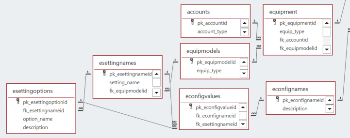
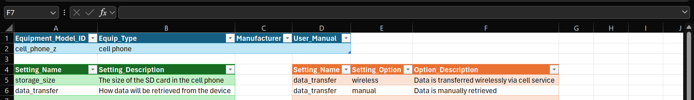
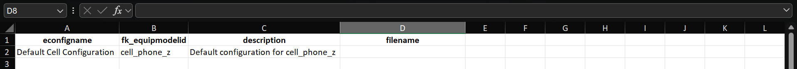
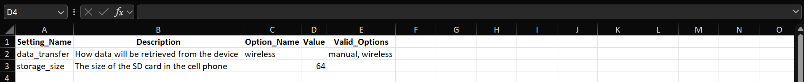
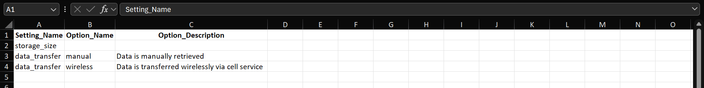
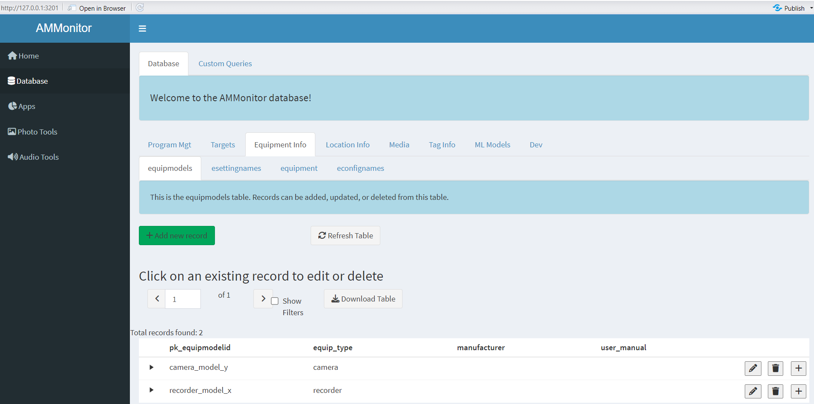

```{r setup, include=FALSE}
source('includes.R')
shiny::addResourcePath("figs", system.file("extdata/figs", package = "AMMonitor"))
```

## {width="100px"} AMMonitor equipment

In the *AMMonitor* system, raw monitoring files such as recordings and photos are collected by Autonomous Monitoring Units (AMUs). The practice of using AMUs such as trail cameras or audio recorders to monitor wildlife and other environmental characteristics has grown immensely in the past decade, with monitoring projects spanning species from birds, to bats, amphibians, insects, terrestrial mammals, phenology, and marine mammals.

This tutorial focuses on several tables in the *AMMonitor* database that are associated with monitoring equipment.

As with all other tutorials, we used the `ammCreateMiniDemo()` function to create a small demo project named "demoAMM" that is pulled into the tutorial itself, with the file path stored as the R object, "demo_fp". This filepath is stored on your machine and can be found by running the following code:

```{r demofp}
demo_fp
```

The database is already present in the demo project, as shown below:

```{r}
list.files(file.path(demo_fp, "database"))
```

As you can see, the demo database is named "demo.sqlite". Let's set the connection now:

```{r, echo = TRUE, eval = TRUE}
# set a database connection by pointing to the database filepath
conx <- dbSetCon(paste0(demo_fp, "/database/demo.sqlite"))

# look at the class of the connection object
class(conx)
```

Once a connection is made, you can use many functions from the *DBI* package [@DBI] or from *AMMonitor* to work with the database. For example, DBI's `dbListTables()` is used below to return an alphabetical listing of each table in the database

```{r}
# use DBI's dbListTables function to list all tables
DBI::dbListTables(conn = conx)
```

Seven of these tables are of interest for this tutorial:

1.  *equipment*
2.  *accounts*
3.  *equipmodels*
4.  *esettingnames*
5.  *esettingoptions*
6.  *econfignames*
7.  *econfigvalues*

The figure below shows the relationships among these seven tables. Recall that the primary key of each table is indicated by the tiny key symbol, and the lines between the tables identify the type of relationship. For example, one record in the *equipmodels* table may be associated with many records in the *equipment* table (the relationship shown is called a "one-to-many" relationship).

```{r locer2, eval = T, echo = F, fig.align='center', out.width = "100%", fig.cap = "*Figure 1. Database schema diagram showing relationships between AMMonitor database tables in the equipment grouping.*", out.extra='style="background-color: #999999; padding:5px; display: inline-block;"'}

```

The table *equipment* simply identifies each unit of monitoring equipment (a single camera/recorder) that may be used in the project. Units may be associated with an *account*, such as a google account. There are different makes and models of units, stored in the *equipmodels* table. This table includes variables such as the model name and manufacturer, and points to the user manual. Equipment models have settings that can be defined in the *esettingnames* table. Some of these settings may have a restricted list of options, stored in the *esettingoptions* table. The table *econfignames* allows users to create configurations by name, such as "Middle Earth Camera Settings", while the actual values are stored in the *econfigvalues* table.

> &#128073;&#127998; You may have noticed that both *equipment* and *econfignames* tables are connected to some other table that is not displayed. The connected table is the *visits* table, which will be introduced in the next tutorial. During a site visit, a person visits a site/location to deploy/maintain/retrieve a monitoring unit, and the configurations associated with the unit may be recorded.

## Equipment models

We'll start by showing the *equipmodels* and *esettingnames* tables, which are used infrequently but most likely when you first purchase monitoring devices. When you begin a monitoring program and decide on which audio recorders or trail cameras to use, information about those units are stored in these database tables. Let's have a look at the Middle Earth units.

```{r}
DBI::dbReadTable(conx, "equipmodels")
```

Here, we see that the Middle Earth team is using "recorder_model_x" for audio monitoring and "camera_model_y" for camera monitoring. These are the primary keys of the *equipmodels* table. The field **equip_type** is a dropdown stored in a list named "equip_type" (defined in the *lists* table, with acceptable options stored in the *listitems* table). There are placeholders for **manufacturer** and a link to the **user_manual** as well.

Both of these models have settings, which will be described and stored in the *esettingnames* table. Let's have a look at the settings for "recorder_model_x":

```{r}
DBI::dbGetQuery(
  con = conx, 
  statement = "SELECT * FROM esettingnames
    WHERE fk_equipmodelid = 'recorder_model_x';"
)

```

The *esettingname* table has 4 columns (**pk_esettingnameid**, the primary key and an auto-number), the **setting_name**, the **fk_equipmodelid** (which points to the **pk_equipmodelid** column in the *equipmodels* table), and a **description.** Here, you can see that "recorder_model_x" has 3 settings, with names "sample rate", "max recording length" and "gain".

If any setting has options that are restricted to a list, these options are stored in the *esettingoptions* table. Let's look at the options for the setting named "sample rate", which is **pk_esettingnameid** = 1.

```{r}
DBI::dbGetQuery(
  con = conx, 
  statement = "SELECT * FROM esettingoptions
    WHERE fk_esettingnameid = 1;"
)

```

Hopefully you can see that the setting named "sample rate" has 4 options: 8000Hz, 12000Hz, 16000Hz, and 24000Hz.

<p class="instructions">

Your turn. Enter code below to retrieve the settings associated with "camera_model_y", then look for acceptable setting entries for the setting named "illumination mode".

</p>

```{r, yourturn, exercise = TRUE}

```

```{r, yourturn-hint}
DBI::dbGetQuery(
  con = conx, 
  statement = "SELECT * FROM esettingnames
    WHERE fk_equipmodelid = 'camera_model_y';"
)

DBI::dbGetQuery(
  con = conx, 
  statement = "SELECT * FROM esettingoptions
    WHERE fk_esettingnameid = 6;"
)

```

> &#128073;&#127997; As we mentioned, these tables are typically used when new units are purchased. Taking time to log them into the database is useful because it allows you to use these entries to register "configurations", described in the next section.

## Equipment Configurations

Two additional tables make use of the tables described in the previous section: *econfignames* and *econfigvalues.* A configuration name simply identifies the name of a configuration, the equipment model it's associated with, its description, and, if applicable, a filepath to the file that stores the actual configurations. (Some monitoring units permit all configurations to be stored in a file such as a text file, which can be imported into a device to quickly apply the settings). Let's look at the econfignames table for the demo database:

```{r}
DBI::dbReadTable(conx, "econfignames")

```

Here, we see two configuration names: "default recorder settings" and "default camera settings", which serve as the primary keys for this table.

The actual configuration information is stored in the *econfigvalues* table. Let's have a look.

```{r econfigvalues, exercise = TRUE}
DBI::dbReadTable(conx, "econfigvalues")
```

This table is not reader-friendly: it stores foreign key values to *econfigname* table, and to other tables which are all numbers (e.g., **fk_esettingnameid**, **fk_esettingoptionid**).

For example, the "default recorder settings" associated **fk_esettingnameid** = 1 ("sample_rate") and **fk_esettingoption** = 4 ("24000Hz"). If a setting stores numeric values, those would be identified in the **value_num** column of the *econfigvalues* table.

```{r reqcols, echo=FALSE}
quiz(
  question("The number 1 is listed in the value_num column in the *econfigvalues* table displayed above. What setting does this refer to?",
    answer("sample rate"),
    answer("max recording length", correct = TRUE),
    answer("gain"),
    answer("image size"),
    answer("image format"),
    answer("illumination mode"),
    message = "This record is associated with the 'max recording length' setting in the 'default recorder settings' configuration.  The number 2 is the pk_esettingnameid in the esettingnames table. In this table, you can also find a description of the setting, where we learn that the units are maximum recording length in minutes.",
  incorrect = "Not quite!  &#128540;",
  allow_retry = TRUE
  )
)

```

> &#128073;&#127996; This table can be difficult to interpret. You can use the built-in queries to help show the results in a more readable format, coming up next.

> &#128073;&#127996; Note that configurations are not associated with any particular piece of equipment at this time. This association is made during a site visit, described in the "visits" tutorial.

## Built-in queries

*AMMonitor* comes with several built-in queries that may be of interest. To help find queries related to any of the equipment tables, use the `help.search()` function, and specify one of the equipment family table names as the "concept" argument, like this:

```{r qry, exercise = TRUE}
help.search(
  package = "AMMonitor", 
  pattern = "econfignames", 
  fields = "concept")
```

Once you find a potential query of interest, please read the helpfiles of the returned queries; running the examples will illustrate exactly what each query returns.

For example, the query `qryEconfiguration()` will return the setting names and values associated with a given configuration. Let's look at the configuration values for the "default recorder settings" configuration.

```{r, eval = T}
# get default recorder configuration settings
qryEconfiguration(
  con = conx, 
  econfigname = "default recorder settings", 
  disconnect = FALSE)
```

Here, you can see a more readable output of the "default recorder settings". This information is very useful for reporting purposes.

## Adding Equipment Models and Configurations

As mentioned previously, information about equipment models and their configurations are often recorded at the start of a project, but the associated tables can be challenging to interpret without some help. AMMonitor offers two ways to make adding equipment models and configurations easier. A small suite of functions help add all of the relevant information programmatically to the database, while the **EquipManager** app provides a graphic interface for adding, editing, or deleting equipment models, settings, and configurations.

### Adding equipment models programmatically

The first function for adding equipment models to a database programmatically, equipModelAdd(), uses an Excel spreadsheet to specify an equipment model, along with any relevant settings and setting options for that model. A template spreadsheet comes with AMMonitor and can be copied like so. For this example, we'll use a temporary directory with the demo.

<p class=instructions>
If you'd like to follow along with your own spreadsheet, you can open a new session of R by going to Session | New Session. Copy the code below to get a copy of the initial spreadsheet. You can follow along with future code blocks and screenshots to walk through the process alongside this tutorial.
</p>

```{r, eval = FALSE, echo = TRUE}

# Create a demo database
demo_fp <- ammCreateMiniDemo(filepath = tempdir())

# Get the file path to the spreadsheet on your machine
fp <- system.file("extdata/equipModelAdd.xlsx", package = "AMMonitor")

# Copy the spreadsheet to your demo directory
file.copy(from = fp, to = demo_fp, overwrite = FALSE)

```

Open the copied spreadsheet, which contains three color-coded tables. The first table, in blue, corresponds to the "equipmodels" table. In this case, let's say we're adding a cell phone to the Middle Earth monitoring program called "cell_phone_z". Fill in the first table with details; notice that the "Equip_Type" cell includes a dropdown of valid equipment types in AMMonitor.

The second table, in green, specifies setting names. For example, cell_phone_z may have different potential amounts of storage which we want to document. Additionally, data may be stored locally until the equipment is retrieved, or transmitted wireless when cell service is available. The storage size can simply be stored as a number, but for the data transfer setting, setting options would be more useful.

The third table, in orange, can be used to list setting options. The first column provides a drop down of setting names, to make sure that options correspond to a provided setting. In this case, an option can be created for wireless and manual data transfer, along with descriptions for each. Here's an example of a completed spreadsheet:

```{r , echo = F, fig.align='center', out.width = "100%", fig.cap = "An example completed equipModelAdd spreadsheet.", out.extra='style="background-color: #999999; padding:5px; width:90%; display: inline-block;"'}

```

Now, run the equipModelAdd() function to add the information in the spreadsheet to the database. This process will automatically update the equipmodels, esettingnames, and esetting options tables. The qryEquipModelSettings() query can also be used to see the relevant settings and options for an equipment model in an easily readable format.

```{r, eval = FALSE, echo = TRUE}

# Add the new equipment model to the database
equipModelAdd(
  con = conx,
  excel_fp = file.path(demo_fp, "equipModelAdd.xlsx"),
  disconnect = FALSE
)

# Check the new model settings
qryEquipModelSettings(
  con = conx,
  equipmodelid = "cell_phone_z",
  disconnect = FALSE
)

```

With a new equipment model added, we can also add a new equipment configuration. First, the equipConfigWriteXL() function can be used to produce an Excel spreadsheet tailored specifically to and equipment model in the database. In this case, let's create a configuration for the new cell_phone_z and output the resulting spreadsheet to our demo directory.

```{r, eval = FALSE, echo = TRUE}

# Create a spreadsheet for cell_phone_z
equipConfigWriteXL(
  con = conx,
  equipmodelid = "cell_phone_z",
  output_dir = demo_fp,
  disconnect = FALSE
)

```

The output spreadsheet will be named "equipAddConfig.xlsx" and includes three named sheets. The first sheet, "Configuration_Name", corresponds to the econfignames table of the database. Notice that the fk_equipmodelid is automatically filled in from the function; other fields should be filled in. To leave a field blank, simply leave a cell empty.

```{r , echo = F, fig.align='center', out.width = "100%", fig.cap = "An example completed Configuration_Name spreadsheet.", out.extra='style="background-color: #999999; padding:5px; width:90%; display: inline-block;"'}

```

The second sheet, "Configuration_Values", corresponds to the econfigvalues table of the database and references esettingnames and esettingoptions. 

```{r , echo = F, fig.align='center', out.width = "100%", fig.cap = "An example completed Configuration_Values spreadsheet.", out.extra='style="background-color: #999999; padding:5px; width:90%; display: inline-block;"'}

```

If you need more information on setting options, the final sheet, "Setting_Options", provides a description of all relevant setting options for the selected equipment model. This sheet doesn't need to be updated; it's provided for easy reference.

```{r , echo = F, fig.align='center', out.width = "100%", fig.cap = "An example Setting_Options spreadsheet.", out.extra='style="background-color: #999999; padding:5px; width:90%; display: inline-block;"'}

```

Once this spreadsheet is completed, the configuration can be added to the database using the equipAddConfig() function. To see the new configuration, use qryEconfiguration().

```{r, eval = FALSE, echo = TRUE}

# Add a new configuration
equipAddConfig(
  con = conx,
  excel_fp = file.path(demo_fp, "equipAddConfig.xlsx"),
  disconnect = FALSE
)

# Check the new configuration
qryEconfiguration(
  con = conx,
  econfigname = "Default Cell Configuration",
  disconnect = FALSE
)

```

The new equipment configuration has been successfully added to the database! This process allows for easy set up of new configuration and documentation of equipment settings throughout a remote monitoring project.

### Adding equipment models with **equipManager**

Adding models (and settings and configurations) programmatically can be convenient when you want to share that configuration with others, as it allows for the excel spreadsheet to be shared and imported easily to multiple databases. But for a more interactive, user-friendly interface to equipment models, users can launch the **equipManager** app. 

The first tab of the app, "Add Equipment Models", allows users to add new models and model settings. The left section of this tab, "Add New Equipment Models", allows the user to add a new model by selecting the model name, equipment type (camera, recorder, etc.), the manufacturer, and links to a user manual. The right section of this tab, "Model Settings", lets users add, edit, or delete setting options for the selected equipment model. The second tab of the app, "Add Configurations", allows users to select an equipment model and create/edit/delete configurations for that model. 

> &#128073;&#127996; The **equipManager** app shows labels rather than integer primary keys for various tables (e.g., esettingnames, esettingoptions, econfignames, and econfigvalues) to make the information in these tables more readable.

## The equipment table

Now that we've registered our 2 equipment models for Middle Earth, let's examine the *equipment* table itself. 

```{r}
DBI::dbReadTable(conx, "equipment")

```

Some scrolling may be necessary, but you should confirm that the Middle Earth team has registered 6 monitoring units: 3 recorders that are "recorder_model_x" and 3 cameras that are "camera_model_y". Have a look at the other columns in this table.

> &#128073;&#127997; The "unknownEquipment" entry is a default entry in the *equipment* table that comes with every *AMMonitor* database. Don't remove it.

The equipment table has 2 foreign keys (easily spotted by their column names, "fk_accountid" and "fk_equipmodelid"). Let's use a PRAGMA call to see how the SQLite database handles these relationships:

```{r, eval = TRUE}
# return foreign key information for the locations table
DBI::dbGetQuery(
  conn = conx, 
  statement = "PRAGMA foreign_key_list(equipment);"
)
```

As shown, the field **fk_equipmodelid** references the field **pk_equipmodelid** in the *equipmodels* table, and the field **fk_accountid** references the field **pk_accountid** in the *accounts* table. In both cases, the **on_update** setting is CASCADE and the **on_delete** setting is RESTRICT. This means that if the primary key is updated in either the *equipmodels* or the *accounts* tables, the change will trickle down to the *equipment* table. Further, deletions to these tables are restricted if the *equipment* table contains those entries. We'll introduce the *accounts* table in the next section.

Two other fields in the *equipment* table should be noted: **equip_type** and **equip_status.** Both fields have entries that are restricted to a list, as can be confirmed by looking at the dbdictionary table.

<p class="instructions">

Your turn. Enter code below to retrieve the *listitems* associated with "equip_type" and then "equip_status".

</p>

```{r dbdictionary, exercise = TRUE}

```

```{r dbdictionary-hint}
DBI::dbGetQuery(
  con = conx,
  statement = "SELECT * from listitems 
    WHERE fk_listid = 'equip_type';"
)

DBI::dbGetQuery(
  con = conx,
  statement = "SELECT * from listitems 
    WHERE fk_listid = 'equip_status';"
)
```

You may add to these lists if desired.

## The accounts table

The *accounts* table stores information about various accounts that you may use in your monitoring program. For example, if you use Google, OneDrive, or other external accounts such as the NOAA API introduced in the "temporals" tutorial, you may register those accounts here.

The demo database does not contain any entries for this table, but let's look at the columns:

```{r}
# get info about the locations table
DBI::dbGetQuery(conx, statement = "PRAGMA table_info(accounts)")
```

This table stores typical credentials for an account, with a mix of data types (VARCHAR, INTEGER, TEXT). The primary key is the column **pk_accountid**, which must be unique. The field **account_type** indicates the type of account (e.g., Google, Dropbox, OneDrive, NOAA, etc.), stored in the list named "account_type". Feel free to add to this list.

The field **primary_account** is binary and identifies whether an account is a primary account or not (where primary accounts have access to secondary accounts). We used this field in earlier versions of *AMMonitor* and it is retained here. The field **login** identifies the login name, if needed, while the field **notes** allows notes of any kind.

<p class="instructions">

Your turn. Insert a hypothetical record into the accounts table".

</p>

```{r addaccount, exercise = TRUE}
new_account <- data.frame(
  pk_accountid = "midEarthMgt",
  account_type = "google",
  primary_account = 1,
  login = "midEarth1@gmail.com",
  notes = "A google account for the Middle Earth monitoring program."
)

DBI::dbAppendTable(
  conn = conx,
  name = "accounts",
  value = new_account
)

DBI::dbReadTable(conx, name = "accounts")

```

> &#128073;&#127995; This table is largely for reference and is not used directly by *AMMonitor* functions. We don't recommend storing password credentials here.

## AMMonitor Shiny

We've been using R code to work with the various tables related to monitoring equipment. You can view these tables through the Shiny interface as well. It's best if you can see this in action.

<p class="instructions">
Open a new session of R by going to Session \| New Session (so that two instances of R are running on your machine). Then, run the following commands in the new session's console, which uses `ammCreateMiniDemo()` to create the lightweight demo AMMonitor project and `launchApp()` to launch the app.
</p>

```{r, eval = FALSE}
# load AMMonitor
library(AMMonitor)

# create a demo AMMonitor project in a temporary directory (to be deleted)
demo_fp <- ammCreateMiniDemo(filepath = tempdir())

# launch the Shiny application
launchApp(demo_fp)
```

Assume the role of the default user (sgamgee), and connect to the database.

```{r shinyimage, eval = T, echo = F, fig.align='center', out.width = "100%", fig.cap = "*Figure 2a. Upon launching the app, you are presented with the option to select a user and connect to the database.*", out.extra='style="background-color: #999999; padding:5px; display: inline-block;"'}
knitr::include_graphics('www/shiny0.PNG')
```

Then, click on the "Database" option in the left menu. Here, you will see database tables arranged in different groupings (and populated with demo data). Then click on the "Equipment Info" tab, which stores all of the tables related to equipment (except accounts, which is under "Program Mgt" tab).

```{r shinyimage2, eval = T, echo = F, fig.align='center', out.width = "100%", fig.cap = "*Figure 2b. The equipmodels table of the demo database.*", out.extra='style="background-color: #999999; padding:5px; display: inline-block;"'}

```

<p class="instructions">
Please poke around! Try adding a few models that you work with, along with a few settings and setting options.
</p>

## Tutorial summary

This chapter was a brief introduction to the seven tables associated with monitoring equipment. Of these tables, the *equipment* table is critical as the monitoring equipment is responsible for collecting the media files that are the focus of a remote monitoring project.

The last step in this tutorial is to disconnect from the database, and then delete the demo database to free up space on your machine.

```{r, eval = TRUE}
# disconnect from database
DBI::dbDisconnect(conx)

# delete the demo database
unlink(demo_fp, recursive = TRUE)
```

Once at a monitoring station, the next step is deploy monitoring equipment that captures audio or images of monitoring targets.

```{r , eval = FALSE}
learnr::run_tutorial(
  name = "visits", 
  package = "AMMonitor"
)
```

A list of other *AMMonitor* tutorials is shown below.

```{r , eval = T}
learnr::available_tutorials("AMMonitor")
```

> &#128073;&#127997; A final FYI: If you'd like a pdf of this document, use the browser "print" function (right-click, print) to print to pdf. If you want to include quiz questions and R exercises, make sure to provide answers to them before printing.

## References
