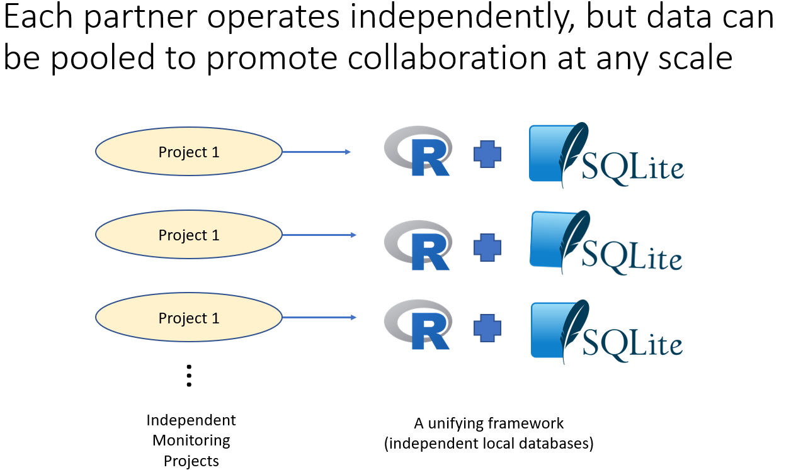

```{r setup, include=FALSE}
source('includes.R')
shiny::addResourcePath("figs", system.file("extdata/figs", package = "AMMonitor"))
```

## {width=100px} Introduction

In this tutorial, we overview the R package *AMMonitor* and provide guidance on getting started. *AMMonitor* is a multi-purpose monitoring platform that uses (1) Autonomous Monitoring Units (AMUs) to collect media files (e.g., photos or audio recordings) with either local or cloud-based media storage, (2) SQLite as a database engine for storing and tracking all other components of the monitoring effort, including media metadata, and (3) a suite of R-based functions for analysis of monitoring data (Figure 1).

```{r , eval = T, echo = F, fig.align = 'center', out.width = "70%", fig.cap = "*Figure 1.*", out.extra='style="background-color: #999999; padding:5px; display: inline-block;"'}
knitr::include_graphics('www/ecosystem.png')
```


Each research project that uses the *AMMonitor* approach maintains their own files and database (Figure 2). However, because all projects use the same database structure, the approach facilitates collaboration at unprecedented levels.  

```{r , eval = T, echo = F, fig.align = 'center', out.width = "80%", fig.cap = "*Figure 2.*", out.extra='style="background-color: #999999; padding:5px; display: inline-block;"'}

```

This tutorial will introduce you to the demo *AMMonitor* project that comes with the package, and will further show you how to set up a new *AMMonitor* project on your machine.

##  AMMonitor package overview

To work with *AMMonitor*, begin by loading the package:

```{r, eval = FALSE}
library(AMMonitor)
```

The package overview and function index page can be accessed with the following code:

```{r ammhelp, eval = FALSE}
# View package overview
help("AMMonitor")

# View function index page
help(package = "AMMonitor")
```

*AMMonitor* depends on R version 3.3 or greater. The following packages are installed when *AMMonitor* is installed and are attached when *AMMonitor* is loaded for use:

- *monitoR* [@monitoR] - our first monitoring R package, focused on acoustic monitoring with template matching algorithms.

*AMMonitor* also installs several other R packages, as it makes liberal use of their functions.  These include: 

- *Microsoft365R* [@365] and *googledrive* [@googledrive] - packages for working with cloud-based media files.
- *RSQLite* [@RSQLite] and *DBI* [@DBI] - connects *R* to a SQLite database and permits working with the database via SQL (Structured Query Language). 
- *tuneR* [@tuneR] and *seewave* [@seewave] - packages dedicated to acoustic data processing.
- *shiny* [@shiny], *shinydashboard* [@shinydashboard],  *shinyjs* [@shinyjs], and *reactable* [@reactable] - packages that drive the user-friendly shiny app for interacting with the *AMMonitor* database and running functions.
- *data.table* [@datatable] - enables rapid sorting and manipulation of large tables.
- *caret* [@caret] - provides a variety of machine learning functions for identifying monitoring targets.
- *ggplot2* [@ggplot2], *maps* [@maps], and *gt* [@gt] - primary packages used for generating graphs and tables.
- *ritis* [@ritis] - package that bridges R with the Information Taxonomic Information system at itis.gov


These packages should be automatically installed when you install *AMMonitor.* If not, use the `install.packages()` function to install them manually.

Other packages are "suggested"; they are used by *AMMonitor* in specific conditions and include *learnr* [@learnr], and *soundecology* [@soundecology].  If these packages are not installed, you will be prompted to install them.  

*AMMonitor* contains many functions that will be introduced across different tutorials. Below, the `ls()` function used to display the exported functions and datasets that come with the package:

```{r lsfunction, exercise = TRUE}
# List the functions in AMMonitor
ls("package:AMMonitor")
```

The functions of interest for this tutorial are the `ammCreateDirectories()` and `ammCreateMiniDemo()` functions, which we'll introduce next.

## AMMonitor mini-demo

The best way to introduce you to *AMMonitor* is to walk you through a small sample project.  The function `ammCreateMiniDemo()` creates this sample project and returns the filepath to that directory.  

```{r  eval = FALSE}
# create a demo AMMonitor project in a temporary directory (to be deleted)
demo_fp <- ammCreateMiniDemo(filepath = tempdir())

# look at the returned filepath
demo_fp
```

Let's have a look at the demo project now so you can see where we're headed:


>  &#128073;&#127996;  All tutorials make use of the `ammCreateMiniDemo()` function to create a small demo project named "demoAMM" that is pulled into the tutorial itself. The filepath to this project folder is stored on your machine and can be found by running the following code:

```{r demofp, exercise = TRUE}
demo_fp
```


## Recapping into the demo

Let's recap the demo now.  Here, our intention is to provide a bird's-eye view of an *AMMonitor*  project; we will dive into details in separate tutorials. 

Let's start by reviewing the main directory layout of an *AMMonitor* project. 


```{r demofolders, exercise = TRUE}
# look at the folders within an AMMonitor project
list.files(demo_fp, recursive = FALSE)
```


### The ammls directory

The directory named **ammls** stores *AMModel* libraries.  The code below shows that the demo project comes with one model library named "templates.RDS".

```{r}
# look at the sample ammodels library that stores templates in the amml directory
list.files(file.path(demo_fp, "ammls"), recursive = FALSE)
```

*AMModels* is an R package that can be used to store models of any kind [@AMModels]. Generally speaking, a “model” can be something like a machine learning model  dedicated to searching for target wildlife species captured in media.  But models can also be ecological models, such as an occupancy model that inputs both machine-learning tags and human tags, and provides estimates of status and trend for a species of interest.  An *AMModel* library (abbreviated "amml") stores a collection of models as a single R object (the “model library”) that can be saved as an .RDS file, thus allowing models to be retrieved for future use.  Models stored in an *AMModels* library retain their original R class, can be associated with metadata, and can be easily saved and retrieved when needed.  Please see the "ammodels" tutorial for more detail.

### The database directory

The directory named **database** stores the SQLite database, which is a file on your machine.  The demo SQLite database is named "demo.sqlite", as shown with the following code.

```{r}
# look at the sample database in the database directory
list.files(file.path(demo_fp, "database"))
```

To access the database, we connect to it with the `dbSetCon()` function. Once the connection has been set, we can pass it to a variety of functions to explore the database. For example, the `dbListTables()` function from the package *DBI* will list the tables in an *AMMonitor* database.

```{r, firstcon, exercise=TRUE}
# to work with the database, set a connection
con <- dbSetCon(file.path(demo_fp, "database", "demo.sqlite"))

# list the tables in the AMMonitor database
DBI::dbListTables(con)
```


The *AMMonitor* SQLite database does the heavy lifting in terms of data management, tracking people, equipment, metadata about monitoring media files (e.g., wav, jpg, avi), human-tags, and machine-tags. 

>  &#128073;&#127998; The database stores "metadata" about each media file collected from a monitoring effort.  The raw media files are not stored in the database directly.  

As mentioned, a SQLite database is stored as a single file on your machine, just like a document or spreadsheet file.  From www.sqlite.org:  "SQLite is a C-language library that implements a small, fast, self-contained, high-reliability, full-featured, SQL database engine. SQLite is the most used database engine in the world. . . . The SQLite file format is stable, cross-platform, and backwards compatible and the developers pledge to keep it that way through the year 2050."  Please see the "database" tutorial for more information. 

### The logs and logs_drop directories

The **logs** and **logs_drop** folders store raw log files that provide information about a monitoring unit or an analysis.  The **logs_drop** stores incoming log files to be processed, while the **logs** directory stores logs that have been registered in the *AMMonitor* database.  We will discuss equipment and model logs in the "equipment" and "models" tutorials.

### The media directories

The media directories within an AMMonitor project include the **photos**, **recordings**, and **videos** directories, along with their companion **drop** directories.  The directories store files captured by AMU devices, such as jpg, avi, or wav files.  For example, the code below shows the media files that come with the *AMMonitor* demo project.

```{r}
# look at the sample photos in the photos directory
list.files(file.path(demo_fp, "photos"))

# look at the sample recordings in the recordings directory
list.files(file.path(demo_fp, "recordings"))
```

As stated, for each kind of media there are two folders. The "drop" directories hold files that have not yet been registered in the database. (Recall the database stores only the metadata about each media file).  R functions are used to register the files in the "drop" folders to the database, and move them to their corresponding media folders.  Once registered, the database is aware of the existence of the files and knows how to access them.  

The demo project stores raw media files directly within the *AMMonitor* project. However, in addition to local storage, *AMMonitor* also supports media storage on an external drive or in cloud based repositories (Google Drive, SharePoint, or AWS S3). Please see the "media" tutorial for more information.
  
### Other "drop" directories

The **tags_drop** stores mini-databases that contain new tags made by volunteers that can be imported into the database by the database manager. Please see the "dbdistributed" tutorial for more information.
  
The **ml_drop** stores mini-databases that contain new machine learning outputs that can be imported into the database by the database manager. Please see the "models" tutorial for more information.
  
### The mobile_apps directory

The **mobile_apps** directory stores files that can be used to create or edit a mobile app (e.g., cell phone app) that can be used to standardize data collection in the field (site visits).  The demo project contains an example of a Survey123 Excel sheet that can be used to create an ESRI Survey123 mobile app for collecting information about site visits.

```{r}
# look at the sample mobile apps in the mobile_apps directory
list.files(file.path(demo_fp, "mobile_apps"))
```

Please see the "mobile_apps" tutorial for more information.

### The scripts directory

The **scripts** directory stores user-crafted R, Rmd, or Qmd documents that can be sourced each day to automatically process new data or run analyses.

The demo project comes with two sample scripts, named "dbCheckAll.R" and "annualReport.qmd".

```{r}
# look at the sample scripts in the scripts directory
list.files(file.path(demo_fp, "scripts"))
```

Scripts will be introduced in the "scripts" tutorial.

### The settings directory

The **settings** directory stores text files that contain information needed to access cloud-based accounts via API calls from R, or to set default values. The demo project comes with a handful of settings, and will be introduced in other tutorials where appropriate.  

```{r}
# look at the sample settings in the settings directory
list.files(file.path(demo_fp, "settings"))
```


### The spatials directory

The **spatials** directory can be used to store spatial layers associated with locations in a monitoring program (rasters and/or shapefiles) as RDS files.  For more information about working with spatial layers in R, please refer to the "locations" tutorial.

>  &#128073;&#127995; We will describe each directory in detail as they become relevant in the *AMMonitor* workflow. For example, in the next chapter, we introduce users to the *AMMonitor* database, where we will create a SQLite database and store it in the database directory.

## Setting up your AMMonitor project

*AMMonitor* is a multi-purpose monitoring platform, and the functions within it rely on a specific directory structure that we assume all users will implement.  The function `ammCreateDirectories()` is the first function users will run to set up a monitoring program with *AMMonitor*.


```{r help1, eval = FALSE, exercise  = TRUE}
help(topic = "ammCreateDirectories", package = "AMMonitor")
```

This function will create the required *AMMonitor* directory structure on your machine.  The function has two main arguments:

1. **amm_dirname** = The name of the *AMMonitor* project directory 
2. **filepath** = The file path to the parent directory that will house the new project


The function will create an *AMMonitor* project folder within the specified parent directory.  Further, it will create 16 subdirectories, each of which stores specific elements of the *AMMonitor* framework.  For example, the following code will create an *AMMonitor* project called "myProject" within R's working directory:


```{r, eval = FALSE}
# Create the AMMonitor directory structure
my_filepath <- ammCreateDirectories(
  amm_dirname = "myProject", 
  filepath = getwd()
)
```

Here, we've captured the filepath to the project as an R object named "my_filepath".

The next step is to create the SQLite database for your project, which is described in the "database" tutorial.


>  &#128073;&#127998; When you are ready to set up a "real" *AMMonitor* project, we highly recommend that you associate a new RStudio project (folder) that is your project's home base.  Once there, open R and ensure this folder is your working directory.  


## The Shiny app

It's time to explore the demo.

<p class = "instructions">
For this last section, open a new session of R by going to Session | New Session (so that two instances of R are running on your machine). Then, run the following commands in the new session's console, which will show the `ammCreateMiniDemo()` function in action.  Capture the file path for this *AMMonitor* project as "demo_fp".  List the folders within this new demo project and re-confirm the general layout of an AMMonitor project. Finally, run the `launchApp()` function by pointing to the "demo_fp", which will open the Shiny app and allow you to poke around a bit. </p> 

```{r, eval = FALSE}
# load AMMonitor
library(AMMonitor)

# create a demo AMMonitor project in a temporary directory(to be deleted)
demo_fp <- ammCreateMiniDemo(filepath = tempdir())

# look at the returned filepath
demo_fp

# look at the folders within an AMMonitor project
list.files(demo_fp, recursive = FALSE)

# launch the Shiny application
launchApp(demo_fp)
```

We will review the Shiny app in other tutorials, but for now click on the Database option in the left menu. The database is one of the main elements of the *AMMonitor* ecosystem, and we will take a deeper dive into databases in the next tutorial, where you will learn how to create your own SQLite database.

## Tutorial summary

At this point, you have have seen what an *AMMonitor* project looks like and hopefully a general understanding of what *AMMonitor* is.  We will be working with the demo project in future tutorials and walking you through the various tools that *AMMonitor* offers.  

The next tutorial is the "database" tutorial.
 

```{r , eval = FALSE}
learnr::run_tutorial(
  name = "database", 
  package = "AMMonitor"
)
```


> &#128073;&#127997; A final FYI:  If you'd like a pdf of this document, use the browser "print" function (right-click, print) to print to pdf.  If you want to include quiz questions and R exercises, make sure to provide answers to them before printing.


## References

