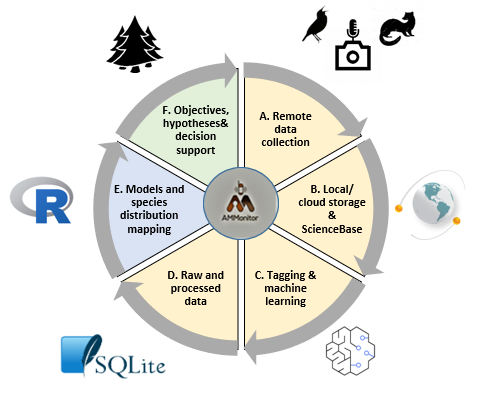

```{r setup, include=FALSE}
source('includes.R')
shiny::addResourcePath("figs", system.file("extdata/figs", package = "AMMonitor"))
```

## {width=100px} Welcome

Amid climate change and rapidly shifting land uses, effective methods for monitoring wildlife are critical to support scientifically-informed resource management decisions. As such, monitoring is motivated by ecological hypotheses or natural resource management objectives. The practice of using Autonomous Monitoring Units (AMUs) such as trail cameras or audio recorders to monitor wildlife species has grown immensely in the past decade, with monitoring projects spanning species from birds, to bats, amphibians, insects, terrestrial mammals, and marine mammals.

AMUs can be deployed for long periods of time to collect massive amounts of audio and photographic data. However, the data management requirements can be immense, leaving researchers buried under terabytes of data. A monitoring program is a collection of people, equipment, monitoring locations, location characteristics, research objectives, and data files, with multiple moving parts to manage. Without a comprehensive framework for efficiently moving from raw data collection to results and analysis, monitoring programs are limited in their capacity to characterize ecological processes and inform management decisions in a timely manner.

**AMMonitor** stands for "monitoring for adaptive management" and is an R package of the same name. It is an analysis ecosystem (R + SQLite + media storage) that seamlessly incorporates wildlife monitoring data, species distribution modeling, and decision tools.  The analysis ecosystem is characterized by:

1.	Continuous stream of data collection on a variety of wildlife taxa.  Autonomous monitoring units (AMUs) such as trail cameras or audio recorders allow the remote capture of digital files that form the backbone of wildlife monitoring.  AMUs can be deployed at small or large scales, over short or long-time frames, and are inexpensive relative to human-based surveys.

2.	Standardized yet flexible data and metadata infrastructure.  Because many terabytes of monitoring data are collected by AMUs, the data management requirements of an AMU-based monitoring effort are immense.  A standardized data infrastructure is critical to store files with strict metadata standards that can be easily incorporated into open access repositories. 

3.	Rapid analysis.  Vast quantities of AMU data may be collected in a short amount of time, rendering manual inspection of files for target wildlife species impractical.  Accordingly, machine learning (ML) algorithms can be used to automatically detect wildlife species in recordings and photos, avoiding the time-consuming task of manual annotation. ML outputs can be seamlessly incorporated into species distribution models and updated as new data are collected via continuous monitoring. 

Each *AMMonitor* project utilizes the same approach, keyed to Figure 1:

```{r bookpng, eval = T, echo = F, fig.align='center', out.width = "90%", fig.cap = "*Figure 1. The adaptive management cycle employed by AMMonitor.*", out.extra='style="background-color: #999999; padding:10px; display: inline-block;"'}

```


(A) Wildlife data are collected by AMUs such as trail cameras and audio recorders to monitor mammals, birds, insects, amphibians, and bats;  

(B) R functions upload media files to a local machine or to the cloud, with an option of permanent archiving in the USGS ScienceBase repository; 

(C) Media files can be tagged by humans and/or analyzed with machine learning models that automate the species detection process (e.g., there is a 0.65 probability that a white-tailed deer is in this image or a 0.8 probability that this audio signal was issued by a Black-capped Chickadee); 

(D) Raw and post-processed data are maintained in the project’s SQLite database; 

(E) R functions and scripts permit rapid, reproducible analyses of species distribution models and resulting maps, regularly updated along with metadata as new data are analyzed;  

(F) These products can be the building blocks of a decision support tool, continually updated as knowledge evolves, enabling decisions to be made with the most current information.  

We created the first iteration of *AMMonitor* (Balantic and Donovan 2020, 2021) for the Bureau of Land Management to monitor high priority wildlife across the southern California Solar Energy Zone (SEZ), including the Couch’s Spadefoot (*Scaphiopus couchii*), kit fox (*Vuples macrotis*), and a variety of bird species, such as the Verdin (*Auriparus flaviceps*) and Black-tailed Gnatcatcher (*Polioptila melanura*). In developing *AMMonitor*, our primary goal was to create a system for handling and processing massive amounts of data to allow BLM to quickly ascertain species distribution patterns (e.g., an occupancy analysis) in relation to their management objectives.

The second iteration of *AMMonitor* significantly expands on the first (Clarfeld, Tang, Huber, Balantic, and Donovan).  Primary developments include:

- A user-friendly interface for running analyses and working with data via R Shiny;
- Built-out methods for wildlife monitoring with trail cameras;
- A friendly R Shiny image and audio tagger, allowing humans to label data captured within media files;
- Support for a variety of cloud-based storage options for storing media files;
- Updated R functions that streamline data analysis;
- Improved ability to develop template-based audio machine-learning models;
- Ability to incorporate existing machine learning models, such as Microsoft's MegaDetector or Cornell Lab of Ornithology's BirdNET;
- Ability to collaborate directly with the USGS AMBER Network (Alliance for Monitoring Biodiversity and Ecosystems Remotely) using cloud-based resources for rapid analysis (requires a data-sharing agreement and fee structure);
- A function that converts an *AMMonitor* 1.0 database to an *AMMonitor* 2.0 database.
- A suite of *learnr* tutorials that introduce users to the *AMMonitor* 2.0 software and approach.  You are reading the first tutorial now.  

## List of tutorials

Below is a list of current tutorials, listed in the recommended order of execution:


```{r availtuts, warning = FALSE, eval = FALSE, echo = TRUE}
learnr::available_tutorials(
  package = "AMMonitor"
)
```

```{r availtuts1, warning = FALSE, eval = T, echo = FALSE}
tuts <- learnr::available_tutorials(
  package = "AMMonitor"
) 

tuts1 <- tuts[order(tuts$title),]
rownames(tuts1) <- NULL
tuts1


```


To run any given tutorial, look for the tutorial in the "Tutorial" tab in RStudio, or launch it directly with code. The following code will launch the tutorial that describes how to get started with an *AMMonitor* project:

```{r runsoftware, eval = FALSE}
learnr::run_tutorial(
  name = "getting_started", 
  package = "AMMonitor"
)
```


## How to use *learnr* tutorials

All tutorials were written with the R package, *learnr*. You're looking at Tutorial # 1, which simply gives an overview of what a tutorial is and what you may be asked to do. This tutorial should have launched in your browser.  

Each tutorial is divided into topics, which can be seen in the left menu.  As you work though the topics, your progression is saved.  This means you can close out when needed and pick up where you left off at a later time.  The _very small_ "Start Over" button at the bottom of the left menu will sweep clean any progress so you can start afresh if needed.  

Tutorials consist of  written content (like you're reading now) and R examples, but may also include short videos, interactive R coding and demos, and quizzes.  


## Tutorial formatting

Tutorials are designed to be informative and engaging.  If we want to highlight a key concept, we will include a large yellow box, like this: 

> &#128073;&#127996; Hey! This is important!


If we want to show you how to do something in R, you should see a green colored "code chunk" that illustrates something, like this:

```{r}
# add 1 + 1
1 + 1
```

The inputs into R are shaded green, and typically include a short comment that starts with a hashtag (e.g., # add 1 + 1).  Comments are not executed by R; they are notes to the programmer (you!).  The outputs are identified by the double hashtag symbol enclosed in a gray or white box as shown above.  Some output (e.g., tables) may be formatted to make them easier to read, thereby omitting the gray box.

If you'd like to follow along in R, you can copy this code and paste it into your R console and execute it.   

> &#128073;&#127995; However, when a *learnr* tutorial is active, your R console cannot be accessed because it is "busy" with the tutorial.  Instead of coding in the R console, coding is done directly in the tutorial, as you'll see in  a few seconds.

Tutorials are designed to give you hands-on practice. Exercises are identified with instructions provided in a steel blue box, like this:

<p class=instructions>
Enter the equation 1 + 1 in the box below, and execute it by pressing the "Run Code" button.
</p>


```{r pr1, exercise = TRUE}

```

```{r pr1-hint}
1 + 1
```

Hints may or may not be included, so make sure to look for them!  Press the "Hint" button to see the hint.

Quizzes may include short answers or multiple choice questions, like this one provided by the authors of the *learnr* package:

```{r letter-a, echo=FALSE}
quiz(
  question("What number is the letter A in the English alphabet?",
    answer("8"),
    answer("14"),
    answer("1", correct = TRUE),
    answer("23")
  ),
  question("Where are you right now? (select ALL that apply)",
    answer("Planet Earth", correct = TRUE),
    answer("Pluto"),
    answer("At a computing device", correct = TRUE),
    answer("In the Milky Way", correct = TRUE),
    incorrect = "Incorrect. You're on Earth, in the Milky Way, at a computer."
  )
)
```

Your answers are saved in the tutorial itself (unless you press the Start Over button in the left menu, which will erase any previous work).  

Tutorials may include interactive components that are created with R Shiny widgets, like this one showing the waiting time between eruptions for the Old Faithful geyser in Yellowstone National Park, Wyoming, USA.

<p class=instructions>
Use the slider to change the number of grouping "bins" in the histogram below:
</p>

```{r, echo = FALSE}
sliderInput(inputId = "bins",
                  label = "Number of bins:",
                  min = 1,
                  max = 50,
                  value = 30)
plotOutput(outputId = "distPlot")
```

```{r, context = "server"}
output$distPlot <- renderPlot({

    x    <- faithful$waiting
    bins <- seq(min(x), max(x), length.out = input$bins + 1)

    hist(x, breaks = bins, col = "#75AADB", border = "white",
         xlab = "Waiting time to next eruption (in mins)",
         main = "Histogram of waiting times")

    })
```

With Shiny tutorial inputs,  R receives "user-inputs" from sliders, buttons, drop-downs, etc., and produces an output such as this histogram of waiting times.  

## Tutorial summary 

You're finished!  Hopefully you now know what a tutorial is, and roughly how tutorials are laid out.  The *AMMonitor* tutorials are intended to be worked through in order.  The next tutorial gives an overview of the *AMMonitor* framework.

```{r , eval = FALSE}
learnr::run_tutorial(
  name = "getting_started", 
  package = "AMMonitor"
)
```


> &#128073;&#127997; A final FYI:  If you'd like a pdf of this document, use the browser "print" function (right-click, print) to print to pdf.  If you want to include quiz questions and R exercises, make sure to provide answers to them before printing.


## References

Balantic, C., and T. Donovan.  2020. AMMonitor: Remote Monitoring of Biodiversity in an Adaptive Framework with R. Methods in Ecology and Evolution 11: 869–77. https://doi.org/10.1111/2041-210X.13397.

Balantic, C., and T. Donovan.  2021.  AMMonitor: Remote monitoring of biodiversity in an adaptive framework. Version 1.0.0: U.S. Geological Survey software release. Reston, VA. https://doi.org/10.5066/P9669095 


