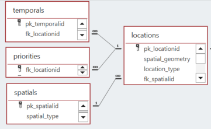
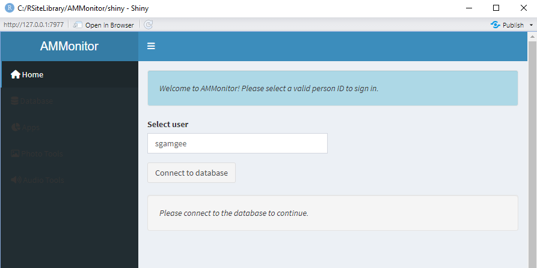
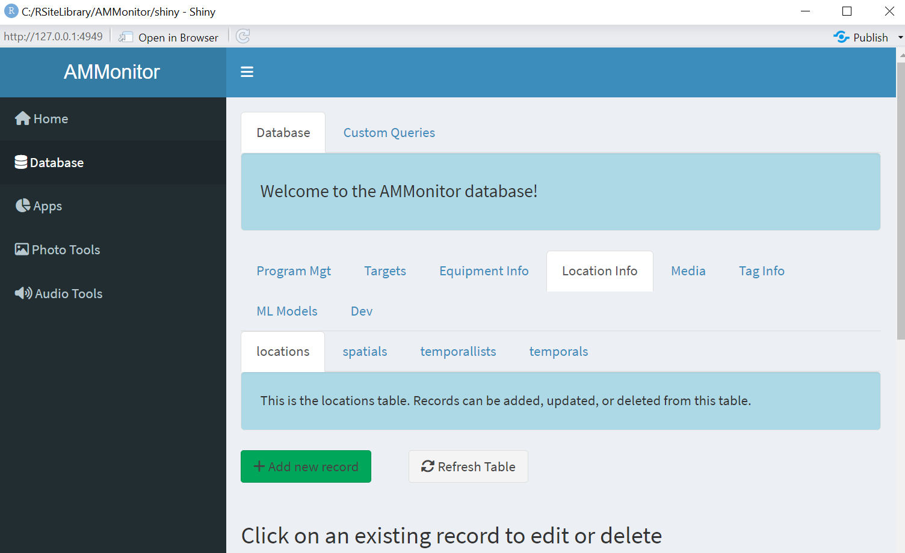

```{r setup, include=FALSE}
source('includes.R')
shiny::addResourcePath("figs", system.file("extdata/figs", package = "AMMonitor"))
```

## {width=100px} AMMonitor locations

In this tutorial, we will introduce the *locations* and *spatials* tables within an *AMMonitor* database.  

As with all other tutorials, we used the `ammCreateMiniDemo()` function to create a small demo project named "demoAMM" that is pulled into the tutorial itself, with the file path stored as the R object, "demo_fp". This filepath is stored on your machine and can be found by running the following code:

```{r demofp}
demo_fp
```

The database is already present in the demo project, as shown below:
```{r}
list.files(file.path(demo_fp, "database"))
```

As you can see, the demo database is named "demo.sqlite". Let's connect to the database with the `dbSetCon()` function, which creates the connection *and enforces foreign keys*.  Here, our connnection is named "conx". 

```{r, echo = TRUE, eval = TRUE}
# set a database connection by pointing to the database filepath
conx <- dbSetCon(paste0(demo_fp, "/database/demo.sqlite"))
```

Once a connection is made, you can use many functions from the *DBI* package [@DBI] or from *AMMonitor* to work with the database.  For example, DBI's  `dbListTables()` is used below, where the connection named "conx" is passed in as an argument to the `dbListTables()` function.  

```{r}
# use DBI's dbListTables function to list all tables
DBI::dbListTables(conn = conx)
```

Here, you can see an alphabetical listing of each table in the database. Generally speaking, four tables make up the "locations grouping" in an *AMMonitor* database, and are highlighted below.  The figure shows a portion of the SQLite "schema" that depicts how tables are connected to each other, where each table is represented as a box with column names displayed inside.  The primary keys of each table can be identified by looking for the tiny "key" symbol next to the column name.  As you can hopefully see, the *locations* table is connected to three other tables (and to the *visits* table, which is not shown).


```{r locer2, eval = T, echo = F, fig.align='center', out.width = "100%", fig.cap = "*Figure 1. Database schema diagram showing relationships between AMMonitor database tables in the locations grouping.*", out.extra='style="background-color: #999999; padding:5px; display: inline-block;"'}

```


This tutorial introduces two key tables of an *AMMonitor* database: *locations* and *spatials*.  The *locations* table stores the XY coordinates and description of a location, but it can also store information about areas (such as study sites and study areas).  The *spatials* table stores metadata about raster and shapefiles that are central for analysis of monitoring data and reporting.  These files, in turn, should be stored in the "spatials" folder within the main  *AMMonitor* project directory. In a follow-up tutorial, we will describe the *temporals* table and illustrate how you can add weather stations as locations and scrape weather data from NOAA.  The *priorities* table will also be described in a separate tutorial.


## Key terms

Before we describe the *locations* and *spatials* tables, let's take a moment to define a few key terms that will be used in the tables.

- **Datum**.  As you know, the Earth is not a perfect sphere, but we can model it as an ellipsoid.  A **datum** is a 3D model of the shape of the earth.  WGS_1984 is an example of a datum.

- **CRS**.  As noted by the [rspatial.org](https://rspatial.org/) authors, "a location of (140, 12) is not meaningful if you do know where the origin is (0,0) and if the x-coordinate is 140 meters, kilometers, or perhaps degrees away from it (in the x direction)." CRS stands for "Coordinate Reference System", defined in Wikipedia as " . . a coordinate-based local, regional or global system used to locate geographical entities."  Latitude and longitude are example of coordinates, but their CRS must also include the datum upon which they are layered.  Another popular CRS is "UTM", which stands for [Universal Transverse Mercator coordinate system](https://en.wikipedia.org/wiki/Universal_Transverse_Mercator_coordinate_system).  

     The website https://epsg.io/ lists coordinate systems around the world, where the site states: "EPSG.io (https://epsg.io/) simplifies discovery of coordinate reference systems utilized all over the world for creating maps and geodata and for identifying geo-position. It is a practical tool for anybody interested in cartography and digital map making, who needs to know exact latitude and longitude values for numerical coordinates in different spatial reference systems."

- **Projection**.  Projection is a mathematical process by which we transform spatial locations with a given datum (spherical model) to a 2D planar system (i.e., a flat map).  

In this tutorial, we will explore these concepts in more detail and practice using them.

## The locations table 


To begin, let's look at the records in the  *locations* table that come with the demo database, and then discuss the database nuances.  *DBI*'s `dbGetQuery()` can be used to retrieve specific data via a SQL statement:  

```{r}
# read in the locations table to R
locations <- DBI::dbReadTable(
  con = conx, 
  name = "locations"
) 

# show the dataframe
locations

```

Take a moment to familiarize yourself with the column headings.  Here, a dataframe with `r ncol(locations)` columns and `r nrow(locations)` records (rows) is returned.  

The first column is named **pk_locationid**, and serves as the table's primary key (we'll confirm this shortly). Look for primary key values such as "locationA", "locationB", and "locationC".  Primary keys must be unique; that is, there cannot be two rows that have the same primary key. The remaining columns describe each location.  

> &#128073;&#127997; The "unknownLocation" entry is a default entry in the locations table that comes with every *AMMonitor* database.  


Under the hood, the database has strict rules about what information is stored in each column.  We can use the `dbGetQuery()` function to retrieve detailed information about each column in a given table, like so:

```{r}

# get info about the locations table
dbGetQuery(conx, statement = "PRAGMA table_info(locations)")

```

The `dbGetQuery()` function returns a dataframe with 10 rows; each row that is returned represents a column (field) in the *locations* table, and the columns that are returned provide critical information about each field.  Here, notice a mix of variable types, including VARCHAR(255), REAL, INTEGER, and TEXT.  


By way of practice, we should examine the foreign key constraints for any given table. The code below will display foreign key relationships in the *locations* table.  

```{r, eval = TRUE}
# return foreign key information for the locations table
DBI::dbGetQuery(
  conn = conx, 
  statement = "PRAGMA foreign_key_list(locations);"
)
```

In this case, there is one foreign key field that references the *spatials* table (see Figure 1).  That is, the field **fk_spatialid** in the *locations* table maps to a **pk_spatialid** in the *spatials* table.  Thus, any record in the *locations* table may be linked to a spatial layer that is identified in the *spatials* table. For example, if a given location represents a study site, and a shapefile is associated with this study site, the association between the two can be captured by the database.  We'll review the *spatials* table later on in this tutorial.  

## The dbdictionary entries

The columns are described in the *dbdictionary* table.   Let's read in the *dbdictionary* table but limit records to the *locations* table:

```{r, eval = FALSE}
# select  locations records the dbDictionary table 
dictionary <- DBI::dbGetQuery(
  conn = conx, 
  statement =  "SELECT * FROM dbdictionary 
    WHERE pk_tablename = 'locations';"
)
```

```{r}
# show the full dictionary
dictionary
```

Many of the entries should look familiar.  Several columns are used by AMMonitor's Shiny interface.  

The *locations* table has many fields (columns), and many are self-explanatory.  In a nutshell, each location is given a name (the primary key, **pk_locationid**).  Its **spatial_geometry** can be "point", "line", or "polygon".  Most monitoring sites are considered "points" with XY coordinates.  The XY coordinates can be registered as **lat** and **long**, along with the datum. As you know, the Earth is not perfectly round, but it is modeled as an ellipsoid. The datum defines how the coordinate system is situated over a given ellipsoid.  Cell phones typically use the WGS84 datum and register latitude and longitude.  Locations can also be associated with different coordinate systems as well, which would be stored in the **x** and **y** fields, along with the corresponding **epsg**.  

Typically, only lat/long or the x/y and epsg are recorded (and technically these columns could be condensed but are separated to save computing time). An epsg of 32618 represents UTM zone 18N with the WGS 84 datum, and encompasses the author's home state of Vermont, USA.

Four fields in the *locations* table define a bounding box for each location (**long_min**, **long_max**, **lat_min**, and **lat_max**) and enable exact locatons to be obscured for reporting or public-facing documents. This may be important when privacy is a concern, especially if the data are in the public domain.

Inspect a few columns of interest. In particular, please note which columns have entries that are limited to a list.

```{r, reqcols, echo=FALSE}
quiz(
  question("Which columns in the locations table are associated with a dropdown list? Select all that apply.",
    answer("pk_locationid"),
    answer("location_type", correct = TRUE),
    answer("spatial_geometry", correct = TRUE),
    answer("location_status", correct = TRUE),
    answer("epsg"),
    answer("datum", correct = TRUE),
    message = "Several columns in the locations table have associated lists that control what entries are acceptable.",
  incorrect = "Not quite!  &#128540;",
  allow_retry = TRUE
  )
)

```

## Lists and listitems (again)

As you've seen, several columns in the *locations* table have entries that are limited to a list.  The list name is stored in the *lists* table, while the list items are stored in the *listitems* table.

For example, we took the liberty of adding a SQL statement to return the  *listitems* associated with the *locations* table below.   

```{r getlistitems, exercise = TRUE}
DBI::dbGetQuery(
  conn = conx,
  statement = "SELECT * FROM listitems
    WHERE (listitems.fk_listid = 'location_type' 
    OR listitems.fk_listid = 'spatial_geometry' 
    OR listitems.fk_listid = 'location_status' 
    OR listitems.fk_listid = 'datum');"
)
```

Take some time to familiarize yourself with core lists.

>&#128073;&#127995; The *dbdictionary* entries are used by *AMMonitor*'s Shiny interface and create dropdowns that ensure only valid entries are made. For instance, if you add a new location, you will need to associate that location with a location type by selecting one of the three current options in the 'location_type' list. If you desire an option that is not on the list, feel free to add it to the *listitems* table (most easily done in the Shiny interface).  

>&#128073;&#127998; Also, please note that what is stored in the locations table is actually the drop-down item, not the primary key from the *listitems* table. For example, a new monitoring location named "new_location" will have a location_type = "monitoring_station", and will not reference the pk_listitemid = 41.  (This was a design choice to make the tables more readable.)

## Obscuring locations

The function, `locationsObscure()` can be used to add or update bounding boxes around point locations. The description in this function's helpfile suggests that this function will add a random value between -0.2 and 0.2 to the latitude and longitude to create a bounding box around a point.  The method used ensures that the location is not centered within the bounding box; rather, it ensures the point lies somewhere within the bounding box.


```{r helplo, exercise = TRUE}
help(
  topic = "locationsObscure", 
  package = "AMMonitor"
)
```

> &#128073;&#127995; Obscuring locations may be important when considering a public release of your data.  If some locations are sensitive or private, you can create a bounding box of certain dimensions, and release the data showing bounding boxes only. See the "sciencebase" tutorial for more details.

Adding bounding boxes to locations is straightforward. Provide the database connection (**con**) and the **bbLength** arguments, with units in decimal degrees.  For example, the following code will randomly perturb each location, and then center a bounding box around the perturbed point by adding/subtracting 0.02 decimal degrees in each direction.

```{r}
# add obscured locations
locationsObscure(
  con = conx,
  bbLength = 0.02,
  overwrite = TRUE,
  disconnect = FALSE
)

# now look for the bounding boxes
DBI::dbGetQuery(
  conn = conx, 
  statement = "SELECT pk_locationid, lat_max, lat_min, long_max, long_min
    FROM locations")
```

## Plotting locations

There are many R packages that work with spatial data. We frequently make use of the *sf* [@sf], *raster* [@raster], *terra* [@terra], and *leaflet* [@leaflet] packages. But there are many others!

Here, we'll use the R package, *leaflet* [@leaflet] to create a nice plot of our locations (after removing row 1 of the locations table, which is the 'unknownLocation'). You may need to install *leaflet* to see this result:

```{r, eval = T}
# load leaflet
library(leaflet)

# create a leaflet map
m <- leaflet() %>%
  # add markers to the map 
  addMarkers(
    data = locations[-1, ], 
    lng = ~long, 
    lat = ~lat, 
    popup = ~pk_locationid) %>%
  # add bounding boxes
  addRectangles(
    lng1 = locations[-1, "long_min"], 
    lng2 = locations[-1, "long_max"], 
    lat1 = locations[-1, "lat_min"], 
    lat2 = locations[-1, "lat_max"])  %>%
  # add the background
  addTiles()

# show the map
m

```

You can make fantastic graphics in R!  And yes, Vermont is much like Middle Earth.


> &#128073;&#127996; Please remember that these monitoring locations are hypothetical and are not true monitoring stations! 


## The spatials table

Next, let's look at the *spatials* table structure:

```{r, echo = T}
# get info about the spatials table
DBI::dbGetQuery(conx, statement = "PRAGMA table_info(spatials)")

```

Here, we can confirm the table consists of 5 columns named "pk_spatialid", "spatial_type", "spatial_class", and "filepath", and "description". The first column is the table's primary key. 

The fields **spatial_type** and **spatial_class** are limited to a list: 

```{r spatiallists, exercise = TRUE}
DBI::dbGetQuery(
  conn = conx,
  statement = "SELECT * FROM listitems
    WHERE (listitems.fk_listid = 'spatial_type' 
    OR listitems.fk_listid = 'spatial_class');"
)
```

Again, feel free to add items to these core lists.

> &#128073;&#127999; Notice that this table does not store spatial files; rather, it stores the names of the spatial files that we expect to be stored in the "spatials" directory of an AMMonitor project.  The **filepath** column optionally allows the mapping of a spatial file that is not stored in the "spatials" directory.  


## Built-in queries

*AMMonitor* comes with several built-in queries that may be of interest.  To help find queries related to locations, use the `help.search()` function, and specify "concept" as the fields argument, like this:

```{r qry, exercise = TRUE}
help.search(
  package = "AMMonitor", 
  pattern = "locations", 
  fields = "concept"
)
```


Once you find a potential query of interest, please read the helpfiles of the returned queries; running the examples will illustrate exactly what each query returns.  

For example, the query `qryLocationCounts()` will return counts of monitoring station by location type and by location status.  


```{r, eval = T}
# get counts of locations by type in the database
qryLocationCounts(con = conx)
```

Currently, the demo database has 3 active monitoring stations registered in the *locations* table.


## AMMonitor Shiny

The easiest way to add, edit, or delete records from the *locations* and *spatials* tables is to launch the *AMMonitor* shiny interface with the `launchApp()` function.  

<p class=instructions>
Open a new session of R by going to Session | New Session (so that two instances of R are running on your machine). Then, run the following commands in the new session's console, which uses `ammCreateMiniDemo()` to create the lightweight demo *AMMonitor* project and `launchApp()` to launch the app.  
</p>

```{r, eval = FALSE}
# load AMMonitor
library(AMMonitor)

# create a demo AMMonitor project in a temporary directory (to be deleted)
demo_fp <- ammCreateMiniDemo(filepath = tempdir())

# launch the Shiny application
launchApp(demo_fp)
```

Assume the role of the default user (sgamgee), and connect to the database.  

```{r shinyimage, eval = T, echo = F, fig.align='center', out.width = "100%", fig.cap = "*Figure 2a. Upon launching the app, you are presented with the option to select a user and connect to the database.*", out.extra='style="background-color: #999999; padding:5px; display: inline-block;"'}

```
 

Then, click on the Database option in the left menu. Here, you will see database tables arranged in different groupings (and populated with demo data).  The *locations* and *spatials* table can be found under the "Location Info" tab.  

```{r shinyimage2, eval = T, echo = F, fig.align='center', out.width = "100%", fig.cap = "*Figure 2b. The locations table of the 'demo' database.*", out.extra='style="background-color: #999999; padding:5px; display: inline-block;"'}

```
 
<p class=instructions>
Please poke around!  Try adding new locations, deleting locations, or updating locations.
</p>


## Working with spatial data in R

If you are new to spatial analysis in R, we suggest three great resources that provide the essentials:

1.  [https://rspatial.org/](https://rspatial.org/). This site is dedicated to teaching spatial data science in R.  

2.  [https://r-spatial.org/book/](https://r-spatial.org/book/). An online book that focuses on spatial data science using R, written by Edzer Pebesma and Roger Bivand [@sds].

3. [https://bookdown.org/robinlovelace/geocompr/](https://bookdown.org/robinlovelace/geocompr/).  Another site dedicated to teaching spatial data science, this is an ebook called "Geocomputation with R", written by Robin Lovelace, Jakub Nowosad, and Jannes Muenchow.  


In addition, the package, *occupancyTuts*, has a *learnr* tutorial aimed at introducing spatial topics in R, featuring a shapefile from Middle Earth.


## Tutorial summary 

This chapter was a brief introduction to the *locations* and *spatials* tables in an *AMMonitor* SQLite database. We also very briefly introduced the key concepts of coordinates, coordinate reference systems, and projections.  The *AMMonitor* Shiny front-end is the easiest way to add/edit locations and spatial records. 

The last step in this tutorial is to delete the demo database to free up space on your machine.  Remember, this demo comes with the *AMMonitor* package, and each tutorial begins by copying it to your working directory so that you can play with it at will.  

```{r, eval = FALSE}
DBI::dbDisconnect(conx)
```

```{r}
# delete the demo project
unlink(demo_fp)
```

Our next stop is the "temporals" tutorial, where we will learn how to add weather stations to the locations table and to obtain weather data from a NOAA API.  

```{r , eval = FALSE}
learnr::run_tutorial(
  name = "temporals", 
  package = "AMMonitor"
)
```

A list of other *AMMonitor* tutorials is shown below.  

```{r , eval = T}
learnr::available_tutorials("AMMonitor")
```

> &#128073;&#127997; A final FYI:  If you'd like a pdf of this document, use the browser "print" function (right-click, print) to print to pdf.  If you want to include quiz questions and R exercises, make sure to provide answers to them before printing.

## References


