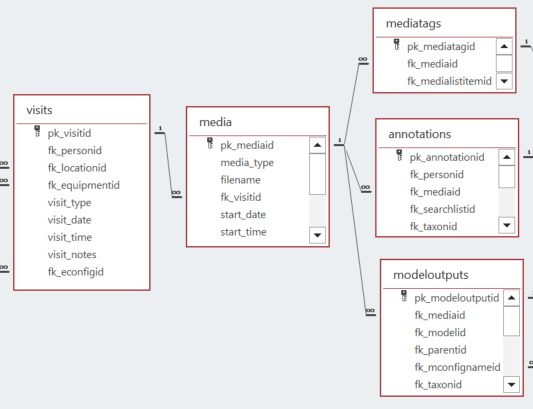
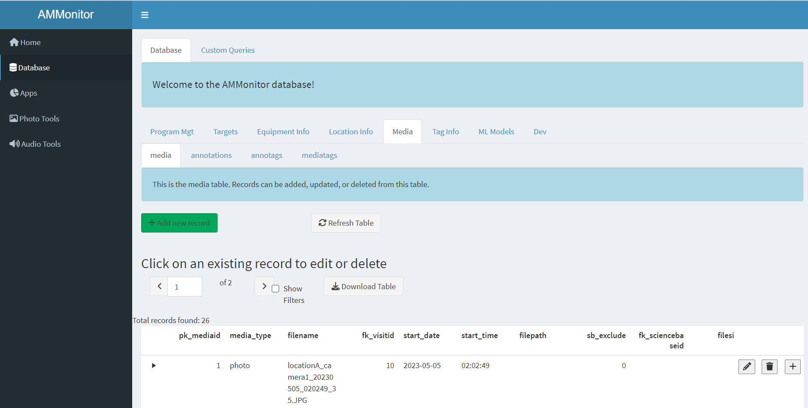
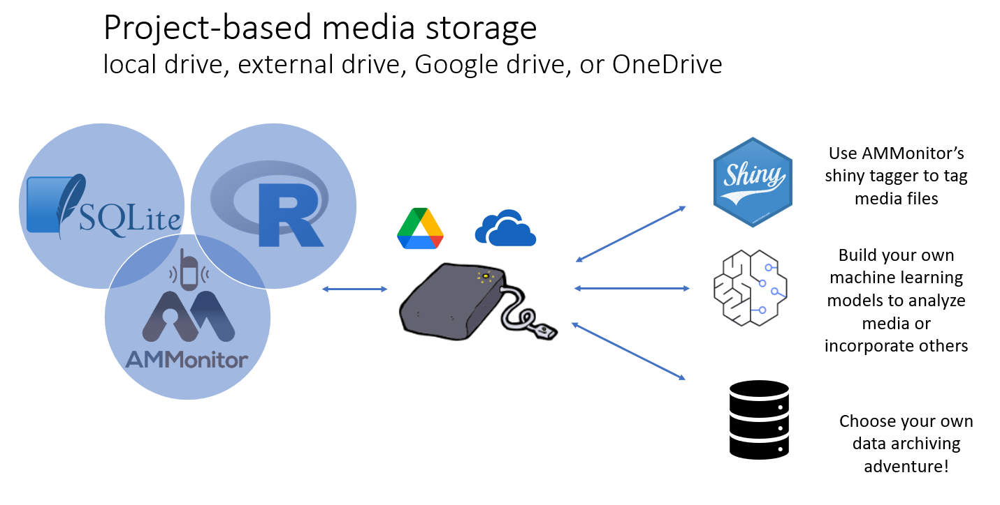
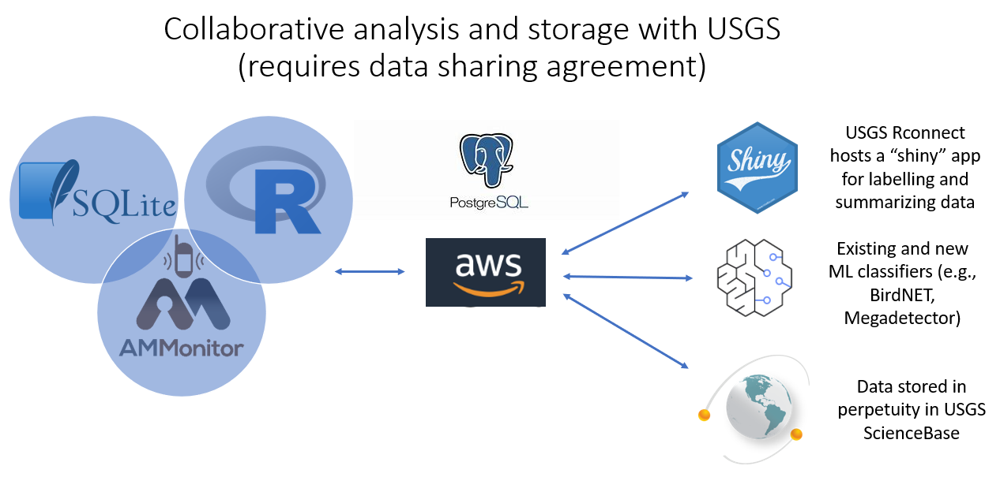

```{r setup, include=FALSE}
source('includes.R')
shiny::addResourcePath("figs", system.file("extdata/figs", package = "AMMonitor"))
```

## {width=100px} Monitoring media

In the *AMMonitor* system, raw monitoring files such as recordings and photos are collected by Autonomous Monitoring Units (AMUs).  The captured raw monitoring files are stored either locally or in the cloud. All other data, including photo and recording metadata, are stored within the *AMMonitor* SQLite database.  

> &#128073;&#127995; This tutorial introduces the media table, and discusses options for external media storage.

As with all other tutorials, we used the `ammCreateMiniDemo()` function to create a small demo project named "demoAMM" that is pulled into the tutorial itself, with the file path stored as the R object, "demo_fp". This filepath is stored on your machine and can be found by running the following code:

```{r demofp}
demo_fp
```

The database is already present in the demo project, as shown below:

```{r}
list.files(file.path(demo_fp, "database"))
```

As you can see, the demo database is named "demo.sqlite". Let's set the connection now:

```{r, echo = TRUE, eval = TRUE}
# set a database connection by pointing to the database filepath
conx <- dbSetCon(paste0(demo_fp, "/database/demo.sqlite"))

# look at the class of the connection object
class(conx)
```

Once a connection is made, you can use many functions from the *DBI* package [@DBI] or from *AMMonitor* to work with the database.  For example, DBI's  `dbListTables()` is used below to return an  alphabetical listing of each table in the database

```{r}
# use DBI's dbListTables function to list all tables
DBI::dbListTables(conn = conx)
```

Look for the *media* table in the middle of the list.

## Connected tables

The figure below shows the *media* table, and also the tables that are linked to it. A single record in the *media* table identifies a file, like a .jpg or .wav file. The primary key is **pk_mediaid**, an auto-number, but the **filename** is stored as well.  The media files themselves are not stored in the database, only their metadata are stored.

```{r locer2, eval = T, echo = F, fig.align='center', out.width = "100%", fig.cap = "*Figure 1. Database schema diagram showing relationships between AMMonitor database tables in the media grouping.*", out.extra='style="background-color: #999999; padding:5px; display: inline-block;"'}

```

Let's work our way around the circle of connected tables, beginning with the *visits* table in the left side of the diagram. Recall that a single visit is comprised of a *person* deploying a monitoring unit (*equipment*) at a given *location* on a given *date*.  Visits can be virtual, in which files are automatically sent to a cloud based repository. Media files collected from AMU's are associated with the visit during which they were collected. For instance, if Frodo visits a site and retrieves an SD card from an AMU, the media on the SD card are associated with that visit. 

Once media files are registered in the database, they are available to be tagged (labeled) by humans or by machines, identifying wildlife targets within the media files. The *annotations* table stores human-applied labels associated with taxa (e.g., "this photo has a black bear", "this media file has a singing chickadee at minute 1.5").  We introduce the *taxa* table in the next tutorial. The table *mediatags* stores any non-taxa related tags, such as identifying if a file is corrupt, should be highlighted, or contains a vehicle. The *modeloutputs* table stores tags identified by a machine learning model, introduced in a separate tutorial.


## The media table

Let's first look at columns in the media table, noting how information is stored in the table.

```{r pragmamedia, exercise = TRUE}
# get info about the media table
DBI::dbGetQuery(
  con = conx, 
  statement = "PRAGMA table_info(media)"
)
```


The *media* table has 10 columns, and the primary key is **pk_mediaid**, an auto-number stored as an INTEGER.  The column **media_type** is from a dropdown list named **media_type** (stored in the *lists* table, with acceptable items in the *listitems* table).  The options are "photo" or "audio" (the media_type "video" is not supported at this time).  The **filename** gives the name of the file, including extensions (e.g., "photo1.JPG"). The **fk_visitid** links a media file with a visit. The **start_date** and **start_time** indicate when the file was collected. The **filepath** column provides a way to point to a media filepath if the file is not in the default "photos" or "recordings" directory of an *AMMonitor* project, or some other directory that has a common root path.  We will discuss this in depth in another section.   The columns **sb_exclude** and **fk_sciencebase** pertain to public data releases, where **sb_exclude** is 0 or 1, and **fk_sciencebaseid** is a foreign key to the *sciencebase* table. These columns identify if a file should be excluded from a data release for any given reason, and if released, the release details.  These two columns are discussed in depth in the "sciencebase" tutorial.  Finally, the column **filesize** gives the size of the file.

> &#128073;&#127999; It is important to note that the *media* table does not have fields for location or monitoring equipment. These fields, and others pertaining to the site visit when the media were collected, are stored in the *visits* table and can be accessed via the visit record with the associated **fk_visitid**.


```{r, reqcols, echo=FALSE}
quiz(
  question("Which columns in the media table are required? Select all that apply.",
    answer("pk_mediaid", correct = TRUE),
    answer("media_type"),
    answer("filename", correct = TRUE),
    answer("fk_visitid", correct = TRUE),
    answer("start_date"),
    answer("start_time"),
    answer("filepath"),
    answer("sb_exclude"),
    answer("fk_sciencebaseid"),
    answer("filesize"),
    message = "The primary key of a table is always required, overriding the notnull column. In addition, the filename and fk_visitid columns are required.",
  incorrect = "Not quite!  &#128540;",
  allow_retry = TRUE
  )
)

```

Why so few required entries?  We definitely encourage that the most critical columns be filled in, providing the date, time, media type and visit.  However, we did not want to impose constraints on users as variables such as the date and time of file creation can be scraped from the file header, and populated at a later time. 

Now let's have a look at the *media* table for the demo database.

```{r}
# read in the media table
DBI::dbReadTable(conx, name = "media")

```

Scrolling will be necessary!  The demo *AMMonitor* project has 25 photos and 1 audio file, with filenames such as "locationA_camera1_20230819_143950_295.JPG" and "1.wav".  These files were all collected in the year 2023.  

> &#128073;&#127999; We strongly advocate that you name your monitoring files in the format **locationid_equipmentid_date_time**, with date listed in YYYYMMDD format and time in HHMMSS format, if possible. Many audio and trail camera monitoring units allow users to configure media file naming convention, and linking the location and equipment with the date and time of media capture provides a back-up for associating media files with visit information. This is especially important for audio files, which have non-standard EXIF data fields and for which the file naming convention is a primary method for inferring when the recording was made.


## AMMonitor Shiny media

We've been using R code to work with the *media* table. You can view this table through the Shiny interface as well.  

<p class=instructions>
Open a new session of R by going to Session | New Session (so that two instances of R are running on your machine). Then, run the following commands in the new session's console, which uses `ammCreateMiniDemo()` to create the lightweight demo AMMonitor project and `launchApp()` to launch the app.  
</p>

```{r, eval = FALSE}
# load AMMonitor
library(AMMonitor)

# create a demo AMMonitor project in a temporary directory (to be deleted)
demo_fp <- ammCreateMiniDemo(filepath = tempdir())

# launch the Shiny application
launchApp(demo_fp)
```

Assume the role of the default user (sgamgee), and connect to the database.  

```{r shinyimage, eval = T, echo = F, fig.align='center', out.width = "100%", fig.cap = "*Figure 2a. Upon launching the app, you are presented with the option to select a user and connect to the database.*", out.extra='style="background-color: #999999; padding:5px; display: inline-block;"'}
knitr::include_graphics('www/shiny0.PNG')
```
 

Then, click on the "Database" option in the left menu. Here, you will see database tables arranged in different groupings (and populated with demo data).  Then click on the "Media" tab, where you will find the *media* table.

```{r shinyimage2, eval = T, echo = F, fig.align='center', out.width = "100%", fig.cap = "*Figure 2b. The media table of the demo database.*", out.extra='style="background-color: #999999; padding:5px; display: inline-block;"'}

```
 
<p class=instructions>
Please poke around!  Try adding a few hypothetical media files.
</p>


## Media settings

In a previous section, you may have noticed that the **filepath** column is `NA` for all records in the *media* table.


The demo *AMMonitor* project stores media files within its "photos" and "recordings" directories. Let's confirm this now.

```{r listfiles, exercise = TRUE}
list.files(file.path(demo_fp, "photos"))
list.files(file.path(demo_fp, "recordings"))
```

There they are.  But how does the *AMMonitor* Shiny interface know how to find them?

A single remote monitoring project can accumulate terabytes of data in a short amount of time, so *AMMonitor* offers multiple flexible storage options. Media files can be stored locally (on a local or external hard drive, or on a networked drive), in which case the location of the file is specified with a filepath. *AMMonitor* additionally supports several popular cloud storage options including Google Drive, SharePoint (OneDrive), and AWS S3. For simplicity, we'll simply refer to filepaths for the remainder of this section, but cloud storage URL's can be substituted (cloud storage will be discussed in greater detail in the next section).

By default, *AMMonitor* will store media files in the "photos" and "recordings" directories of the *AMMonitor* project. *AMMonitor* also offers two options for changing where media files are stored:

1. A "root" filepath can be provided in the project's settings using the names "audio_path.txt" and "image_path.txt". 

2. The **filepath** field in the media table can be used to specify an absolute filepath for each file.

If you want to store media files in a different directory (such as an external hard drive), or split media files between many subdirectories, the **filepath** field can be used to provide an absolute filepath for each file in the media table. *AMMonitor* will then use this filepath to find the media.

Alternatively, a root filepath can be provided in an *AMMonitor* project's settings. This setting can be set through the Shiny interface (see the "annotations" tutorial for details), or added directly to the "settings" directory. *AMMonitor* will append the **filename** to the provided root path to find media files. This feature can be especially helpful when files are being shared between different users and their filepaths may differ, such as using external or networked drives.

> &#128073;&#127996; If the **filepath** field is not used in the *media* table, you can specify the media "root path" as a setting, stored in the "settings" directory of the *AMMonitor* project.  

Let's look at the files within the "settings" directory of the demo *AMMonitor* project.  

```{r}
list.files(file.path(demo_fp, "settings"))

```

Here, two files are of interest:  "audio_path.txt" and "image_path.txt". 

> &#128073;&#127997;  These two text files point to the root directories that store media files. The root file may be on your local machine, or may point to cloud-based root directories. If media files are not stored in the default media directories, or specified by the **filepath** column, the root directory must be provided.

What do these files contain? Let's find out by reading the lines within the files:

```{r, eval = T}
# read in the lines in the "audio_path.txt" file
readLines(file.path(demo_fp, "settings", "audio_path.txt"))

```

As you can see, "audio_path.txt" stores a root filepath to the folder on your machine storing *AMMonitor*'s demo audio file. The filepath to all audio recordings are formed by appending the filename to this root directory.  We can expect something similar with the "image_path.txt" file, which should point to the directory where photos are stored.

```{r, eval = T}
# read in the lines in the "image_path.txt" file
readLines(file.path(demo_fp, "settings", "image_path.txt"))

```

> &#128073;&#127998;  By telling *AMMonitor* where to find media files using one of these options, we can view them in the convenient Shiny interface.

## Cloud storage options

The ability to accumulate huge volumes of data relatively quickly has made cloud-based storage an attractive alternative to traditional storage on local or external hard drives. A variety of cloud-based storage services are in popular use today, offering features such as automated backup, easy sharing, and fine-tuned privacy controls. Further, most popular services provide an R-based interface to their API's, making it possible to work with cloud-based files directly in R. The *AMMonitor* Shiny app, for example, can directly read image files hosted on the web, avoiding the need to download the files for display. 

> &#128073;&#127995; You can upload media directly to the cloud using *AMMonitor*'s "registerVisit" app, discussed in a later section. 

> &#128073;&#127998; The user is responsible for ensuring their cloud-based accounts are properly authenticated *before* launching AMMonitor.

*AMMonitor* currently supports three cloud-based repositories that can be used to store media: Google Drive and Sharepoint (Microsoft), and AWS S3. Here are pertinent details regarding the use of these cloud repositories with *AMMonitor*.

### Google Drive

At the present time, [Google Drive](https://www.google.com/drive/) offers up to 15 GB of free storage, with paid subscription plans for more space. *AMMonitor* uses the *googledrive* [@googledrive] R package to interact with files stored on Drive. The first time you try to upload (or delete) a file on Google Drive through *AMMonitor*, you will be prompted to authenticate in the R console. Be alert for the need to authenticate, as you may not be prompted in Shiny and will need to inspect your R console to see that R is waiting for you to authenticate. After authenticating the first time, you should not need to authenticate for the remainder of the session.

For images, the URL string that identifies a media file stored in Google Drive will have the form:

`https://drive.google.com/thumbnail?id=FILE-ID&sz=w1200`

and for audio recordings, the URL string will have the form:

`https://docs.google.com/uc?export=download&id=FILE-ID`

where `FILE-ID` is the Google file id. If you use *AMMonitor*'s *registerVisit* app to add media files to your database, the application will take care of this formatting for you, saving the filename and URL path (in the format above) in the **filename** and **filepath** fields of your *AMMonitor* database. Due to the inability of Google Drive to embed audio files via HTML, expect the audio tools to be a bit slower for Google Drive than for the other storage options. 

### SharePoint

[SharePoint](https://www.microsoft.com/en-us/microsoft-365/sharepoint/collaboration) is a service offered by Microsoft that is marketed as a collaborative platform with integrated content management. There is not a free tier for SharePoint, but it is widely used by state and federal agencies and academic institutions. AMMonitor uses the *Microsoft365R* [@Microsoft365R] R package to interact with files stored on SharePoint. *Microsoft365R* provides details on how to authenticate, with several options for authentication listed in [the package documentation](https://github.com/Azure/Microsoft365R?tab=readme-ov-file). If not authenticated before launching the app, the user may be redirected to the web browser to authenticate when calling functions from AMMonitor that upload/delete files. 

The URL string that identifies a media file stored in SharePoint will have the form:

`https://TENANT-ID.sharepoint.com/sites/FOLDER-PATH/FILE-NAME.ext`

where `TENANT-ID` is the Microsoft tenant ID, `FOLDER-PATH` is the relative folder path in the SharePoint directory (with forward-slashes "/" between subfolders), and `FILE-NAME.ext` is the filename (with extension). If you use AMMonitor's *registerVisit* app to add media files to your database, the application will take care of this formatting for you, saving the filename and URL path (in the format above) in the **filename** and **filepath** fields of your AMMontior database.

### AWS S3

Amazon Web Services (AWS) offers a popular bulk storage service called [S3 (Simple Storage Service)](https://aws.amazon.com/pm/serv-s3/) that, as of the release of *AMMonitor* 2.0, includes a free tier with 5GB of storage for up to 12 months and certain caps on API usage. Paid subscriptions are billed based on the amount of storage used. AMMonitor uses the *aws.s3* [@awss3] R package to interact with files stored on S3. Authentication to S3 is most easily achieved by creating an IAM user in AWS and saving the IAM user *Access Keys* as a system environment variable. This process is easier than it sounds, and is detailed in [the aws.s3 package documentation](https://github.com/cloudyr/aws.s3). Authentication must occur *before* launching the AMMonitor app in order to upload/delete files, and the S3 bucket must be configured with public read-only access for media to be usable in AMMonitor's audio/photo tools.  

The URL string that identifies a media file stored in SharePoint will have the form:

`https://BUCKET-NAME.s3.amazonaws.com/FOLDER-PATH/FILE-NAME.ext`

where `BUCKET-NAME` is the S3 bucket name, `FOLDER-PATH` is the relative "folder path" in S3 (with forward-slashes "/" between "subfolders"), and `FILE-NAME.ext` is the filename (with extension). 

> &#128073;&#127998; If you wish to have collaborators use an *AMMonitor* database to view media files stored in the cloud, make sure they have the proper credentials to be able to access files and complete any authentication in their web browser prior to launching *AMMonitor.*

> &#128073;&#127996; Some web browser privacy settings may prevent media files from being rendered using *AMMonitor*'s photo/audio tools. Make sure your web browser settings are configured such that the *AMMonitor* Shiny app, when viewed in the web browser, will recognize that you have authenticated to the desired cloud platform. 

## Built-in queries

*AMMonitor* comes with several built-in queries that may be of interest.  To help find queries related to any of the media tables, use the `help.search()` function, and specify one of the media family table names as the "concept" argument, like this:

```{r qry, exercise = TRUE}
help.search(
  package = "AMMonitor", 
  pattern = "media", 
  fields = "concept")
```

Once you find a potential query of interest, please read the helpfiles of the returned queries; running the examples will illustrate exactly what each query returns.  

For example, the query `qryMediaDateRange()` will return the date range of a given type of media  as registered in the *media* table: 


```{r, eval = T}
# query the photo date range
result <- qryMediaDateRange(
  con = conx, 
  mediaType = "photo", 
  disconnect = FALSE)

# show the result
result
```

Here, we can see the photos collected by the Middle Earth team were collected between `r result$startdate` and `r result$enddate`.  There are many other built-in queries associated with the *media* table, and we encourage you to explore them further. And of course, you can code your own queries with the *DBI* package.

## Registering new media

There is a natural lag between the time media are collected and the time they are registered in the database. After all, the database has no knowledge of new media files until the metadata are inserted into the *media* table. 

Each *AMMonitor* project directory has folders named "recordings_drop" and "photos_drop", which is where collected files can live until they are ready to be moved to a permanent storage location and registered in the database. You are not required to use the "drop" directories, but their original purpose is to temporarily store media files that are waiting for registration.  

*AMMonitor* includes an "app" named "registerVisit" that can be used to add media to the database, associating them with either a new or existing visit. In *AMMonitor*, apps guide users through an analysis step by step, or tab by tab. All apps were created with the R package, *shinymgr* [@shinymgr]. In the case of "registerVisit", the user is guided through the following steps:

 - Select a media type
 - Select an existing visit, or enter metadata for a new visit
 - Select a "source" (folder containing media files to be added to the database)
 - Select a "destination" (where media files will be saved to after being registered, including either local or cloud storage)
 - Review data quality checks
 - Optionally, save log files
 - Add the new visit (and media) to the database

This short video will illustrate the process.


<p class=instructions>
Your turn.  If your second R session is still running, click on the Apps tab in the left menu.  Then select "registerVisit" app and work your way through a new visit entry.    In AMMonitor, apps guide users through an analysis step-by-step, or tab-by-tab.    
</p>

## Media workflow options with USGS

In previous sections, we mentioned a few storage options for *AMMonitor.*  The first is project-based file storage, in which a user stores media files on a local drive, an external hard drive, or supported cloud-based options (Figure 3). Users can launch the *AMMonitor* Shiny interface to label (tag) media files, build and analyze data with template matching algorithms or approaches from other R packages, and archive data long-term as desired.

```{r , eval = T, echo = F, fig.align = 'center', out.width = "90%", fig.cap = "*Figure 3. Project-based media sotrage workflow for an AMMonitor project.*", out.extra='style="background-color: #999999; padding:5px; display: inline-block;"'}

```

The second option is a collaborative model in which users collaborate with the USGS AMBER network (**A**lliance for **M**onitoring **B**iodiversity and **E**cosystems **R**emotely), in which an original *AMMonitor* project is brought into the AWS environment, incorporated into a PostgreSQL (served) database, analyzed with machine learning models, and ultimately stored in perpetuity in the USGS ScienceBase repository.  This approach may be valuable to monitoring programs that are unable or unwilling to shepherd the workflow independently.  In this model, users have full access to their files and database via RConnect, which operates within the USGS computing environment.  A data sharing agreement and fee is required for this approach.

```{r , eval = T, echo = F, fig.align = 'center', out.width = "90%", fig.cap = "*Figure 4. USGS AMBER-based media sotrage workflow for an AMMonitor project.*", out.extra='style="background-color: #999999; padding:5px; display: inline-block;"'}

```

Those wishing to pursue the AMBER workflow should consult the "amber" tutorial.

```{r , eval = FALSE}
learnr::run_tutorial(
  name = "amber", 
  package = "AMMonitor"
)
```


## Tutorial Summary

In this tutorial, we introduced the media table, discussed methods of media file storage, and showed you how to view media files in the *AMMonitor* Shiny interface.  

The last step in this tutorial is to disconnect from the database, and then delete the demo database to free up space on your machine.   

```{r, eval = TRUE}
# disconnect from database
DBI::dbDisconnect(conx)

# delete the demo database
unlink(demo_fp, recursive = TRUE)
```

Once media files have been collected and registered in the database, it's time to inspect them for target taxa.  Our first stop is the *taxa* table in an *AMMonitor* database.

```{r , eval = FALSE}
learnr::run_tutorial(
  name = "taxa", 
  package = "AMMonitor"
)
```

A list of other *AMMonitor* tutorials is shown below.  

```{r , eval = T}
learnr::available_tutorials("AMMonitor")
```


> &#128073;&#127997; A final FYI:  If you'd like a pdf of this document, use the browser "print" function (right-click, print) to print to pdf.  If you want to include quiz questions and R exercises, make sure to provide answers to them before printing.


## References

