```{r setup, include=FALSE}
source('includes.R')
shiny::addResourcePath("figs", system.file("extdata/figs", package = "AMMonitor"))
```

## {width=100px} Mobile Apps


> &#128073;&#127995; This tutorial introduces the setup and use of the no-code cell phone apps, Survey123 and GoogleAppSheet. These apps can be used in the field to collect visit data, which can later be added to the 'visits' table of an *AMMonitor* database.

As with all other tutorials, we used the `ammCreateMiniDemo()` function to create a small demo project named "demoAMM" that is pulled into the tutorial itself, with the file path stored as the R object, "demo_fp". This file path is stored on your machine and can be found by running the following code:

```{r demofp}
demo_fp
```

The database is already present in the demo project, as shown below:

```{r}
list.files(file.path(demo_fp, "database"))
```

As you can see, the demo database is named "demo.sqlite". Let's set the connection now:

```{r, echo = TRUE, eval = TRUE}
# set a database connection by pointing to the database file path
conx <- dbSetCon(paste0(demo_fp, "/database/demo.sqlite"))

# look at the class of the connection object
class(conx)
```

Once a connection is made, you can use many functions from the *DBI* package [@DBI] or from *AMMonitor* to work with the database.  For example, *DBI*'s  `dbListTables()` is used below to return an  alphabetical listing of each table in the database:

```{r listtables, exercise = TRUE}
# use DBI's dbListTables function to list all tables
DBI::dbListTables(conn = conx)
```

The *visits* table is a key table in the database.  Let's have a look:

```{r visits, exercise = TRUE}
DBI::dbReadTable(conx, name = "visits")
```

As you can see, the *visits* table stores information about a **person** making a visit to a **location** to set/check/pull a specific monitoring **equipment** on a given **date**.  All four entries are required and constitute a single visit, with three coming from linked tables. The equipment unit can be configured with a specific configuration, stored in the *econfigs* table.

> &#128073;&#127997; While this information could be collected in a field notebook, cell phone apps streamline the data collection, where field technicians enter the visit data directly on their phone, and where results are collected in the cloud. 


No-code cell phone apps such as [ESRI's Survey123](https://www.esri.com/en-us/arcgis/products/arcgis-survey123/overview) and [Google AppSheets](https://appsheet.com) allow the creation of a cell phone app for use by a monitoring team.  

> &#128073;&#127998; While many cell phone apps are created by a dedicated coder or team of coders, no-code cell phone apps allow individuals without traditional programming skills to create apps via the use of a template or a visual platform.    

This tutorial will show you how to create a no-code app using Survey123 and Google AppSheets for collecting visit data. 


## {width=100px} Survey123

If your monitoring team has an ESRI license that allows it, **ArcGIS Survey123** is a great platform for collecting field visit data.  A video outlining the entire process of building the app is included at the end of this section.  When deployed, the Survey123 cell phone app allows users to enter their information directly on their phone, as highlighted below:

```{r s123demo, eval = T, echo = F, fig.align='center', out.width = "60%", fig.cap = "*Figure 1. Stylized Survey123 phone app view.*", out.extra='style="background-color: #999999; padding:10px; display: inline-block;"'}
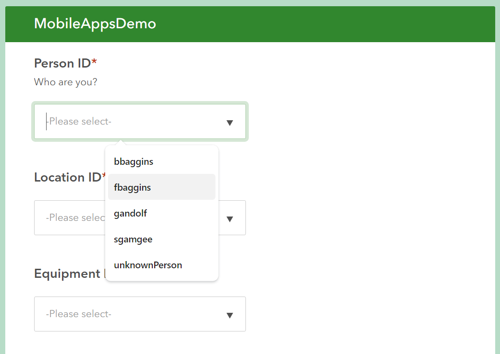
```

Other examples can be found at https://doc.arcgis.com/en/survey123/gallery/.

> &#128073;&#127998; An *AMMonitor* Survey123 app is created in  the *ArcGIS Survey123 Connect* desktop application, and requires a correctly-formatted Excel spreadsheet to create the cell phone app. You will need to download the [ArcGIS Survey123 Connect](https://apps.microsoft.com/detail/9pmst5c0dlst?rtc=1&hl=en-us&gl=US) desktop application and log in with a valid Esri account. 

Within Survey123 Connect, a single spreadsheet provides all of the information needed to create the cell phone app, and includes a 'survey' tab and a 'choices' tab. For the demo database, this sheet looks like this:

```{r s123demo2, eval = T, echo = F, fig.align='center', out.width = "95%", fig.cap = "*Figure 2. The format of a Survey123 spreadsheet that provides information needed to create a Survey123 cell phone app for collecting visit data.*", out.extra='style="background-color: #999999; padding:10px; display: inline-block;"'}
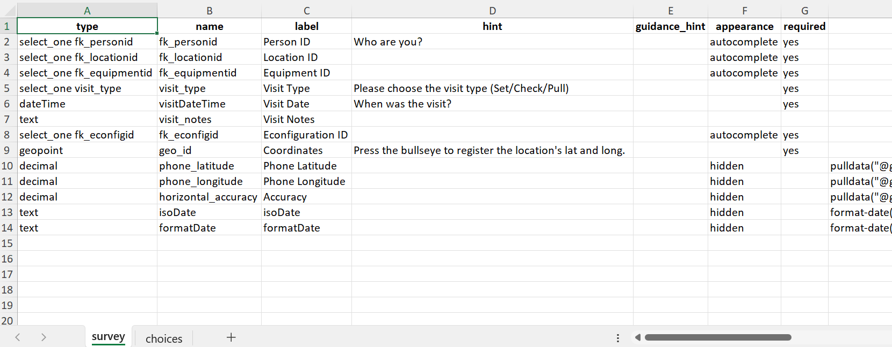
```

This spreadsheet controls how the cell phone app is built.  Column B links the cell phone app with the *AMMonitor* *visits* table; look for entries such as "fk_personid", "fk_locationid", and "fk_equipmentid". Column A establishes how these elements are to be collected on the cell phone (e.g. a drop-down, a text entry, a date picker, etc.).

> &#128073;&#127997; The *AMMonitor* function `s123Create()` creates and populates this spreadsheet with information from an *AMMonitor* database.  Let's create this app for the Middle Earth Team.

To begin, make sure that:

- The *visits* table is finalized. While the *visits* table comes with "core" columns such as "fk_personid", "fk_locationid", etc., additional user-columns can be added to the *visits* table, if desired. For example, if you want to collect the battery status of a monitoring unit when the visit is made, you can add this field to the *visits* table with the function, `dbAddUserCol()`. This information can then be collected with the cell phone app and associated with a specific site visit.
- The *people*, *locations*, and *equipment* tables are populated with up-to-date information. The entries in these and other tables will be used to create your survey. 

<p class = 'instructions'>Let's take a look at the key tables in the demo database now.  The pk_personid, pk_locationid, and pk_equipmentid columns will become dropdown choices in the survey questions.
</p>

``` {r view_demo_tables, exercise = TRUE, echo = TRUE}
DBI::dbReadTable(conx, name = 'people')
DBI::dbReadTable(conx, name = 'locations')
DBI::dbReadTable(conx, name = 'equipment')
```
  

As mentioned, the entire survey form is created from an Excel spreadsheet, and the `s123Create()` function creates this spreadsheet from an open connection to an AMMonitor database.  The `s123Create()` function uses the package *writexl* [@writexl] to create the needed Excel file in your working directory.  Let's have a look at this function's helpfile:

```{r s123help2, exercise = TRUE}
help(s123Create)
```

If you've read the help file, you should see the function has 5 arguments:

- con => An open connection to the database.
- equip_type =>  The **equip_type** argument can be 'camera', 'recorder', or 'all', and allows you to create separate surveys for different equipment types for the same project, if desired.
- reminders => a vector of checklist 'reminders' that will appear on the app.
- notes => A note to be provided at the end of the survey.
- disconnect => TRUE or FALSE. Should the database connection be severed on exit? Default is FALSE.

A function call to `s123Create()` looks like this, capturing the filepath to the Excel spreadsheet that is created by the function.

``` {r, echo = TRUE, eval = F}
filepath <- s123Create(
  con = conx,
  equip_type = 'all',
  reminders = c(
    'Is the unit secured?',
    'Did you change the batteries?'),
  notes = 'Remember to label the SD card')

```

Parts of resulting spreadsheet (also shown above), can be edited.

```{r s123demo3, eval = T, echo = F, fig.align='center', out.width = "95%", fig.cap = "*Figure 3. The spreadsheet produced by the s123Create() function provides information needed to create a Survey123 cell phone app for collecting visit data. The label and hint columns can be updated as desired.*", out.extra='style="background-color: #999999; padding:10px; display: inline-block;"'}
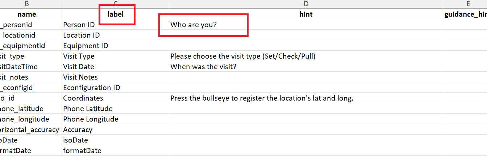
```

You can edit this spreadsheet's columns C and D as needed.  For example, the 'label' and 'hint' columns can be updated in the spreadsheet if desired. This might be useful in a case where additional user columns were added to the *visits* table with `dbAddUserCol()` with names that might be confusing to users filling out the survey.  For example, the first row in the spreadsheet is linked to the *visits* table's **fk_personid** column (cell B2), and its label is "Person ID" and hint is "Who are you?".  These could be updated to "Username" and "Select your username" if desired.


> &#128073;&#127995; Do not edit columns A or B (especially column B, which maps each survey question to a column in your *AMMonitor* database's "visits" table).


<p class=instructions>
Your turn.  To see how the Survey123 cell phone spreadsheet can be created, open a new session of R by going to Session | New Session (so that two instances of R are running on your machine).  Then, run the following commands in the new session's console, which uses `ammCreateMiniDemo()` to create the mini demo *AMMonitor* project in the working directory of the new session.  Connect to the database, and then create the spreadsheet. The function will write the spreadsheet to the session's working directory.
</p>

```{r, eval = FALSE}
# load AMMonitor
library(AMMonitor)

# create a demo AMMonitor project in a temporary directory (to be deleted)
demo_fp <- ammCreateMiniDemo(filepath = getwd())

# connect to the database
conx <- dbSetCon(paste0(demo_fp, "/database/demo.sqlite"))

# create the spreadsheet, capturing the filepath
filepath <- s123Create(
  con = conx,
  equip_type = 'all',
  reminders = c(
    'Is the unit secured?',
    'Did you change the batteries?'),
  notes = 'Remember to label the SD card')

# open the file and have a look!
filepath

```

### Deploying the app

Once the spreadsheet has been created, we're ready to create the cell phone app in *ArcGIS Survey123 Connect*.

In the desktop application, select 'New Survey'.

```{r s12310, eval = T, echo = F, fig.align='center', out.width = "40%", fig.cap = "*Figure 4. The 'New Survey' button in Survey123 Connect.*", out.extra='style="background-color: #999999; padding:10px; display: inline-block;"'}
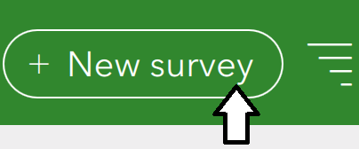
```


Create a new survey from the 'File' radio button, and select the spreadsheet you created using `s123Create()`.

```{r s1239, eval = T, echo = F, fig.align='center', out.width = "80%", fig.cap = "*Figure 5. Creating a new survey from the Excel spreadsheet.*", out.extra='style="background-color: #999999; padding:10px; display: inline-block;"'}
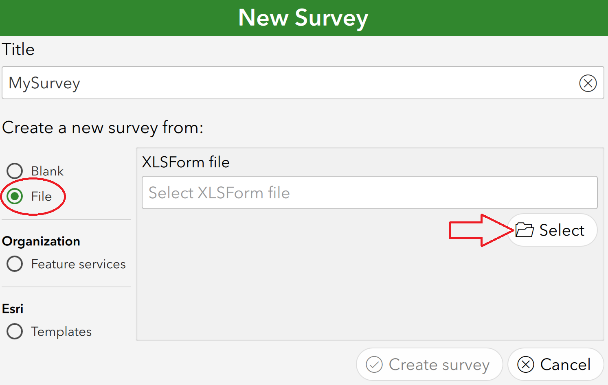
```


After selecting the "Create Survey" button, the app will then be displayed in *ArcGIS Survey123 Connect*. 

```{r s1236, eval = T, echo = F, fig.align='center', out.width = "90%", fig.cap = "*Figure 6. The newly creatd app for collecting visit metadata, as viewed through Survey123 Connect.*", out.extra='style="background-color: #999999; padding:10px; display: inline-block;"'}
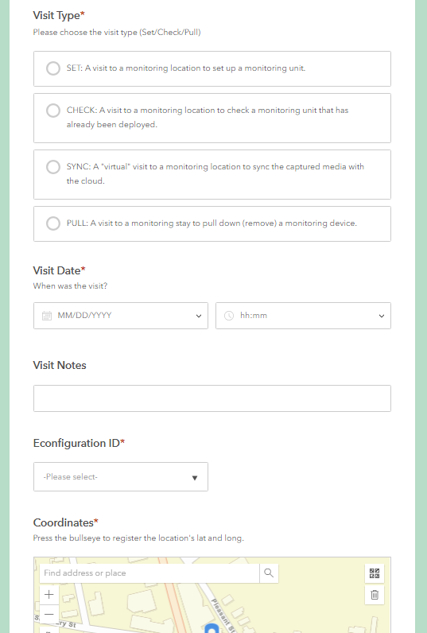
```

As mentioned, the survey elements are controlled by the spreadsheet's entries in column A.  Any element that has a "type" of "select_one" results in a dropdown box, controlling the options that can be selected.  For example, you can see  how choices of 'Visit Types' are pre-populated below, as will be the case for any core or user fields with choices in the *listitems* table in the database (Figure 6). Note there is date/time entry, as well as a way to enter spatial coordinates within the form.

> &#128073;&#127996; The process of building the cell phone app generally involves making minor tweaks to the spreadsheet, viewing the resulting app, and making more adjustments as needed.  When everything is satifactory, your survey can then be published and distributed to your team to use in the *Survey123* cell phone app, available through Google Play Store (for Android phones) or App Store (iPhone/iPad).

More information can be found here:

- Learn ArcGIS: Get started with Survey123: https://learn.arcgis.com/en/projects/get-started-with-arcgis-survey123/
- Esri Resources for Survey123: https://www.esri.com/en-us/arcgis/products/arcgis-survey123/resources

This short video illustrates the entire process of making the Survey123 spreadsheet with *AMMonitor* functions:


> &#128073;&#127995; When in *Survey123 Connect*, make sure to check the "Details", "Options", and "Map" tabs to add additional settings for your app. For example, under the "Map" tab you can change how spatial coordinates are collected.


> &#128073;&#127997; IMPORTANT: Please remember to re-run `s123Create()` and update your survey's file in *ArcGIS Survey123 Connect* whenever you add people, equipment, locations, or user fields to your database. This will keep the form consistent with field efforts and prevent issues where users might try to enter visits for new locations, equipment, etc.


## {width=100px} Google AppSheet

**Google AppSheet ** is another no-code cell phone option that can be used to collect visit data. While setup is slightly more involved than Survey123 (which requires an ESRI account), *AppSheet* can be more accessible as it only requires a Google sign-in. The app can be shared with a small number of people at no charge, but sharing with multiple people involves a fee.  A video outlining the entire process of creating an app in *Google AppSheet* is included at the end of this section. When created, the app will look like this:

```{r google1, eval = T, echo = F, fig.align='center', out.width = "50%", fig.cap = "*Figure 7. An example app with Google AppSheets for collecting visit metadata.*", out.extra='style="background-color: #999999; padding:10px; display: inline-block;"'}
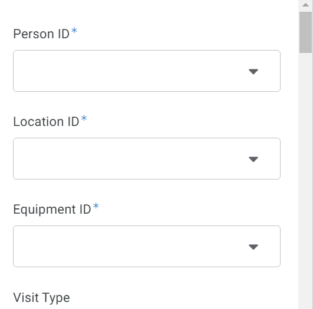
```

> &#128073;&#127995; The *AMMonitor* function `googleAppCreate()` will write an Excel workbook that can be imported into *Google Drive*. Then, the app can be created in *AppSheet* with some additional steps and accessed from a cell phone. 

Let's walk through the steps to make this app now.

To begin, make sure that:

- The *visits* table is finalized. While the *visits* table comes with "core" columns such as "fk_personid", "fk_locationid", etc., additional user-columns can be added to the *visits* table, if desired. For example, if you want to collect the battery status of a monitoring unit when the visit is made, you can add this field to the *visits* table with the function, `dbAddUserCol()`. This information can then be collected with the cell phone app and associated with a specific site visit.
- The *people*, *locations*, and *equipment* tables are populated with up-to-date information. The entries in these and other tables will be used to create your survey. 

<p class = 'instructions'>Let's take a look at the key tables in the demo database now.  The pk_personid, pk_locationid, and pk_equipmentid columns will become choices in the survey questions.
</p>

``` {r view_demo_tables2, exercise = TRUE, echo = TRUE}
DBI::dbReadTable(conx, name = 'people')
DBI::dbReadTable(conx, name = 'locations')
DBI::dbReadTable(conx, name = 'equipment')
```
  
As mentioned, with a database connection in place, the function `googleAppCreate()` can be used to create a spreadsheet that can be imported into *Google Drive* to later create an app. The `googleAppCreate()` function uses the package *writexl* [@writexl] to create a new Excel file in your working directory.   Let's have a look at this function's helpfile:

```{r googlehelp, exercise = TRUE}
help(googleAppCreate)
```

In the helpfile, you should see the function has 3 arguments:

- con => An open connection to the database
- equip_type =>  The 'equip_type' argument can be 'camera', 'recorder', or 'all', and allows you to create separate surveys for different equipment types for the same project.
- disconnect => TRUE or FALSE. Should the database connection be severed on exit? Default is FALSE

A function call to `googleAppCreate()` looks like this, capturing the filepath to the Excel spreadsheet.

``` {r, echo = TRUE, eval = F}
filepath <- googleAppCreate(
  con = conx,
  equip_type = 'all',
  disconnect = FALSE)

``` 


The resulting spreadsheet (below) can then be imported into *Google Drive*. Note the spreadsheet that is created contains multiple tabs. Each column from the tab named "survey_fields" maps directly to a column from the AMMonitor *visits* table.

```{r google2, eval = T, echo = F, fig.align='center', out.width = "95%", fig.cap = "*Figure 8. The survey_fields sheet from the Excel spreadsheet for creating an Google AppSheets app.*", out.extra='style="background-color: #999999; padding:10px; display: inline-block;"'}
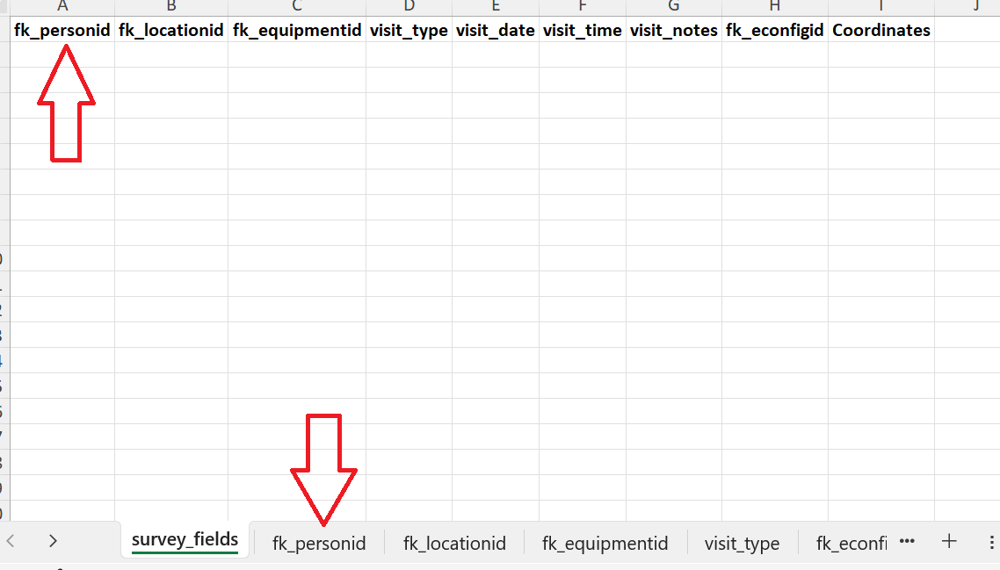
```

Similar to the process of creating the spreadsheet for *Survey123*, `googleAppCreate()` will create an additional tab of choices for any fields that will become dropdowns in the app. For example, see the tab for 'fk_personid' below, and note the column names.  The column named **choices** contains all the choices (pk_personid's) from the *people* table in the database.

```{r google4, eval = T, echo = F, fig.align='center', out.width = "60%", fig.cap = "*Figure 9. The fk_personid sheet from the Excel spreadsheet for creating an Google AppSheets app, showing the choices for this field to be displayed in a drop-down.*", out.extra='style="background-color: #999999; padding:10px; display: inline-block;"'}
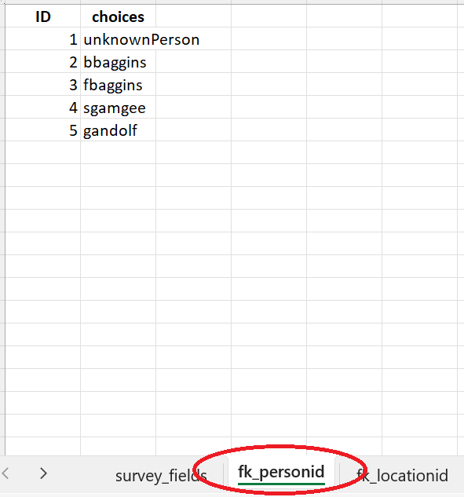
```

> &#128073;&#127998; Unlike the process for building a *Survey123* app, spreadsheets created with `googleAppCreate()` should not be edited. User-friendly labels can be added later in *Google AppSheet*.


<p class=instructions>
Your turn.  To see how the Survey123 cell phone spreadsheet can be created, open a new session of R by going to Session | New Session (so that two instances of R are running on your machine).  Then, run the following commands in the new session's console, which uses `ammCreateMiniDemo()` to create the mini demo *AMMonitor* project in the working directory of the new session.  Connect to the database, and then create the spreadsheet. The function will write the spreadsheet to the session's working directory.
</p>

```{r, eval = FALSE}
# load AMMonitor
library(AMMonitor)

# create a demo AMMonitor project in a temporary directory (to be deleted)
demo_fp <- ammCreateMiniDemo(filepath = getwd())

# connect to the database
conx <- dbSetCon(paste0(demo_fp, "/database/demo.sqlite"))

# create the spreadsheet, capturing the filepath
filepath <- googleAppCreate(
  con = conx,
  equip_type = 'all')

# open the file!
filepath

```

### Importing to Google Drive

As mentioned, the spreadsheet can now be imported into *Google Drive* by creating a new spreadsheet there (*Google Sheets*) and navigating to 'File' >> 'Import'. Select the spreadsheet created with the `googleAppCreate()` function.

```{r google5, eval = T, echo = F, fig.align='center', out.width = "95%", fig.cap = "*Figure 10. The interface for importing the Excel spreadsheet for creating an app to Google Drive.*", out.extra='style="background-color: #999999; padding:10px; display: inline-block;"'}
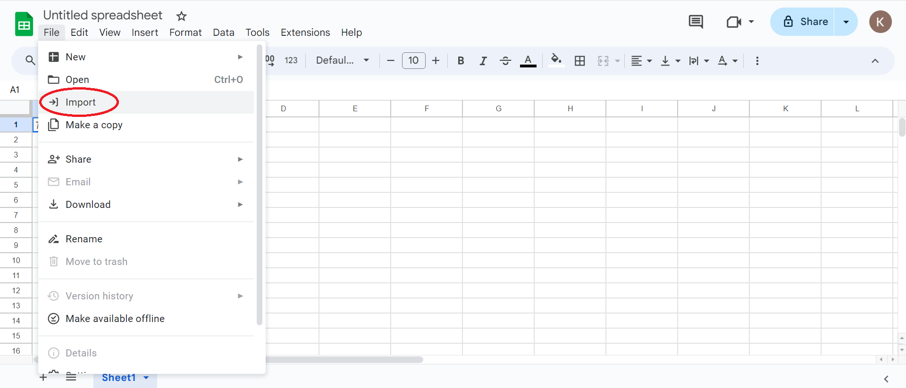
```


Once the data has been imported, select 'Extensions' >> 'AppSheet' >> 'Create an app'.

```{r google6, eval = T, echo = F, fig.align='center', out.width = "95%", fig.cap = "*Figure 11. The interface for creating an app from an imported Excel spreadsheet.*", out.extra='style="background-color: #999999; padding:10px; display: inline-block;"'}
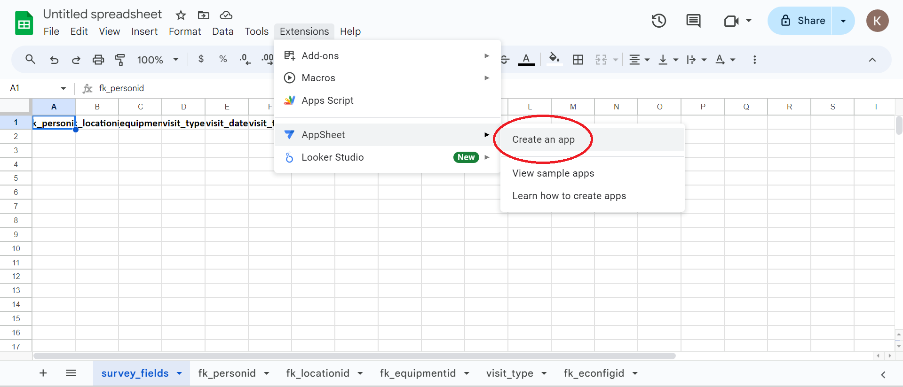
```


This will open a new tab in *Google AppSheet*. At first, no form will appear. Some settings have to be adjusted, which we will discuss next.

In *AppSheet*, navigate to the 'Data' tab in the left menu. 

- Delete the 'survey_fields' data in that pane.
- Then select the '+' to add your *Google Sheet*, this time include all of the additional tables (tabs) by pressing the "Add 6 tables" button in the lower right corner.

```{r google7, eval = T, echo = F, fig.align='center', out.width = "60%", fig.cap = "*Figure 12. The interface in AppSheet's 'Data' tab for adjusting the form settings.*", out.extra='style="background-color: #999999; padding:10px; display: inline-block;"'}
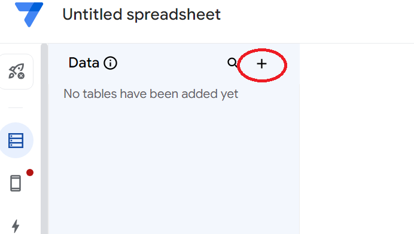
```

```{r google8, eval = T, echo = F, fig.align='center', out.width = "60%", fig.cap = "*Figure 13. The interface for adding the 6 tables, as necessary to properly render the app.*", out.extra='style="background-color: #999999; padding:10px; display: inline-block;"'}
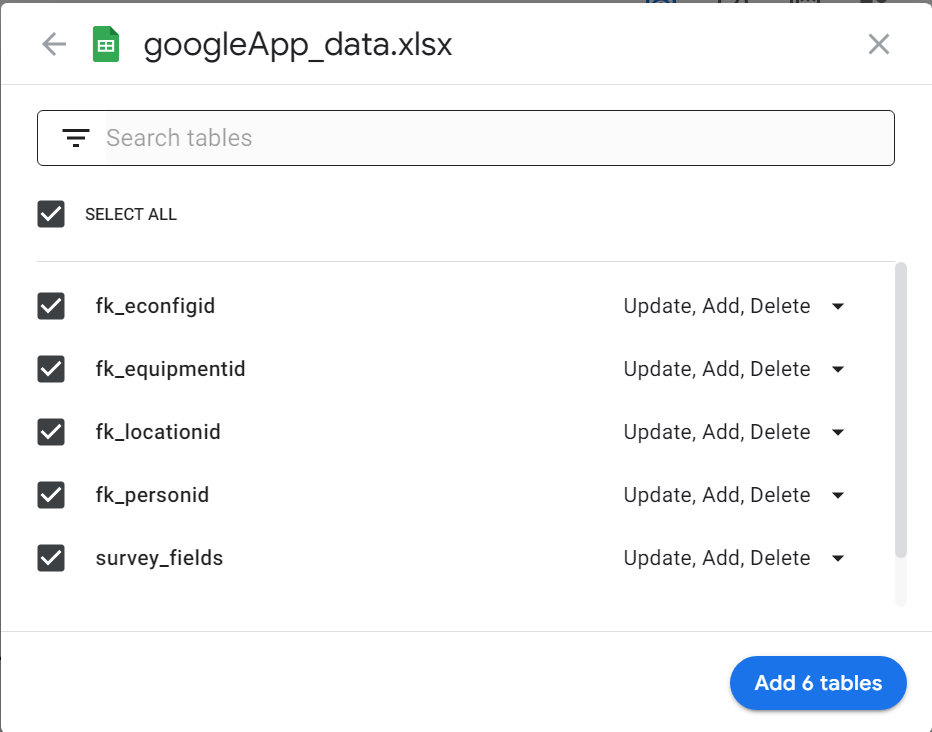
```


The 'Data' tab will include 6 data sources (all sheets of the spreadsheet). The main survey is the "survey_fields" data source, while the other data sources store drop-down information.

### Configuring the survey

**Click on the "survey_fields" data source, as this is the data source that will ultimately become the app.**  Uncheck the 'Show' box in the "_RowNumber" or 'ID' field (as the cell phone user won't need to see this).  

Then,  make sure that every field  that references another data source is set to 'Ref'.  This includes the fields "fk_personid", "fk_locationid",  "fk_equipmentid" and "fk_econfigid" fields, which are all *AMMonitor* core fields.  If you added user columns as dropdowns with the `dbAddUseCol()` function, make sure to set those to 'Ref' as well.

```{r google9, eval = T, echo = F, fig.align='center', out.width = "95%", fig.cap = "*Figure 14. The interface for matching survey_field names and types.*", out.extra='style="background-color: #999999; padding:10px; display: inline-block;"'}
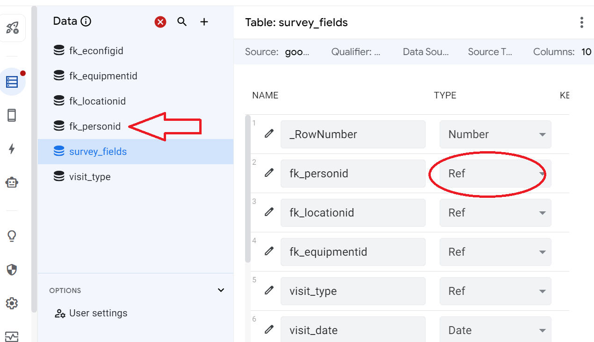
```

> &#128073;&#127996;  For each 'Ref' entry, such as "fk_personid", a dialogue box will open, prompting you to select the data source that provides the dropdown information. In this dialogue box, select the **Source table** that provides the dropdown information (e.g., when setting the field named "fk_personid", select the "fk_personid" data source as the dropdown feeding that source). 

Next, go through each of the data sources sources one by one, such as 'fk_personid' and 'fk_locationid', and set the 'choices' field in each to 'Label':

```{r google11, eval = T, echo = F, fig.align='center', out.width = "90%", fig.cap = "*Figure 15. Setting the data source 'choices' field to 'Label'*", out.extra='style="background-color: #999999; padding:10px; display: inline-block;"'}
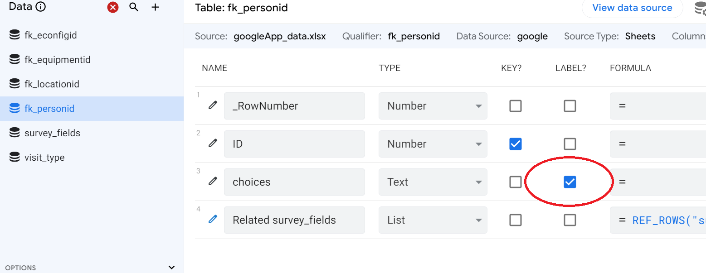
```

This specifies the column named **choices** will be used as a drop-down.  Also note that an association has been made between the data source named "fk_personid" and data source "survey_fields" as indicated in the column named "Related survey_fields".  

After setting the drop-down fields, now set the TYPE of 'visit_date', 'visit_time', and 'Coordinates' to 'Date', 'Time', and 'LatLong', respectively:

```{r google10, eval = T, echo = F, fig.align='center', out.width = "60%", fig.cap = "*Figure 16. Proper TYPE settings for the 'visit_date', 'visit_time', and 'Coordinates' fields.*", out.extra='style="background-color: #999999; padding:10px; display: inline-block;"'}
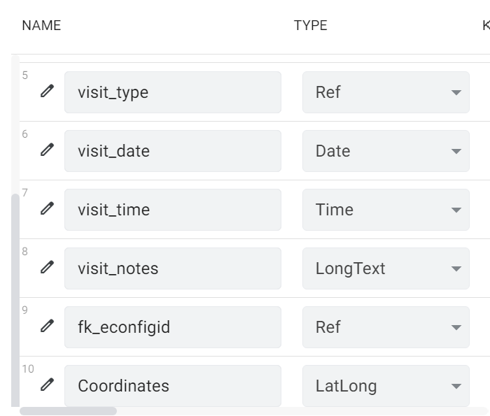
```


> &#128073;&#127995; IMPORTANT: Make sure the 'TYPE' for any user fields that were added with `dbAddUserCol()` match the data types within the 'dbdictionary' table of the database. Data type mismatches will prevent any data from *Google AppSheets* from being entered into the database with `dbImportCSV()`, described in the next section.

> &#128073;&#127995; More important stuff: You may change the labels of the fields to more user-friendly options such as 'Person ID' instead of 'fk_personid'. Make sure that the fields "fk_personid", "fk_equipmentid", "fk_locationid", and "date" are all required!  Otherwise you will end up with import issues when you upload the entries into the *AMMonitor* database. Other fields can also be set to "Required" as desired.  


Finally, select the 'Views' tab in the left menu, set the 'View Type' to 'form':

```{r google12, eval = T, echo = F, fig.align='center', out.width = "90%", fig.cap = "*Figure 17. Setting the 'View Type' to 'form' in the 'Views' tab in AppSheets.*", out.extra='style="background-color: #999999; padding:10px; display: inline-block;"'}
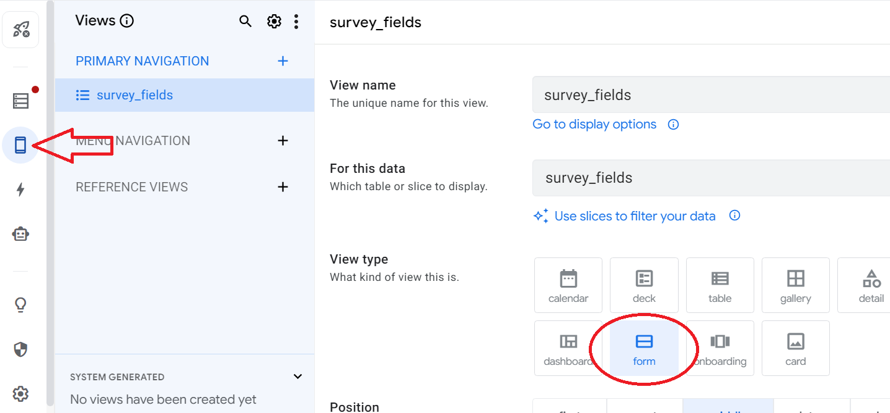
```

This controls how the information will appear in the cell phone app -- here it will look like a data entry form.


Once saved, the (undeployed) app should now look like this:

```{r google13, eval = T, echo = F, fig.align='center', out.width = "60%", fig.cap = "*Figure 18. Appearance of a properly configured, undeployed app.*", out.extra='style="background-color: #999999; padding:10px; display: inline-block;"'}
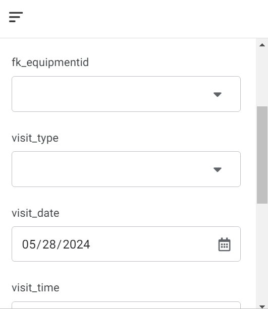
```


More information can be found here:

 - How to create an app in Google AppSheet: https://about.appsheet.com/how-to-create-an-app/
 - Get started with AppSheet: https://support.google.com/appsheet/answer/11581986?hl=en


The video below overviews the entire process of building a Google App for an *AMMonitor* database:


> &#128073;&#127995; IMPORTANT: Please remember to re-run `googleAppCreate()` and carefully update your survey's data source in *GoogleAppSheet* whenever you add people, equipment, locations, or user fields to your database. This will keep the form consistent with field efforts and prevent issues where users might try to enter visits for new locations, equipment, etc.  Use this new spreadsheet to update the Google Sheet data source by copying and pasting the new information, taking care not to destroy the original set-up. If you have updated the data source with new user columns, you can add any new tables in the 'Data' tab of *GoogleAppSheet* and 'Regenerate Schema' on the 'survey_fields' field without destroying the settings for the rest of the app.

After the AppSheet is finalized, you can deploy it for your *AMMonitor* team to collect visit information on their phones.  Deploying your app is an exciting step in the process of app creation. However, the first step is to make sure everything is ready to go.   Please visit this website for more information: https://support.google.com/appsheet/answer/10104495?hl=en

## dbImportCSV for MobileApps

The *AMMonitor* function `dbImportCSV()` can be used to import data from a .csv file (**c**omma **s**eparated **v**alues) with the correct column names to a table within a database. For mobile apps such as Survey123 or Google AppSheets, the data collected by cell phones is stored in the cloud, which can be downloaded as a .csv file. Once downloaded, the .csv data file can imported into the *visits* table in an *AMMonitor* database.

Take a look at the help file for `dbImportCSV()`:

``` {r dbimporthelp, exercise = TRUE}
help(dbImportCSV)
```

You will see the function has 4 arguments:

- con => An open database connection
- csv_path => File path to a csv containing rows to be added
- table_name => The name of the table to import records into
- row_numbers => A vector of row_numbers to include (if subsetting the CSV; e.g., 1:5)
- disconnect => TRUE or FALSE. Should the database connection be severed? Default is FALSE

Visit data can be exported as .csv files in the *Survey123* website, or from *Google AppSheet* within the *Google Sheet* data source. Before downloading the .csv file from *Google AppSheet*, make sure all columns in the *Google Sheet* are in the correct format. For example, the 'visit_date' column should be in the format YYYY-MM-DD and the 'visit_time' column should be in the format HH:MM:SS. 

> &#128073;&#127997;  When exporting the spreadsheet to a CSV file, make sure the first row includes the headers!

> &#128073;&#127995; Any user fields **MUST** be in a format that matches their type in the 'dbdictionary' table of the database before exporting data from *Google AppSheet*. Mismatches will cause errors when running `dbImportCSV()`.


The videos below will show how to import visit data from both cell phone apps using `dbImportCSV()`:

*Survey123*


*Google AppSheet*


> &#128073;&#127998; The videos show the approach for importing an entire CSV file by using the default of NA for the "row_numbers" argument.  However, once a visit has been imported, you don't want to import it again. Thus, you will find the need to specify the "row_numbers" argument as your monitoring program progresses.

## Tutorial Summary

In this tutorial, we introduced two no-code apps that may assist with collecting site visit information.

The last step in this tutorial is to disconnect from the database, and then delete the demo database to free up space on your machine.   

```{r, eval = FALSE}
# disconnect from database
DBI::dbDisconnect(conx)

# delete the demo database
unlink(demo_fp, recursive = TRUE)
```

Media files are associated with these site visits, and are the subject of our next tutorial.

```{r , eval = FALSE}
learnr::run_tutorial(
  name = "media", 
  package = "AMMonitor"
)
```


> &#128073;&#127997; A final FYI:  If you'd like a pdf of this document, use the browser "print" function (right-click, print) to print to pdf.  If you want to include quiz questions and R exercises, make sure to provide answers to them before printing.


## References

