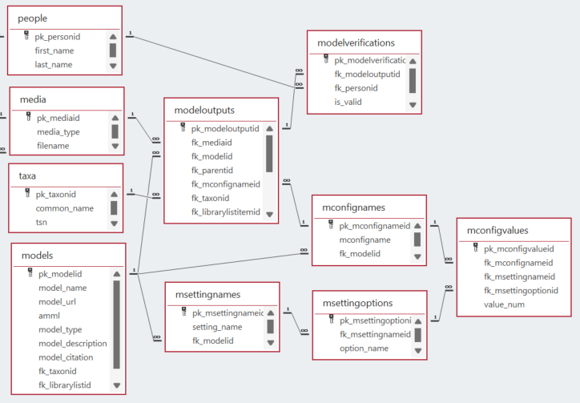
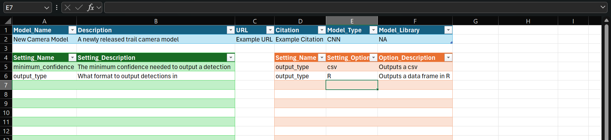
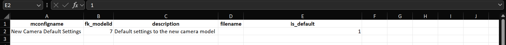
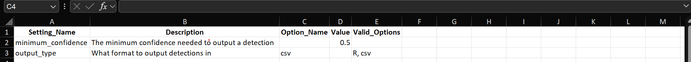
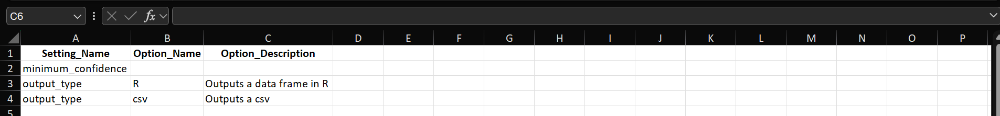
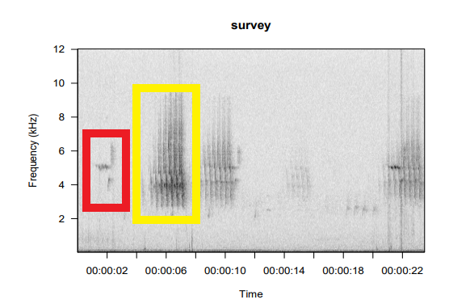
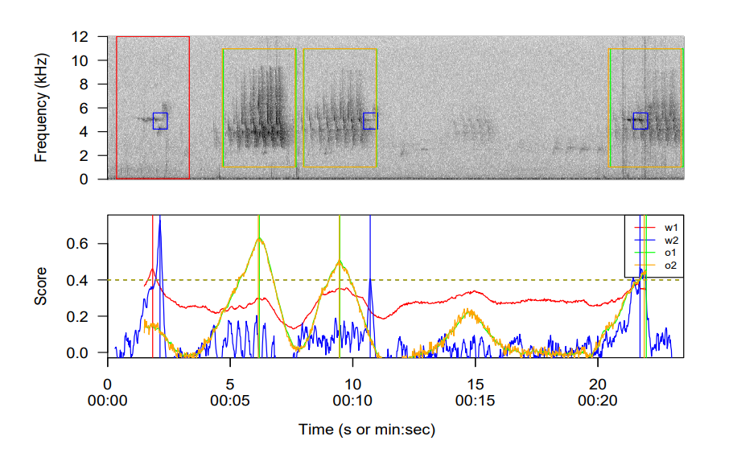

```{r setup, include=FALSE}
source('includes.R')
shiny::addResourcePath("figs", system.file("extdata/figs", package = "AMMonitor"))
```

## {width=100px} Models in AMMonitor

In the *AMMonitor* system, raw monitoring files such as recordings and photos are collected by Autonomous Monitoring Units (AMUs).  The captured raw monitoring files are stored either locally or in the cloud, and presumably contain taxonomic targets of conservation or management interest. 

To translate media files into meaningful information that informs conservation and management, we must first label these media files so we may interpret what they represent. The process of data labeling, or tagging, is the act of pairing media with taxa or some other characteristics. We'll use the terms "label" and "tag" interchangeably. *AMMonitor* supports labels produced by humans (or hobbits) as well as labels produced by via computer models. 

> &#128073;&#127996; We introduced the process of human labeling in the "annotations" tutorial.  This tutorial focuses on labeling with a suite of computer models known as machine learning models.  Warning! This is a very long tutorial!


> &#128073;&#127998; Machine learning works by training algorithms on sets of data to achieve an expected outcome such as identifying a pattern or recognizing an object. Machine learning is the process of optimizing the model so that it can predict the correct response based on the training data samples (i.e. human labels).  Assuming the training data is of high quality, the more training samples the machine learning algorithm receives, the more accurate the model will become. The algorithm fits the model to the data during training, in what is called the “fitting process.” If the outcome does not fit the expected outcome, the algorithm is re-trained again and again until it outputs the accurate response. In essence, the algorithm learns from the data and reaches outcomes based on whether the input and response fit with a line, cluster, or other statistical correlation. Source: https://cloud.google.com/learn/what-is-machine-learning

If you've been following the recent literature, you know that identifying wildlife targets in media with machine learning models is a hot, hot, hot research topic.  There are numerous examples, and there is a good chance that you've seen machine learning models in action. For example, the cell phone app, "Merlin", allows users to "listen" for environmental sounds, displays the sonogram, and returns to the user the most likely animals that it is detecting. Try it!  Merlin was developed by the Cornell Lab of Ornithology. The model behind Merlin is named "BirdNET" (https://birdnet.cornell.edu/), and the model itself is a convolutional neural network  model (CNN; a type of machine learning model) that has been trained on millions of bird (and frog) vocalizations. 

From the camera trapping world, the CNN named "MegaDetector" (https://github.com/agentmorris/MegaDetector) identifies animals, people, and vehicles in images (which also makes it useful for eliminating blank images). This model is trained on several million images from a variety of ecosystems. 

The *AMMonitor* package does not support these models directly, but you can run them and import their results to the *AMMonitor* database and then make use of *AMMonitor* functions for downstream analysis. 

> &#128073;&#127995; FYI - The USGS AMBER coalition supports these models; see the "amber" *learnr* tutorial for more information.

*AMMonitor* supports the development of much simpler models in the form of acoustic templates - a small portion of the spectrogram that is used as a "baseline signal" and that can be run through audio recordings in search of close matches [@katz].  The resulting "hits" are either true-positive detections or false-positive detections. *AMMonitor* further supports the development of machine learning models that can help separate the true positives from the false positives [@balantic].

The results of these models can be used to investigate a large suite of ecological questions.  Let's get started.


## Tutorial set up

We'll need a demo *AMMonitor* project for this tutorial. As with all other tutorials, we used the `ammCreateMiniDemo()` function to create a small demo project named "demoAMM" that is pulled into the tutorial itself, with the file path stored as the R object, "demo_fp". This filepath is stored on your machine and can be found by running the following code:

```{r demofp}
demo_fp
```

For this tutorial, we wish to refresh your memory about the directories in the demo *AMMonitor* project.

```{r}
list.files(demo_fp)
```

In particular, the SQLite database is stored in the "database" directory, a single recording is stored in the "recordings" directory, and a single *AMModels* library named "templates.RDS" is stored in the "ammls" directory. Let's look at the model library, an RDS file.

```{r}
list.files(file.path(demo_fp, "ammls"))
```

> &#128073;&#127999; *AMModels* is an R package that can be used to store models of any kind [@AMModels]. Generally speaking, a “model” can be something like a machine learning model  dedicated to searching for target wildlife species captured in media.  But models can also be ecological models, such as an occupancy model that inputs both machine-learning tags and human tags, and provides estimates of status and trend for a species of interest.  An *AMModel* library (abbreviated "amml") stores a collection of models as a single R object (the “model library”) that can be saved as an .RDS file, thus allowing models to be retrieved for future use.  Models stored in an *AMModels* library retain their original R class, can be associated with metadata, and can be easily saved and retrieved when needed.  Please see the "ammodels" *learnr* tutorial for more detail.

Let's peak at what is stored inside the “templates.RDS” library:

```{r}
# read in the library
library <- readRDS(file = file.path(demo_fp, "ammls", "templates.RDS"))

# look at the library
library
```

This library stores 4 models, as seen in the "Models" section of the output.  We will be using this library later in the tutorial.

Let's set the connection to the database now:

```{r, echo = TRUE, eval = TRUE}
# set a database connection by pointing to the database filepath
conx <- dbSetCon(paste0(demo_fp, "/database/demo.sqlite"))

# look at the class of the connection object
class(conx)
```

Once a connection is made, you can use many functions from the *DBI* package [@DBI] or from *AMMonitor* to work with the database.  For example, DBI's  `dbListTables()` is used below to return an  alphabetical listing of each table in the database

```{r listtables, exercise = TRUE}
# use DBI's dbListTables function to list all tables
DBI::dbListTables(conn = conx)
```

Eight tables are of special interest for this tutorial: *models*, *msettings*, *msettingnames*, *msettingoptions*, *mconfignames*, *modeloutputs*, *modelverifications*, and *modellabels* (not pictured).  Figure 1 shows the relationships among the tables:

```{r , echo = F, fig.align='center', out.width = "100%", fig.cap = "*Figure 1.*", out.extra='style="background-color: #999999; padding:5px; width:90%; display: inline-block;"'}

```

Let's work our way through these tables, keeping the big picture in mind. Each model's metadata is logged in the *models* table; the actual model code can be stored in an "ammodels" library (as previously noted).  Each model may have particular settings and configurations (stored in the *msettings*, *msettingnames*, *mconfignames*, and *mconfigvalues* tables).  The models are then pitted against media files, hopefully identifying taxonomic targets (from the *taxa* table) or other targets identified in the tagging *librarylistitems* or *medialistitems* tables (not shown), with outputs stored in the *modeloutputs* table. The *modellabels* table is provided for optionally using to map the raw labels produced by models to the aforementioned AMMonitor database tables. As you likely know, machine learning models are not perfect, but they can be improved by tracking true detections from false detections; these records are stored in the *modelverifications* table.  We'll introduce all seven tables in this tutorial.

## The models table

Let's start by reading in the models table that comes with the demo.  

```{r}
DBI::dbReadTable(conx, name = "models")
```

Please scroll! The *models* table stores metadata about each model, such as its name (**model_name**), the **model_url** (e.g., source code to a GitHub repository), the name of the *AMModels* model library that stores the code (**amml**), the type of model (**model_type**), the **model_description**, and the **model_citation**.  The fields **fk_taxonid** and **fk_librarylistid** identify the "targets" that the model is trained to detect. The primary key for this table (**pk_modelid**) is an autonumber.  

For example, the MegaDetector model has a primary key of 5; it is a CNN model with source code posted at https://github.com/microsoft/CameraTraps, and should be cited as 	*Beery, S., Morris, D., & Yang, S. (2019). Efficient pipeline for camera trap image review.  arXiv:1907.06772.*  The **fk_librarylistid** points to a list named "md_list", identifying its targets. Let's have a look, confirming that the items in this list include "Human", "vehicle", and "animal sp.".

```{r}
DBI::dbGetQuery(
  con = conx, 
  statement = "SELECT * FROM librarylistitems WHERE fk_librarylistid = 'md_list';")
```


Let's look at another example. The BirdNET model has a primary key of 6; it is a CNN model with source code posted at https://github.com/kahst/BirdNET-Analyzer and should be cited as *Kahl, S., Wood, C. M., Eibl, M., & Klinck, H. (2021). BirdNET: A deep learning\n solution for avian diversity monitoring. Ecological Informatics, 61, 101236.*  This entry does not include a **fk_librarylistid** identifying the taxa that BirdNET is trained to detect.  The Middle Earth Team must assume they can identify the targets from the model's code repository (though it would be useful to add a list for clarity!).

The remaining four models logged in the *models* table are correlation templates and  binary point matching templates that were created by members of the Middle Earth Monitoring Team (no citation). These templates target two particular taxa, [Ovenbird](https://www.allaboutbirds.org/guide/ovenbird/id) (oven) and [Black-throated Green Warbler](https://www.allaboutbirds.org/guide/Black-throated_Green_Warbler/id) (btnw) as logged in the *taxa* table.  The templates themselves (R objects) are stored in the *AMModels* library named "templates.RDS", which we looked at in the previous section.  We will introduce templates soon.

> &#128073;&#127995; Note that models can have versions. For example, BirdNET is actively being developed and new versions are regularly released.  If so, each version should be its own record in the *models* table.  You can reference previous versions, if desired, by  linking the two primary keys with the **fk_parentid** field in the *models* table.

## Model configurations

Each model may have a settings (inputs), and configurations of these settings can be stored as well.  Then, when a model is run against some media files, the outputs can be linked to the configuration used when running the model.

Let's look at the *msettingnames* table that comes with the demo:

```{r}
DBI::dbReadTable(conx, name = "msettingnames")
```

Here, you can see that **pk_msettingnameid** = 1 has a **setting_name** = "confidence threshold". This is a setting used by **fk_modelid** 5 (which you may recall is MegaDetector), where its **description** is	"Minimum confidence score from a MegaDetector model output  that will be returned."

Some settings have options, where the values are restricted to a dropdown list.  These options would be stored in the *msettingoptions* table, which has the following columns:

```{r}
# get info about the msettingoptions table
DBI::dbGetQuery(
  conn = conx, 
  statement = "PRAGMA table_info(msettingoptions);"
)
```

The primary key for this table (**pk_msettingoptionid**) is an auto-number, and a record references the **fk_msettingnameid** from the *msettings* table. It then stores the **option_name** and **description**.  None of the settings in the demo include options that are restricted to a list, but suppose the setting "sensitivity" had options of "high", "medium", and "low".  These entries would be logged and defined in the *msettingoptions* table. 

Model configurations are stored in the *mconfignames* and *mconfigvalues* tables. Let's have a look at the demo:

```{r}
DBI::dbReadTable(conx, name = "mconfignames")
```

Here, two configurations are stored for the demo. The first one has the name "MegaDetector default settings" (primary key = 1 and associated with **fk_modelid** 5), and the second one has the name "BirdNet default settings" (primary key = 2 and associated with **fk_modelid** = 6).  The configurations may be stored in a filepath and used in a "model run"; if so, the **filename** is provided and the script should be stored in the "settings" directory of the *AMMonitor* project. The column **is_default** is binary, indicating whether the configuration is the default configuration.

Each configuration has a set of values, stored in the *mconfigvalues* table.  

```{r}
DBI::dbReadTable(conx, name = "mconfigvalues")
```

Please scroll through this table.  The *mconfigvalues* table will store the configuration name **fk_mconfignameid**, and pair it with settings **fk_msettingnameid** and their values (either **fk_msettingoptionid** or  **value_num**.) This table is a bit challenging to read though. For example, the "MegaDetector default settings" configuration has a confidence threshhold set to 0.1.  Can you see that?

*AMMonitor* comes with several built-in queries that might be useful in displaying data results.  For models, use the `help.search()` function, and provide one of the model-family table names under the "pattern" argument, and specify "concept" for the "fields" argument:

```{r qry, exercise = TRUE}
help.search(
  package = "AMMonitor", 
  pattern = "mconfigvalues", 
  fields = "concept")
```

You should see that a built-in query named `qryMconfiguration()` is available for use. Let's try it, retrieving the configuration named "MegaDetector default settings", which has a configuration id = 1:

```{r, eval = T}
# get the configuration for the MegaDetector model
qryMconfiguration(
  con = conx, 
  mconfigid = 1, 
  disconnect = FALSE)
```

The results of a query are more readable than the raw database table entries.

> &#128073;&#127995; The benefit of creating configurations is that each output can be traced back to the inputs used in running a model.  

Configurations for templates are not included in the demo because default settings of templates are stored directly in the template itself, as we'll see shortly.

## Adding Models and Configurations

As the past two sections have shown, AMMonitor uses a number of database tables to record models and their configurations. AMMonitor includes two ways to simplify updating a database with new models and configurations.  A suite of functions allow users to easily add new models and configurations and check the settings of existing configurations programmatically, while the **modelManager** app provides a graphic interface for adding, editing, or deleting models, settings, and configurations.

### Adding models programmatically

As an example, let's add a new model to identify species in trail camera photos, called "New Camera Model". The modelAdd() function can be used to add this model and specify what settings the model has. This function makes use of a template Excel spreadsheet, which can be copied to a directory of your choice as follows. We'll use an AMMonitor demo project here.

<p class=instructions>
If you'd like to follow along with your own spreadsheet, you can open a new session of R by going to Session | New Session. Copy the code below to get a copy of the initial spreadsheet. You can follow along with future code blocks and screenshots to walk through the process alongside this tutorial.
</p>

```{r, eval = FALSE, echo = TRUE}

# Create a demo project
demo_fp <- ammCreateMiniDemo(filepath = tempdir())

# Get the filepath to the Excel spreadsheet
fp <- system.file("extdata/modelAdd.xlsx", package = "AMMonitor")

# Create a copy in the demo directory
file.copy(from = fp, to = demo_fp, overwrite = FALSE)

```

The copied spreadsheet can now be opened and updated with new model information. In this example, let's say that the new camera model has a minimum confidence setting to output a detection, and results can be output directly into R or saved as a csv. First, fill in the top table in blue with basic model information. Next, list the setting in the green table, and provide a short description. Lastly, fill in the orange table with any categorical options for settings. Note that the "Setting_Name" column of this table includes a dropdown; this ensures that any setting names match.

```{r, echo = FALSE, fig.align = 'center', out.width = "100%", fig.cap = "An example completed modelAdd spreadhsheet", out.extra='style="background-color: #999999; padding:5px; width:90%; display: inline-block;"'}

```

Now, the model can be added to the database using the model add function:

```{r, eval = FALSE, echo = TRUE}

# Add the model to the database
modelAdd(
  con = conx,
  excel_fp = file.path(demo_fp, "modelAdd.xlsx"),
  disconnect = FALSE
)

```

Let's take a look! The new model will be listed in the models table, and the settings can be viewed easily using a query, qryModelSettings().

```{r, eval = FALSE, echo = TRUE}

# View the models table
DBI::dbReadTable(conx, "models")

# Look at the settings for the new model using the model ID, 7
qryModelSettings(
  conx,
  modelid = 7,
  disconnect = FALSE
)

```

Now, let's add a configuration for the new model. Two functions can be used to easily add a configuration: modelConfigWriteXL() and modelAddConfig(), which create an Excel spreadsheet for a model and update the database, respectively. The first function, modelConfigWriteXL(), queries the database to output a spreadsheet with only relevant settings and options for that model. This function simply requires a model ID and output directory for the new spreadsheet.

```{r, eval = FALSE, echo = TRUE}

# Create a configuration spreadsheet for the new model
modelConfigWriteXL(
  con = conx,
  modelid = 7,
  output_dir = demo_fp,
  disconnect = FALSE
)

```

A spreadsheet named "modelAddConfig.xlsx" will be output in the output directory. This spreadsheet has multiple named sheets. The first, "Configuration_Name" includes the basic information about the model configuration. Note that the model ID is automatically filled in, based on the function inputs. The model configurations of the new camera model are not stored in a file, so the filename field is left blank; this will result in an NA in the database.

```{r, echo = FALSE, fig.align = 'center', out.width = "100%", fig.cap = "An example completed Configuration_Name sheet.", out.extra='style="background-color: #999999; padding:5px; width:90%; display: inline-block;"'}

```

The second sheet, "Configuration_Values", includes the actual configuration settings. Notice that the settings were automatically filled in based on the settings listed in the database, and that valid options were listed for the "output_type" setting based on the provided options. Fill in the "Option_Name" and "Value" columns of this sheet. If you need more information on the options, the "Setting_Options" sheet provides descriptions of any valid options. Note how each row includes a blank cell; this is because each setting needs either a value or a selected option, but not both.

```{r, echo = FALSE, fig.align = 'center', out.width = "100%", fig.cap = "An example completed Configuration_Values sheet.", out.extra='style="background-color: #999999; padding:5px; width:90%; display: inline-block;"'}

```

```{r, echo = FALSE, fig.align = 'center', out.width = "100%", fig.cap = "An example Setting_Options sheet.", out.extra='style="background-color: #999999; padding:5px; width:90%; display: inline-block;"'}

```

With the spreadsheet filled out, the new configuration can now be added to the database! This can be accomplished using the modelAddConfig() function:

```{r, eval = FALSE, echo = TRUE}

# Add the new model configuration to the database using the completed spreadsheet
modelAddConfig(
  con = conx,
  excel_fp = file.path(demo_fp, "modelAddConfig.xlsx"),
  disconnect = FALSE
)

```

The new configuration can be viewed using qryMconfiguration() as well.

```{r, eval = FALSE, echo = TRUE}

# Get the new configuration ID
DBI::dbReadTable(conx, "mconfignames")

# Query the new configuration
qryMconfiguration(
  con = conx, 
  mconfigid = 3,
  disconnect = FALSE
)

```

These functions and queries can be used to easily add and track models and model configurations throughout a project. Tracking model configurations can be essential to provide consistent results throughout a project.

### Adding models with **modelManager**

Adding models (and settings and configurations) programmatically can be convenient when you want to share a configuration with others, as it allows for the excel spreadsheet to be shared and imported easily to multiple databases. But for a more interactive, user-friendly interface to models, users can launch the **modelManager** app.

The first tab of the app, "Model and Model Settings", allows users to add new models and model settings. The left section of this tab, “Add New (Machine Learning) Models”, allows the user to add a new model by selecting the model name, model type (e.g., CNN, KNN, random forest, etc.), the model website, and links to an amml library or user manual, citation and description. You can also add either an fk_taxonid or reference to a taxon list to indicate which taxa the model can classify. The right section of this tab, “Model Settings”, lets users add, edit, or delete setting options for the selected model. The second tab of the app, “Model Configurations”, allows users to select a model and create/edit/delete configurations for that model.

> &#128073;&#127996; The **modelManager** app shows labels rather than integer primary keys for various tables (e.g., msettingnames, msettingoptions, mconfignames, and mconfigvalues) to make the information in these tables more readable.

## Creating template models

*AMMonitor* supports the development of a very simple model  called a "template".  Acoustic templates are simply portions of a spectrogram that contain a signal of interest.  For example, Figure 2 shows a 22 second spectrogram, and two templates depicted in boxes. The red box contains a song from a Black-throated Green Warbler ("btnw" in the *taxa* table), while the yellow box contains a song from an Ovenbird ("oven" in the *taxa* table).  Watch  these songs being broadcast at https://www.allaboutbirds.org/guide/Ovenbird/sounds and https://www.allaboutbirds.org/guide/Black-throated_Green_Warbler/sounds

```{r , echo = F, fig.align='center', out.width = "100%", fig.cap = "*Figure 2.*", out.extra='style="background-color: #999999; padding:5px; width:90%; display: inline-block;"'}

```


Once created, the templates can be saved in an *AMModels* library, and then called upon to scan new audio files in search of matches. Figure 3 shows an example of such an analysis, where the x-axis is the timestamp in an audio file, and the y-axis gives the "score", or closeness between the template and the underlying signal in the audio file.  In this figure, four different templates are run, including the two highlighted in Figure 1.  The user sets a "threshold;" scores greater than this threshold are considered "hits". For example, the horizontally dashed line at 0.4 is an example of a user-defined threshold.  These hits may be true positives or false positives, as discussed in the model verifications section later in the tutorial.

```{r , echo = F, fig.align='center', out.width = "100%", fig.cap = "*Figure 3.*", out.extra='style="background-color: #999999; padding:5px; width:90%; display: inline-block;"'}

```

> &#128073;&#127995; *AMMonitor* relies on the R package, *monitoR* [@katz], for template creation and analysis. This package should be installed and loaded when you launch *AMMonitor*, and was developed at the Vermont Cooperative Fish and Wildlife Research Unit as part of Jon Katz's Ph.D. dissertation project.  Two types of templates can be created: binary point matching templates and correlation templates.

> &#128073;&#127996; *AMMonitor* relies on a second R package, *AMModels* [@AMModels], to store templates in a "model library". As previously mentioned, the concept of a model library is very simple:  a library stores R objects of any class, along with metadata, so that one can easily retain and reuse models at will.  

To create and store templates, launch the *AMMonitor* Shiny application.  Then select the "Apps" icon in the left menu, which brings up a list of built-in apps that guide a user through a particular analysis. The app we are interested in named "create_templates".

This video will show you the basics:


Once templates are added to the model library, and the model library is re-saved, you can call it into R and use it at will:

```{r}
# read in the library
library <- readRDS(file = file.path(demo_fp, "ammls", "templates.RDS"))
```

Then you can inspect each model and metadata with functions from the *AMModels* package. For example, let's look at the template named "btnw_ct", which is a correlation template for the Black-throated Green Warbler.

```{r}
# look at the metadata for the template "btnw_ct"
AMModels::modelMeta(amml = library, x = "btnw_ct")

# extract the "btnw_ct" template into R
btnw_ct <- AMModels::getAMModel(library,"btnw_ct")

# look at the template object's structure
str(btnw_ct)
```

Each template is a chunky R object of class "binTemplateList" or "corTemplateList". It is a list of 1 element, which is the template itself.  Notice that the template object stores the actual spectogram as a matrix (stored in the "pts" slot), along with other information such as the original clip name (\@clip.path), sample rate (\@samp.rate), time step (\@t.step), frequency step (\@freq.step), etc.  The default score cutoff for this template is 0.4, as stored in the \@score.cutoff slot.

## The modeloutputs table

Once a template is made, we can "run" it against new acoustic files in search of target signals.  This applies not just to templates, but any external model that is configured to search media for monitoring targets, such as MegaDetector and BirdNET. The results of any such analysis are stored in the *modeloutputs* table of an *AMMonitor* database.

Before we introduce the *modeloutputs* table, let's remind ourselves of what media files come with the *AMMonitor* demo.

```{r}
DBI::dbReadTable(conx, name = "media")
```

Keep in the back of your mind that **pk_mediaid** 1:25 are of media type "photo", while **pk_mediaid** 26 is of media type "audio".  

Let's now look at the *modeloutputs* table that comes with the demo (we will describe how to populate this table with the function, `scoresDetect()`, in the next section).

```{r}
DBI::dbReadTable(conx, name = "modeloutputs")
```

Scrolling will be necessary, but hopefully you can see that this table consists of 55 model outputs and is largely populated with numbers. Let's walk through a few records in this table, where the field **pk_modeloutputid** is the primary key of the table and is an autonumber. 

- **pk_modeloutputid** = 1 was the result of running **fk_modelid** 2 (the template named "btnw_bt") against **fk_mediaid** 26 (from the media table, a file named "1.wav"). The taxa identified (**fk_taxonid**) was "btnw" within the bounding box defined by **x_min**, **x_max**, **y_min**, and **y_max**, with a score (value_num) of 16.4154009.  This model output does not have a "parent" model output (**fk_parentid**), nor does it provide the configurations used when running the model (**fk_mconfignameid**). The reason that we can avoid specifying configurations here is that the configurations are stored in the template.  We will discuss the **fk_parentid** column later in the tutorial.   

- **pk_modeloutputid** = 11 was the result of running **fk_modelid** 5 (MegaDetector) against **fk_mediaid** 1 (from the media table, a file named "locationA_camera1_20230505_020249_35.JPG").  The taxa identified (**fk_taxonid**) was "animal sp." (a valid record in the *taxa* table indicating the animal kingdom) within the bounding box defined by **x_min**, **x_max**, **y_min**, and **y_max**, with a score (value_num) of 0.9680000.  This model output does not have a "parent" model output (**fk_parentid**), but it used **fk_mconfignameid** = 1 (the configuration named "MegaDetector default settings"). 

> &#128073;&#127996; The second example illustrates how you can incorporate results from external models such as "BirdNET" or "MegaDetector" into the *AMMonitor* database.

## The modellabels table

Oftentimes, a remote monitoring project will involve a large number of model outputs, and multiple different machine-learning models may be used to detect taxa of interest. For example, let's look at our models table again.

```{r}
DBI::dbReadTable(conx, name = "models")
```

Each of our template models (pk_modelids 1 to 4) identifies a single taxon. MegaDetector (pk_modelid 5) is able to identify people, animals, and vehicles. BirdNET is able to detect a wide variety of bird species that may be of interest. Each of these models may also output their results in a different format and label taxa in different ways. At a small scale, these different outputs can be handled manually with relative ease. As a project grows, however, the number of model outputs can quickly increase, and you may want a more systematic approach to add them to your database.

AMMonitor enables this via the *modellabels* table. The *modellabels* table stores mappings between the raw outputs from machine-learning models and the identifiers stored in the database. Let's take a look now!

```{r}
DBI::dbReadTable(conx, "modellabels")
```

Please look through this table! Note that each label (**original_label**) is associated with a model (identified by its **fk_modelid**), along with a taxa (**fk_taxonid**), library list item (**fk_librarylistitemid**), or media list item (**fk_medialistitem**). In this database, we only have the taxa labels listed for our various audio models, so we'll focus on the **fk_taxonids**. The primary key, (**pk_modellabelid**), is an autonumber.

For our template models (**fk_modelids** 1 to 4), we were able to specify the output label when we created the templates. As such, the **original_label** and **fk_taxonid** match. BirdNET, however, has a different output format that identifies species by their common names. So the **original_labels** for BirdNET (**fk_modelid** 6) are full common names, which have been matched with **fk_taxonids** in the database.

These mappings between model outputs from different models can be used to easily add those outputs to the database without manually matching the taxon IDs. Additionally, they can be used to track the labels used by different models to identify the same species. Filling in the *modellabels* table when a new monitoring project begins, or when you add new taxa of interest, can simplify the process of sorting model outputs and adding them to the database throughout a project!

## The scoresDetect() function

How were the template *modeloutputs* created in the demo database?  Once templates are created, they can be run against any audio file of interest using the `scoresDetect()` function, which is similar to a function in *monitoR* but adds SQLite database compatibility.

Because template results are already present in the demo, let's delete the results associated with the template "btnw_ct", which has a primary key of 1.  

```{r mo5, exercise = TRUE}
# delete all records
DBI::dbExecute(
  con = conx, 
  statement = "DELETE FROM modeloutputs 
    WHERE fk_modelid = 1;")

# confirm by looking at the table
DBI::dbReadTable(conx, name = "modeloutputs")
```


Now that we've removed all model outputs associated with model id = 1 ("btnw_ct”), let's look at the `scoresDetect()` function with an eye towards running it and re-populating the *modeloutputs* table:

```{r scoresdetect2, exercise = TRUE}
help(scoresDetect, package = "AMMonitor")
```

Let's study the arguments:

- conx = an open connection to the SQLite database.
- recordingNames  = a vector of filename entries from the *media* table.
- templateNames  = a vector of template model names entries from the *models* table. Recall that the *models* table should also include the "amml" library that stores each template.
- scoreThresholds  = a vector of score thresholds for each template; the length of the vector should match the length of the templateNames argument. If blank, the thresholds stored in the templates directly will be used.
- recordingRootPath  = the root path to the directory that stores the recording files.
- ammlPath  = filepath to the directory that houses AMModels library or libraries that store templates.  
- dbInsert  = TRUE or FALSE.  Should the results be added to the modeloutputs table in the database?
- showProgress = TRUE or FALSE. If TRUE, progress will be reported during the score calculations.
- corMethod  = For spectrogram cross correlation templates, the method used to calculate correlation coefficients.

Let's give this function a whirl by running the correlation template named "btnw_ct" against the audio file named "1.wav".

```{r scoresdetect, warning=FALSE, exercise = TRUE}
scores <- scoresDetect(
    con = conx,
    recordingNames = "1.wav",
    templateNames = "btnw_ct",
    scoreThresholds = NA,
    recordingRootPath = paste0(demo_fp, "/recordings"),
    ammlPath = paste0(demo_fp, "/ammls"),
    dbInsert = TRUE
)

# show the scores
scores
```

The function checks to see if this template and audio file combination has already been run. In this case, 0 rows are present in the database (because we removed the original records), and 2 detections were added.  If previous records were present, however, any records will be updated with the new function call.  

> &#128073;&#127996; It's up to you to make sure that that library is in-sync with the *models* table, which specifies the name of the library that stores each template.


## Verifying model outputs

Now that we've run our templates and have outputs stored in the *modeloutputs* table, it's time to verify the outputs.  When we say "verify", we mean essentially "confirm" whether the machine output correctly identifies its target or not. 

> &#128073;&#127998; Remember:  Machine learning works by training algorithms on sets of data to achieve an expected outcome such as identifying a pattern or recognizing an object. Machine learning is the process of optimizing the model so that it can predict the correct response based on the training data samples (i.e. human labels).  Assuming the training data is of high quality, the more training samples the machine learning algorithm receives, the more accurate the model will become. The algorithm fits the model to the data during training, in what is called the “fitting process.” If the outcome does not fit the expected outcome, the algorithm is re-trained again and again until it outputs the accurate response. In essence, the algorithm learns from the data and reaches outcomes based on whether the input and response fit with a line, cluster, or other statistical correlation. Source: https://cloud.google.com/learn/what-is-machine-learning

Each model output can be inspected and confirmed to be correct or incorrect.  As you likely guessed, model verifications are stored in the *modelverifications* table.  Let's have a look:

```{r}
DBI::dbReadTable(conx, name = "modelverifications")
```

Scroll through this table! You should see that "sgamgee" verified 31 records, and that he deemed not all of the machine model outputs were correct.

Model verifications are made by clicking on the Audio or Photo Tools option in the left menu in the *AMMonitor* Shiny app, and then **carefully** verifying selected model outputs.  This video will show you how it's done:


The query, `qryVerifications()` can be used to return information stored in the *modeloutputs* table, returning a summary of validated outputs.

```{r}
# return modeloutputs verifications
rslt <- qryVerifications(conx, table = 'modeloutputs', disconnect = FALSE)

# graph the result
ggplot2::ggplot(
 data = rslt[,1:11],
 mapping = aes(
   fill = as.factor(is_valid), 
   x = fk_taxonid)) +
 geom_bar() +
 labs(
   x = "Taxa",
   y = "Count",
   fill = "Valid") 

```

Feel free to create your own tables or graphs from the returned output.

> &#128073;&#127995;  It cannot be emphasized enough that verifications should be 100% correct. If a model output is incorrect, the is_valid score should be 0, and if it is correct, the is_valid score should be 1.  If the choice is between speed and accuracy when verifying model outputs, accuracy rules the day. After all, this information is what is used to build a machine learning model that can accurately separate "true" model outputs from "false" model outputs, described in the next section.

### Merged audio for model output verifications

Machine learning models often provide a very large number of model outputs, and a subset of those outputs will need to be reviewed and verified. When you have many model outputs across different audio files, creating merged audio files can streamline the verification process, just as it can for annotation verification.

For full details on using the merged audio functions in AMMonitor, see the "Annotations" tutorial. The process will be mostly the same; you'll just need to provide model output IDs instead of or alongside annotation IDs, as shown below:

```{r}

# create a merged audio file using model output IDs
mergedAudioCreate(
  con = conx,
  modeloutput_ids = 43:55,
  ammPath = demo_fp
)

```

This function will create a single, merged media file containing all of the specified model outputs, allowing for quicker and easier review. Once verifications are completed, they can be reassigned to the original model outputs and media files using the `mergedAudioRemove()` function.

## The scoresGetFeatures() function

The `scoresGetFeatures()` obtains the spectrogram data associated with each verified detection by a particular template and associates them with the model verifications so that they can be used to train classifier models. Only outputs where there is a consensus in the verifications (everyone who verified agreed that the output is a true or false positive) will be obtained. While this function is designed for use with template outputs, it can also be used with other models that produce outputs with identically sized bounding boxes.

Let's try this now:

```{r asdaf, eval = T, exercise = TRUE}
features <- scoresGetFeatures(
  con = conx,
  templateName = "btnw_bt",
  recordingRootPath = paste0(demo_fp, "/recordings/"),
  showProgress = FALSE,
  disconnect = FALSE
)

str(features)
```

What you're seeing is the template's underlying amplitudes (which are visualized as a matrix, but represented here as a vector... remember, matrices are really vectors that have 2 dimensions).  We'll make use of these vectors in the next section.


## Creating classification models

As we've mentioned, there are many, many types of "machine learning" models, including the MegaDetector and BirdNET models introduced in previous sections.  Here, we are interested in "classification" models -- machine models that classify data into a grouping.

Let's get a *feeling* for one of many classification models, a model called "k-means cluster." Below, we'll show you this model in action by looking at R's built-in dataset called "iris," which contains 150 records of iris flowers from 3 different species, detailing the sepal length, sepal width, petal length, and petal width of each individual flower:

```{r}
iris
```

<p class = 'instructions'>
Familiarize yourself with the iris dataset.  Then choose an X variable and Y variable from the iris dataset, and then enter the number of clusters you'd like the k-means cluster algorithm to identify.  Try multiple ways!
</p>


```{r, echo = FALSE}

selectInput(
        inputId = "xcol", 
        label = "X Variable", 
        choices = c(
          "Sepal.Length", 
          "Sepal.Width", 
          "Petal.Length", 
          "Petal.Width"),
        selected = "Sepal.Length"
      )

selectInput(
        inputId = "ycol", 
        label = "Y Variable", 
        choices = c(
          "Sepal.Length", 
          "Sepal.Width", 
          "Petal.Length", 
          "Petal.Width"),
        selected = "Sepal.Width"
      )

numericInput(
        inputId = "clusters", 
        label = "Cluster count", 
        value = 3, 
        min = 1, 
        max = 9
      )

plotOutput(outputId = "plot1")

 

```

```{r, context = "server"}
# subset the iris data
  selectedData <- reactive({
    iris[, c(input$xcol, input$ycol)]
  })
  
  # run the kmeans clustering 
  clusters <- reactive({
    kmeans(
      x = selectedData(), 
      centers = input$clusters
    )
  })
  
  # produce the scatterplot
  output$plot1 <- renderPlot({
    par(mar = c(5.1, 4.1, 0, 1))
    plot(
      selectedData(),
      col = clusters()$cluster,
      pch = 20, 
      cex = 3
    )
  })
```

Hopefully you can see that the k-means cluster algorithm places the 150 unique flower records into "clusters".  Also, note that "Species" is not part of the clustering equation: the clustering is done based on sepal and petal characteristics only, and there is no direct link between the resulting clusters and the Species column.

> &#128073;&#127996; The k-means cluster algorithm is an example of an **unsupervised** machine learning algorithm, which does not use "labels" such as the Species column to create clusters. In unsupervised learning, the machine model is trained on a set of unlabeled data, which means that the input data is not paired with the desired output. The machine then learns to find patterns and relationships in the data. Source: https://www.geeksforgeeks.org/supervised-unsupervised-learning/ 

> &#128073;&#127997; In contrast, **supervised** learning is one in which the machine is trained on a set of labeled data, which means that the input data is paired with the desired output. The machine then learns to predict the output for new input data. Supervised learning is often used for tasks such as classification, regression, and object detection. Source:  https://www.geeksforgeeks.org/supervised-unsupervised-learning/

> &#128073;&#127995;In both cases, once a model has been finalized, it can be saved as an R object, stored in an *AMModels* library, and then put to work in the future.

These links provide additional information about the differences between the unsupervised and supervised algorithms:

- https://cloud.google.com/discover/supervised-vs-unsupervised-learning
- https://azure.microsoft.com/en-us/resources/cloud-computing-dictionary/what-are-machine-learning-algorithms/


What does this have to do with templates?  As we've described in previous sections, any template "score" that exceeds a user-defined cut-off is considered a "hit" or a detection.  These detections are either true positives (the signal is correctly identified) or false positives (the signal is incorrectly identified).

> &#128073;&#127998; While working on her Ph.D. dissertation at the Vermont Cooperative Fish and Wildlife Research Unit, Cathleen Balantic realized that supervised machine learning models can be developed to "weed out" false positive detections, and incorporated this element into the *AMMonitor* package.

<p class = 'instructions'> Keeping in mind that supervised machine models pair the input with desired output, please answer the following: 
</p>


```{r letter-a, echo=FALSE}
question("Which AMMonitor table do you think is critical for developing a supervised machine learning model?",
    answer("media"),
    answer("modeloutputs"),
    answer("modelverifications", correct = TRUE),
    allow_retry = TRUE,
message = "The *modelverifications* is critical, as it identifies outputs that are valid and invalid.  However, the *modeloutputs* and *media* tables will come into play as well!")

```


> &#128073;&#127995; You will need a large number of *modelverifications* in order to create a supervised machine-learning model. Generally speaking, the more data you can use to build your model, the better the model will perform.

<p class = 'instructions'> Thinking back on the iris k-means clustering example, where the data that "fed" the model were sepal or petal characteristics, answer the following question:
</p>

```{r letter-b, echo=FALSE}
question("What 'data' in an *AMMonitor* project are associated with each of the model outputs?",
    answer("I don't know."),
    answer("The raw media clip."),
    answer("The spectrogram window associated with model output's bounding box.", correct = TRUE),
    allow_retry = TRUE,
    message = "To create a supervised classification model in *AMMonitor*, the spectrogram matrix [x = time, y = frequency, value = amplitude] associated with each validated model output becomes the 'features' upon which the model is built.")

```

*AMMonitor* currently supports 5 different supervised machine learning models to help separate template-matching true positives from false positives.  
 
 - glmnet  
 - [k-nearest neighbors](https://en.wikipedia.org/wiki/K-nearest_neighbors_algorithm)
 - [random forest](https://en.wikipedia.org/wiki/Random_forest)
 - [support vector machines with linear kernel](https://en.wikipedia.org/wiki/Support_vector_machine)
 - support vector machines with radial basis function kernel
 
 
> &#128073;&#127996;  Under the *AMMonitor* hood, these models are created with the R package, caret, by Max Kuhn [@caret]. The caret package (short for Classification And REgression Training) is a set of functions that attempt to streamline the process for creating predictive models. The package contains tools for data splitting, pre-processing, feature selection, model tuning using resampling, variable importance estimation, as well as other functionality. Source: https://topepo.github.io/caret/index.html

If you are serious about creating classification models, please see the fabulous ebook on caret at https://topepo.github.io/caret/index.html.  We will not go into the details of the various models here, but suffice it to say that there are many, many different classification models that can be used, and the goal of each is to use the features (the spectrogram matrices) and their corresponding linked validations, to create a model that can accurately identify true positives from false positives.

Supervised machine learning models are often evaluated with a suite of summary statistics that provide some indication of model performance.  Please read this excellent Wikipedia post to familiarize yourself with these concepts.

```{r browse, exercise = TRUE}
browseURL("https://en.wikipedia.org/wiki/Sensitivity_and_specificity")
```

Are you ready to build some classifiers?  We hope so!  Because the demo database has a single audio file with only a handful of verifications, we will illustrate the process of building classifiers using an *AMMonitor* project from our colleague, Hardin Waddle, a USGS ecologist working for the Wetland and Aquatic Research Center. Hardin's *AMMonitor* project centers on detecting Cuban Treefrogs in Florida, where it is considered an invasive species. You can hear the Cuban Treefrog's call in the video below:  


Let's have a look at Hardin's project, and create a supervised machine learning model that will help Hardin weed out false positive detected by his treefrog templates:


> &#128073;&#127995; If there are other machine learning models you would like to use for classifiers that aren't supported in our app, the `scoresGetFeatures()` function can be used to obtain the feature data needed to train your own models with the caret package, and add them to your model library. 


## classifierPredict

After a machine learning model (or more) is created and stored in an *AMModels* library, a user can call up the model at any time and run it on new template score outputs. The function `classfierPredict()` is used for this task.

From the *AMMonitor* function helpfile:  `classifierPredict()` runs classifier models (which are trained to classify the detections from a particular template) on all detections of a template in order to determine whether the detections are true or false positives. 

The function call looks something like this, where you set a connection to the database, identify the classifying model by ID, point to the recordings directory, and further point to the path where your AMModels library is stored.


```{r, eval = FALSE}
classifierPredict(
  con, 
  classifierID,
  recordingRootPath,
  ammlPath,
  showProgress = TRUE
)
```

Unfortunately, we can't demo this process with Hardin's classifiers, but you should know that the outputs of the this function are stored in the *modeloutputs* table, and further identify the template outputs in the field "fk_parentid".  Look for this column now:

```{r}
head(DBI::dbReadTable(conx, name = "modeloutputs"))
```


## Tutorial summary 

What a long tutorial!  We covered 7 essential tables related to models in the *AMMonitor* database.  We also illustrated how to create templates, run models, store outputs, verify outputs, and create classification models with code and/or the *AMMonitor* Shiny interface.

The last step in this tutorial is to disconnect from the database, and then delete the demo database to free up space on your machine.   

```{r, eval = TRUE}
# disconnect from database
DBI::dbDisconnect(conx)

# delete the demo database
unlink(demo_fp, recursive = TRUE)
```

Next, it would be useful to dive deeper into the *AMModels* package. 

```{r , eval = FALSE}
learnr::run_tutorial(
  name = "ammodels", 
  package = "AMMonitor"
)
```

A list of other *AMMonitor* tutorials is shown below.  

```{r , findothers, exercise = TRUE}
learnr::available_tutorials("AMMonitor")
```


> &#128073;&#127997; A final FYI:  If you'd like a pdf of this document, use the browser "print" function (right-click, print) to print to pdf.  If you want to include quiz questions and R exercises, make sure to provide answers to them before printing.


## References

