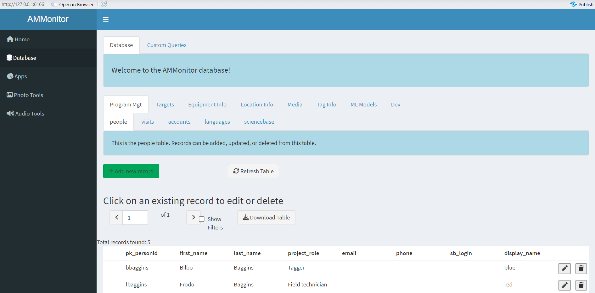

```{r setup, include=FALSE}
source('includes.R')
shiny::addResourcePath("figs", system.file("extdata/figs", package = "AMMonitor"))
```

## {width=100px} The people table

In the *AMMonitor* system, raw monitoring files such as recordings and photos are collected and stored either locally or in the cloud. All other data are stored within a SQLite database.  As a friendly reminder, the database should be stored in the “database” folder within the main *AMMonitor* project directory.  

In this tutorial, we will introduce the *people* table within an *AMMonitor* database.  As with all other tutorials, we used the `ammCreateMiniDemo()` function to create a small demo project named "demoAMM" that is pulled into the tutorial itself, with the file path stored as the R object, "demo_fp". This filepath is stored on your machine and can be found by running the following code:

```{r demofp}
demo_fp
```

The database is already present in the demo project, as shown below:
```{r}
list.files(file.path(demo_fp, "database"))
```

As you can see, the demo database is named "demo.sqlite".

To work with a database, you must set a connection with it.  For *AMMonitor*, the `dbSetCon()` function is used to create the connection *and to enforce foreign keys*.  Here, our connnection is named "conx". 

```{r, echo = TRUE, eval = TRUE}
# set a database connection by pointing to the database filepath
conx <- dbSetCon(paste0(demo_fp, "/database/demo.sqlite"))

# look at the class of the connection object
class(conx)
```

Hopefully you see that the connection is an R object with class **SQLiteConnection**. This connection allows R to communicate with your SQLite file.

Once a connection is made, you can use many functions from the *DBI* package [@DBI] or from *AMMonitor* to work with the database.  For example, DBI's  `dbListTables()` is used below, where the connection named "conx" is passed in as an argument to the `dbListTables()` function.  

```{r}
# use DBI's dbListTables function to list all tables
DBI::dbListTables(conn = conx)
```

Here, you can see an alphabetical listing of each table in the database. Notice the table named *people*. 

> &#128073;&#127995;  **People** are arguably the most important element of a successful monitoring program. This tutorial introduces the *people* table of the database. Given the central importance of the *dbdictionary* table in the database, we will take the opportunity to thoroughly walk you through the dbdictionary table entries associated with the *people* table and explain how these entries are used.

## The people  table structure

To begin, let's use *DBI*'s `dbReadTable()` to read in the people table into R.   

```{r}
# read an entire table into R with DBI's dbReadTable()
DBI::dbReadTable(
  conn = conx, 
  name =  "people"
)
```

Scroll through this table.  Here, a dataframe with `r ncol(people)` columns and `r nrow(people)` records (rows) is returned.  The first column is named **pk_personid**, and serves as the table's primary key (we'll confirm this shortly). Look for primary key values such as "bbaggins", "fbaggins", and "unknownPerson".  Primary keys must be unique; that is, there cannot be two rows that have the same primary key. 

> &#128073;&#127997; The "unknownPerson" entry is a default entry in the people table that comes with every *AMMonitor* database.  

Under the hood, the database has strict rules about what information is stored in each column.  We can use the `dbGetQuery()` function to retrieve detailed information about the columns in the *people* table, like so:

```{r}
# get info about the people table
DBI::dbGetQuery(
  conn = conx, 
  statement = "PRAGMA table_info(people)"
)
```

Scroll through this output now.  Please note that, in addition to the primary key, a second column is required. Can you find it?

```{r, reqcols, echo=FALSE}
quiz(
  question("Which columns are required entries in the people table? Select all that apply.",
    answer("pk_personid", correct = TRUE),
    answer("first_name"),
    answer("last_name"),
    answer("project_role"),
    answer("sb_login"),
    answer("display_name", correct = TRUE),
    message = "A primary key column cannot be null, even if the notnull column is 0. 
          In addition the field 'display_name' is always required. Further, it must contain 
          unique values.",
  incorrect = "Not quite!  &#128540;",
  allow_retry = TRUE
  )
)

```

What is the purpose of the **display_name** field? The display name is intented to mask personally identifiable information (PII). PII should be removed from the database in the event that an *AMMonitor* project is released to the public domain (e.g., www.sciencebase.gov).  For example, if you've watched/read Lord of the Rings, you can guess that the primary key "fbaggins" identifies Frodo Baggins.  But Frodo's **display_name** is "red".  When data are released, the **display_name** field replaces the **pk_personid**, disambiguating any PII.  The "sciencebase" tutorial describes this in more detail.


## Primary keys (again)

DBI's `dbAppendTable()` allows users to insert new records that are stored as a dataframe in R to a SQLite table. For example, let's add Pippin the database:

```{r addnew, exercise = TRUE, eval = TRUE}
# create a dataframe with a new person information
pippin <- data.frame(
  pk_personid = "pippin",
  first_name = "Peregrin",
  last_name = "Took",
  display_name = "breakfast"
)

# append the new person to the table
DBI::dbAppendTable(
  conn = conx,
  name = "people",
  value = pippin
)
```

The returned value of "1" indicates that one row was affected in the database.  Now let's read in the *people* table again and confirm the new entry:


```{r withpippin, exercise  = TRUE}
# read the table to confirm new entry
DBI::dbReadTable(con = conx, name = "people")
```

Look for Pippin.

SQLite will throw an error if you try to re-insert the same record. Try it!

```{r tryagain, exercise = TRUE, eval = FALSE}
# append the new person to the table
DBI::dbAppendTable(
  conn = conx,
  name = "people",
  value = pippin
)
```

This section merely reinforces the concept of primary keys. Please take time to read any error messages that may be returned, as the messages attempt to illustrate the problem.  Surprisingly, the error here is that the UNIQUE contraint failed: people.display_name. That is, the column named **display_name** in the *people* table must be filled with unique values.  

> &#128073;&#127997; Please note: do not use single quotation marks or apostrophes in any primary keys, as they can cause syntax errors.

> &#128073;&#127998; The information returned by the PRAGMA call gives the "SQLite" view of the *people* table. However, much more information about this table is stored in the *dbdictionary* table of the *AMMonitor* database.  Head to the next section to learn more.

## The dbdictionary table

The information shown by the PRAGMA query is also stored in the database table *dbdictionary*.  However, the *dbdictionary* table stores additional information about the *people* table that controls how the table is displayed in *AMMonitor*'s Shiny interface (described in the next section), among other things.

Let's read in the *dbdictionary* table but limit records to the *people* table:

```{r}
dictionary <- DBI::dbGetQuery(
  con = conx,
  statement = "SELECT * 
    FROM dbdictionary
    WHERE pk_tablename = 'people';"
)

# show the dictionary
dictionary
```

You may need to scroll a bit to explore all of the columns in this table.  Without scrolling, you should see that the dictionary's **pk_tablename** column value = "people", the **pk_fieldname** value = the name of the column in the *people* table, and that **core** = 1 for all columns.  

<p class = "instructions">
It may be a bit easier to study the dictionary columns using the Shiny widget below.  Here, select a field from the *people* table, and the widget will show dictionary entries for the selected field (the information is identical to the table shown above, but hopefully easier to read).
</p>

```{r , echo = FALSE, dictionary_function}
dict_fields_unique <- unique(dictionary$pk_fieldname)
  
selectInput("select_dict_field", label = h3("Select Field from the Dictionary"), 
  choices = dict_fields_unique, 
  selected = 'pk_personid')

fluidRow(tableOutput('dic_table'))
    
```
  
```{r dictionary_function1, context = "server"}
output$dic_table <- renderTable(
  expr = {
   field_id <- input$select_dict_field
     dic_table <- subset(dictionary, pk_fieldname == field_id)
     dic_table <- rbind(names(dic_table), dic_table[1,])
     dic_table2 <- t(dic_table)
     colnames(dic_table2) <- c("Dictionary column name", "Dictionary column value")
     dic_table2
     },
  bordered = TRUE,
  striped = TRUE,
  hover = TRUE,
  width = "100%"
)

```

For example, select the column "pk_personid", and you should see that dictionary contains the following information:  **pk_tablename** = people, **pk_fieldname** = "pk_personid", **core** = 1, **var_type** = VARCHAR(255), **not_null_clause** = NA, **pk** = 1, **foreign_key_table** = NA, **foreign_key_field** = NA, **on_update** = NA, **on_delete** = NA.   The values **min** and **max** and **default_value** can also be enforced by the database.

> &#128073;&#127997; Most of these should match up with the SQLite schema returned from the PRAGMA call in the last section.  

> &#128073;&#127996; Reminder: A core column in AMMonitor has a value of 1 if the column is a default table column in the AMMonitor SQLite database; a value of 0 indicates the column is a "user column" added via the function `dbAddUserCol()`.


The field **fk_listid** in the *dbdictionary* table stores a drop-down of acceptable entries for a column, stored in the *lists* and *listitems* tables.   For example, select the field named "project_role" in the Shiny widget above, and you'll see that this column accepts values from a list named "project_role".  Let's look at this entry from the *lists* table.

```{r}
# look at the list named 'project_role'
DBI::dbGetQuery(
  conn = conx,
  statement = "SELECT * FROM lists 
    WHERE pk_listid = 'project_role';"
)
```

The returned result shows that the list named "project_role" is a core list (don't delete it), and its description is "Role of person in the monitoring project."  Now let's look at the items associated with the 'project_role' list, stored in the *listitems* table.

```{r}
DBI::dbGetQuery(
  conn = conx,
  statement = "SELECT * FROM listitems 
    WHERE fk_listid = 'project_role';"
)
```

Here you can see items such as "Field technician", "PI", "Tagger", "Field and tagger", and "Database Manager".  Feel free to add to this list as you see fit. 

> &#128073;&#127999; Once again, notice that items are not the primary key of the table; instead the primary key for the *listitems* table is **pk_listitemid**, and is an auto-number.  You might think (correctly) that the "role" for an entry in the *people* table should be stored as a number. However, for *listitems*, we store the item itself for easy rendering in the Shiny application.

## AMMonitor Shiny

Let's look at the demo database via *AMMonitor*'s Shiny interface [@shiny]. 

<p class=instructions>
Open a new session of R by going to Session | New Session (so that two instances of R are running on your machine). Then, run the following commands in the new session's console, which uses `ammCreateMiniDemo()` to create the lightweight demo AMMonitor project and `launchApp()` to launch the app.  
</p>

```{r, eval = FALSE}
# load AMMonitor
library(AMMonitor)

# create a demo AMMonitor project in a temporary directory (to be deleted)
demo_fp <- ammCreateMiniDemo(filepath = tempdir())

# launch the Shiny application
launchApp(demo_fp)
```

Assume the role of the default user (sgamgee), and connect to the database.  

```{r shinyimage, eval = T, echo = F, fig.align='center', out.width = "100%", fig.cap = "*Figure 1a. Upon launching the app, you are presented with the option to select a user and connect to the database.*", out.extra='style="background-color: #999999; padding:5px; display: inline-block;"'}
knitr::include_graphics('www/shiny0.PNG')
```
 

Then, click on the Database option in the left menu. Here, you will see database tables arranged in different groupings (and populated with demo data).  Below is a screenshot of the "people" table, which is nested within a tab named "Program Mgt".  

```{r shinyimage2, eval = T, echo = F, fig.align='center', out.width = "100%", fig.cap = "*Figure 1b. The people table of the 'demo' database.*", out.extra='style="background-color: #999999; padding:5px; display: inline-block;"'}

```
 
<p class=instructions>
Please poke around!  Try adding new people, deleting people, or updating people.  When adding a new person, see if you can see how the **shiny_placeholder** column in the dictionary is used for the **pk_personid** column.
</p>

## Built-in queries

*AMMonitor* comes with several built-in queries that may be of interest.  To help find queries related to people, use the `help.search()` function, and specify "concept" as the fields argument, like this:

```{r qry, exercise = TRUE}
help.search(
  package = "AMMonitor", 
  pattern = "people", 
  fields = "concept")
```

Once you find a potential query of interest, please read the helpfiles of the returned queries; running the examples will illustrate exactly what each query returns.  For example, the query `qryPeopleActivity()` will return summary information of activities by person by date range (if provided), such as how many field visits were made, how many annotations were applied, and how many annotation and model verifications were made by each person. If the "dates" argument is NA, the query considers all records in the database.

```{r, eval = T}
# get counts of activities by person
results <- qryPeopleActivity(con = conx)

# look at the head of the results
lapply(results, FUN = head)
```

This particular query returns a list of 4 elements, where the first element (visits) provides a count of visits by location, visit_type, and person. The second (annotations) provides a count of annotation activity made by person and media type. For example, "bbaggins" annotated 25 photos. The third and fourth list elements provide a count of verification activity made by person for annotations and for model outputs, respectively.  These outputs can be further modified as desired.

## Tutorial summary 

This chapter was a brief introduction to the **people** table in an *AMMonitor* SQLite database. People play a vital role in the monitoring effort, deploying equipment, annotating files, creating models, and more. We spent some time examining the *dbdictionary* table as well. 

> &#128073;&#127995; The ideas conveyed in this tutorial, including how to get table properties, methods for querying the table, and how to add/edit records, apply to every table in an *AMMonitor* database.

The last step in this tutorial is to delete the demo database to free up space on your machine.  Remember, this demo comes with the *AMMonitor* package, and each tutorial begins by copying it to your working directory so that you can play with it at will.  

```{r, eval = FALSE}
# disconnect from the database
DBI::dbDisconnect(conx)
```

```{r}
# delete the demo database
unlink(demo_fp)
```

The "locations" tutorial is on deck, where we introduce the *locations* and *spatials* tables of an *AMMonitor* database.     

```{r , eval = FALSE}
learnr::run_tutorial(
  name = "locations", 
  package = "AMMonitor"
)
```


> &#128073;&#127997; A final FYI:  If you'd like a pdf of this document, use the browser "print" function (right-click, print) to print to pdf.  If you want to include quiz questions and R exercises, make sure to provide answers to them before printing.


## References


