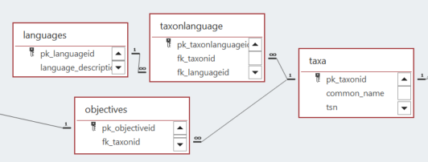
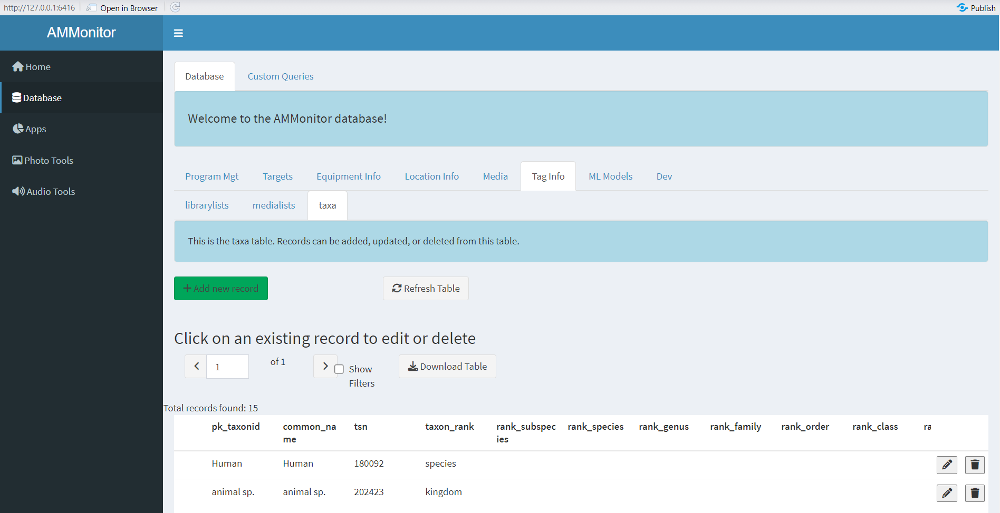
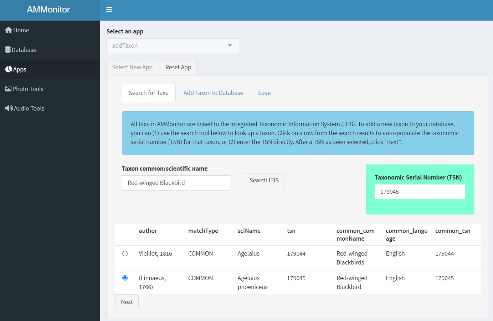
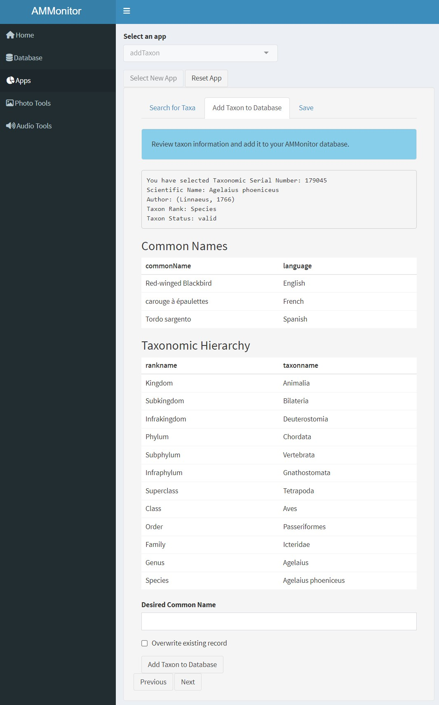

```{r setup, include=FALSE}
source('includes.R')
shiny::addResourcePath("figs", system.file("extdata/figs", package = "AMMonitor"))
```

## {width=100px} Taxa and Objectives

The practice of using AMUs such as trail cameras or audio recorders to monitor wildlife and other environmental characteristics has grown immensely in the past decade, with monitoring projects spanning species from birds, to bats, amphibians, insects, terrestrial mammals, phenology, and marine mammals.

Hopefully, there is a reason as to *why* you are taking the time and effort to monitor wildlife.   Generally speaking, an *objective* identifies a vision that a person, organization, or agency may have for the state of wildlife populations.  

> &#128073;&#127995; This tutorial introduces the *taxa* table, which stores information on taxonomic monitoring targets, and further  links to the *objectives* table, where monitoring objectives are declared.  We also briefly describe the *languages* and *taxonlanguage* tables as a means of storing taxonomic information in different languages.

As with other tutorials, we used the `ammCreateMiniDemo()` function to create a small demo project named "demoAMM" that is pulled into the tutorial itself, with the file path stored as the R object, "demo_fp". This filepath is stored on your machine and can be found by running the following code:

```{r demofp}
demo_fp
```

The database is already present in the demo project, as shown below:
```{r}
list.files(file.path(demo_fp, "database"))
```

As you can see, the demo database is named "demo.sqlite". Let's set the connection now:

```{r, echo = TRUE, eval = TRUE}
# set a database connection by pointing to the database filepath
conx <- dbSetCon(paste0(demo_fp, "/database/demo.sqlite"))

# look at the class of the connection object
class(conx)
```

Once a connection is made, you can use many functions from the *DBI* package [@DBI] or from *AMMonitor* to work with the database.  For example, DBI's  `dbListTables()` is used below to return an  alphabetical listing of each table in the database

```{r}
# use DBI's dbListTables function to list all tables
DBI::dbListTables(conn = conx)
```

Look for the *taxa*, *languages*, *taxonlanguage*, and *objectives* tables. 

## Connected tables

The figure below shows how the four featured tables are linked.  


```{r locer2, eval = T, echo = F, fig.align='center', out.width = "100%", fig.cap = "*Figure 1. Database schema diagram showing relationships between AMMonitor database tables in the taxa grouping.*", out.extra='style="background-color: #999999; padding:5px; display: inline-block;"'}

```


A single record in the *taxa* table identifies a taxon.  The primary key is **pk_taxonid**, typically an abbreviated taxon code, but the **common_name** is stored as well.  The **tsn** column stands for "Taxonomic Serial Number", and is linked to the [Integrated Taxonomic Information System (ITIS)](https://itis.gov/). The taxonomic serial number (TSN) is a unique number assigned to each taxa in the ITIS, which provides authoritative taxonomic information on plants, animals, fungi, and microbes of North America and the world. ITIS partners with Species 2000 and the Global Biodiversity Information Facility, and provides the taxonomic backbone to the Encyclopedia of Life (EOL). Storing the TSN of focal monitoring species can aid in standardization and collaboration across monitoring efforts. Let's look at the ITIS site now:

```{r itisgov, exercise = TRUE}
browseURL("https://itis.gov/")
```

The taxa table is central to many other tables in an *AMMonitor* database, allowing humans and machines to "tag" media that contain target taxa within them.  The *taxa* table is further linked to the *languages* and *taxonlanguage* tables, which provides opportunities to engage taggers by tagging in a new language.  

Finally, although setting natural resource objectives can be very difficult,  they are usually the primary reason a monitoring program exists. Generally speaking, an *objective* identifies a vision that a person, organization, or agency may have for wildlife populations.  The *objectives* table provides a statement of that vision, and may be linked to a given taxon or even suites of taxa. Monitoring can be used to assess whether or not that vision has been met. When an objective is not being met, it may trigger the individual, organization, or agency to act in a way that will push the objective towards its intended target.


## The taxa table

Let's begin by looking at the *taxa* table that comes with the demo AMMonitor database. 

```{r}
DBI::dbReadTable(conx, "taxa")
```

This table has 15 rows and 16 columns.  The primary key is **pk_taxonid** and all fields in this table have textual data types. 

The default AMMonitor database comes with 3 entries, consisting of "no-species", "animal sp." and "Human" as primary keys. In addition to the default taxa, the demo database includes 12 more taxonomic entries.   Glancing through the rest of the table columns, you should see that most of the remaining columns in the *taxa* table provide the taxonomic hierarchy of a given taxa.  

> &#128073;&#127998; Notice that the "no-species" entry has a TSN of 0, while all other entries have a valid TSN number. The taxon_rank field in the *taxa* table identifies the lowest level in the taxonomic hierachy associated with a given record.  For example, the entry "animal sp." can be differentiated to the kingdom level only, while the entry "Human" is defined at the species level.

The `taxaAdd()` function can be used to add or update records to the *taxa* table, but it requires that a TSN is known.  The *ritis* package [@ritis] is very handy and can help with this task. For example, suppose we wish to add "Red-eyed Vireo" to our taxa table.  We can use the `ritis::search_common()` function to help locate the TSN by common name.  


```{r findvireo, exercise = TRUE}
# use the package ritis to find a tsn for red-eyed vireo
ritis::search_common(x = "Red-eyed Vireo")
```


Once we have the TSN, in this case, 179021, we can use the `taxaAdd()` function to make an API call to the ITIS database, and retrieve the information needed to populate the database.  Here, we will be assigning **pk_taxonid** to a value of "revi", the **common_name** to a value of "Red-eyed Vireo", and the **tsn** = 179021. It should be straight-forward to see how these entries will be added to the taxa table, bur *ritis* will do the heavy lifting in terms of extracting the full taxonomy.

```{r addvireo, exercise = TRUE}
# add the red-eyed vireo to the taxa table
taxaAdd(
  con = conx, 
  tsns = 179021,
  common_names = "Red-eyed Vireo",
  pk_taxonids = "revi",
  overwrite = TRUE,
  disconnect = FALSE
)

```


If the function call fails, a reason is provided.  If the function succeeds, it returns the TSN, along with the status of the function call ("success" is good!). 

> &#128073;&#127997; ITIS occassionally goes down, so you may need to try the `ritis` functions a few times.

Assuming it succeeded, let's read in the taxa and look for our new entry:

```{r lookvireo, exercise = TRUE}
DBI::dbReadTable(conx, "taxa")
```


> &#128073;&#127996; You can add many taxa at once by providing a vector of **tsns**, a vector of **common_names**, and a vector of **pk_taxonids** (all which must be of the same length).

## Languages

As we've seen, taxonomic names are linked to the Integrated Taxonomic Information System (http://www.itis.gov), where the TSN serves as "one identifier to rule them all."  There are many cases where the local names of taxa vary culturally.  For example, what we commonly call "moose" in North America is referred to as "moz" by the Abenaki people. The *languages* and *taxonlanguages* tables support the ability to tag in multiple languages, increasing cultural awareness.

The demo does not include examples, but we can get the gist of the idea by looking at the fields in both tables.  Let's start with the *languages* table.

```{r getpragma0, exercise = TRUE}
# get info about the languages table
dbGetQuery(
  con = conx, 
  statement = "PRAGMA table_info(languages)"
)
```

As you can see, this table simply identifies a language, describes it, and further can point to a single language_url or home page.  

> &#128073;&#127995; The ability to tag in multiple languages is not yet implemented in *AMMonitor*.  

Let's add the "Abenaki" language to the *languages* table:

```{r addnew, exercise = TRUE}
# add new language
new_language <- data.frame(
  pk_languageid = "Abenaki",
  language_description = "An Algonquian language of people from the  Wabanaki Confederacy.",
  language_url = NA
)

# add a record to the language table
DBI::dbAppendTable(
  conn = conx,
  name = "languages",
  value = new_language)

```

A returned value of 1 indicates that one record was affected.   Next, we link taxa in the *taxa* table with a given *language* via the *taxonlanguage* table. 

```{r getpragma}
# get info about the taxonlanguage table
dbGetQuery(
  con = conx, 
  statement = "PRAGMA table_info(taxonlanguage)"
)
```

This table simply stores a mapping.  The primary key is **pk_taxonlanguageid**, which is an auto-number.  The field **fk_taxonid** points to an entry in the *taxa* table, while the field **fk_languageid** points to an entry in the *language* table.  The field  **taxon_name** is where the actual name would be stored, along with any notes that may be displayed in the tagger.


```{r addmoz, exercise = TRUE}
# link 'moz' with 'moose'
linked_language <- data.frame(
  pk_taxonlanguageid = NA,
  fk_taxonid = "moose",
  fk_languageid = "Abenaki",
  taxon_name = "moz",
  notes = "https://www.youtube.com/watch?v=86yvwD3ffA0"
)

# add a record to the taxonlanguage table
DBI::dbAppendTable(
  conn = conx,
  name = "taxonlanguage",
  value = linked_language)
```


Let's have a look that the new entry:

```{r lookagain, exercise  = TRUE}
DBI::dbReadTable(conx, "taxonlanguage")
```

We'll be incorporating the ability to integrate other languages into the AMMonitor Shiny app in future development versions of *AMMonitor.*   

## The objectives table

Setting natural resource objectives can be very difficult, but they are usually the primary reason a monitoring program exists. Generally speaking, an objective identifies a vision that a person, organization, or agency may have. Monitoring can be used to assess whether or not that vision has been met. When an objective is not being met, it may trigger the individual, organization, or agency to act in a way that will push the objective towards its intended target.

Objectives can be broadly placed into two categories:

1. Fundamental objectives are objectives that a decision maker truly values and wants to achieve; E.g., “Increase loon populations.”

2. Means objectives are a means to achieving the fundamental objectives. E.g., “Minimize lead in fishing tackle.”

Conroy and Peterson [-@cp] state, “We can sort out fundamental from means objectives by asking the questions ‘why is that important’ and ‘how can we accomplish that’ for each objective. If our answer to ‘why is that important’ is along the lines of ‘to achieve another (perhaps more fundamental) objective’, then it is probably a means objective. If the answer to ‘why is that important’ is simply ‘because that is what we desire’ or for many regulatory agencies, ‘because that is our legal mandate’, then it is probably a fundamental objective."

The authors of “Structured Decision Making: A Practical Guide to Environmental Management Choices” [@gregory] suggest that the “statement of objectives can be kept pretty simple. Essentially, they consist of the thing that matters and (usually) a verb that indicates the desired direction of change:

- Increase revenues to the regional government.
- Reduce the probability of extinction of wild salmon.
- Minimize emissions of greenhouse gasses.
- Maximize year-round employment.

These examples include indicators (also called attributes; what exactly will be measured, such as revenue, probability of extinction, emissions, or employment) and direction (the intended level or direction, such as increase, decrease, minimize, maximize, or maintain). Units of measure may also be specified.

*AMMonitor* facilitates the tracking of objectives generically, but what is most important from the monitoring perspective is that an objective can be quantitatively assessed through the analysis of monitoring data, such as remotely captured acoustic data or images. As such, example objectives may include:

- Maximize occupancy rate of desired species x.
- Minimize occupancy rate of undesired species y.
- Minimize human-made sounds.

Setting objectives can be difficult, and a discussion of how to set objectives is well beyond our scope. Several books and articles can point the way [@cp; @gregory]. Here, we simply wish to highlight how objectives (of any type) can be logged in the AMMonitor database. 

The demo database does not contain objectives, but we can add one. First, let's look at information about the objectives table:

```{r }
# get info about the objectives table
dbGetQuery(
  con = conx, 
  statement = "PRAGMA table_info(objectives)"
)
```

You can see the PRAGMA call identifies the name of each column, the primary key, the type of data stored in each column, and required column entries.

- **pk_objectiveid** - the table’s primary key (must be unique and less than 255 characters). Should be a brief identifier that is easily typed.
- **fk_taxonid** - points to a single taxa in the taxa table, if appropriate.
- **fk_librarylistid** - points to a list of taxa, as identified in the *librarylists* table (described in the annotations tutorial).
- **objective** - the stated objective in report-ready form.
- **indicator** - specifies what exactly will be measured.
- **units** - specifies the units of measure.
- **direction** - indicates the desired direction, such as increase, maximize, decrease, minimize, or maintain.
- **min** - the minimum acceptable target, if applicable.
- **max** - the maximum acceptable target, if applicable.
- **standard** - the stated target, if applicable.
- **narrative** - a text field that allows any number of characters to be stored.

Hypothetically speaking, a Middle Earth objective may be to maintain moose occupancy rates at 0.3.  Here, the **indicator** is "occupancy rate" (estimating with occupancy modeling approaches), where the **units** are in probability of occurrence and the **standard** is identified as 0.3.  The  direction is "maintain", but  “maximize”, “minimize”, and “maintain” are all frequently used in establishing a **direction.**  If we wished to maintain moose occupancy between 0.2 and 0.4, those values could be entered into the **min** and **max** fields. 

> &#128073;&#127995; The purpose of a monitoring effort is to compare the stated objective with the state of the system (e.g., moose occupancy rate) as estimated via the "capture" of monitoring targets with remotely deployed autonomous monitoring units. 

## AMMonitor Shiny

We've been using R code to work with the various tables related to *objectives* and *taxa.* You can view these tables through the Shiny interface as well.  It's best if you can see this in action. 

<p class=instructions>
Open a new session of R by going to Session | New Session (so that two instances of R are running on your machine). Then, run the following commands in the new session's console, which uses `ammCreateMiniDemo()` to create the lightweight demo *AMMonitor* project and `launchApp()` to launch the app.  
</p>

```{r, eval = FALSE}
# load AMMonitor
library(AMMonitor)

# create a demo AMMonitor project in a temporary directory (to be deleted)
demo_fp <- ammCreateMiniDemo(filepath = tempdir())

# launch the Shiny application
launchApp(demo_fp)
```

Assume the role of the default user (sgamgee), and connect to the database.  

```{r shinyimage, eval = T, echo = F, fig.align='center', out.width = "100%", fig.cap = "*Figure 2a. Upon launching the app, you are presented with the option to select a user and connect to the database.*", out.extra='style="background-color: #999999; padding:5px; display: inline-block;"'}
knitr::include_graphics('www/shiny0.PNG')
```


Then, click on the "Database" option in the left menu. Here, you will see database tables arranged in different groupings (and populated with demo data).  The *objectives* table can be found in the "Targets" tab, the languages table can be found in the "Program Mgt" table, and the *taxa* table found  in the "Tag Info" tab. 

```{r shinyimage2, eval = T, echo = F, fig.align='center', out.width = "100%", fig.cap = "*Figure 2b. The taxa table of the demo database.*", out.extra='style="background-color: #999999; padding:5px; display: inline-block;"'}

```
 
<p class=instructions>
Please poke around! 
</p>

## addTaxon app

To make adding new taxa to your database easy, *AMMonitor* comes with the **addTaxon** app that scrapes taxonomic data directly from ITIS in a user-friendly graphic interface. To run the **addTaxon** app, select "apps" from the left navigation menu. You will see a drop-down menu with app names and a table giving a short description of each available app. Select **addTaxon** and click the "Start New Analysis" button. 

```{r locer3, eval = T, echo = F, fig.align='center', out.width = "100%", fig.cap = "*Figure 3. The Search for Taxa tab of **addTaxon** app.*", out.extra='style="background-color: #999999; padding:5px; display: inline-block;"'}

```

Once the app starts, you will see a search menu where you can type the common or scientific name of the taxon you wish to add to the database. After pressing the "Search ITIS" button, a table appears below with the results of the query. You can select the correct taxon from the returned results, or search again. Once selected, the taxon's TSN will appear on the right and the user can click "Next" to move to the next step.

```{r locer4, eval = T, echo = F, fig.align='center', out.width = "100%", fig.cap = "*Figure 4. The Add Taxon to Database tab of **addTaxon** app.*", out.extra='style="background-color: #999999; padding:5px; display: inline-block;"'}

```

Next, you'll be able to see all the information about the selected taxon, including common names and a full taxonomic hierarchy. Under the hood, *AMMonitor* uses the *ritis* package to fetch this information from ITIS and populate your database. All you need to do is enter the desired common name and specify whether to overwrite existing records. The entered common name will be used as the primary key (**pk_taxonid**). After pressing the "AMMonitor Shiny" button, a pop-up window will appear indicating whether the taxon was successfully added.

> &#128073;&#127995; Because the **addTaxon** app requires *ritis* and uses the ITIS API to fetch data from a server, this function may fail for a variety of reasons (i.e., the ITIS server is down for maintenance, loss of internet connectivity, etc.). If this function is not working for one of these reasons, we suggest trying again at a later time or adding the new taxon to the database directly as previously described.

## Tutorial summary 

This chapter was a brief introduction to the *taxa*, *objectives*, *languages* and *taxonlanguage* tables. As we'll see, the *taxa* table is essential for labeling media files by their monitoring targets.  And once files are labeled by humans or by machines, we can use many different ecological modeling approaches (including occupancy modeling) to compare the state of the wildlife population as monitored by remotely deployed units with objectives codified in the *objectives* table. 

It's time to start tagging!

```{r , eval = FALSE}
learnr::run_tutorial(
  name = "annotations", 
  package = "AMMonitor"
)
```

A list of other *AMMonitor* tutorials is shown below.  

```{r , eval = T}
learnr::available_tutorials("AMMonitor")
```


> &#128073;&#127997; A final FYI:  If you'd like a pdf of this document, use the browser "print" function (right-click, print) to print to pdf.  If you want to include quiz questions and R exercises, make sure to provide answers to them before printing.

## References


