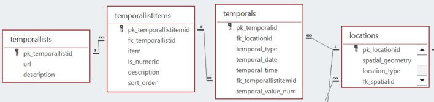
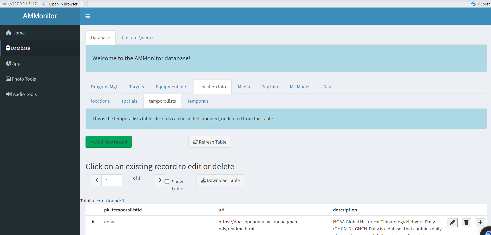

```{r setup, include=FALSE}
source('includes.R')
shiny::addResourcePath("figs", system.file("extdata/figs", package = "AMMonitor"))
```

## {width=100px} Temporal data

Collecting weather data (temporal data) is a common practice for monitoring programs as weather can influence animal activity patterns.  Weather data is collected at weather stations worldwide, and these stations can be added to the *locations* table of an AMMonitor database.  Further, API calls allow easy retrieval of weather data collected at those stations.  In this tutorial, we will introduce the *temporals* table, and its accompanying *temporallists* and *temporallistitems* tables.   

As with all other tutorials, we used the `ammCreateMiniDemo()` function to create a small demo project named "demoAMM" that is pulled into the tutorial itself, with the file path stored as the R object, "demo_fp". This filepath is stored on your machine and can be found by running the following code:

```{r demofp}
demo_fp
```

The database is already present in the demo project, as shown below:
```{r}
list.files(file.path(demo_fp, "database"))
```

As you can see, the demo database is named "demo.sqlite". Let's set the connection now:

```{r, echo = TRUE, eval = TRUE}
# set a database connection by pointing to the database filepath
conx <- dbSetCon(paste0(demo_fp, "/database/demo.sqlite"))

# look at the class of the connection object
class(conx)
```


Once a connection is made, you can use many functions from the *DBI* package [@DBI] or from *AMMonitor* to work with the database.  For example, DBI's  `dbListTables()` is used below to return an  alphabetical listing of each table in the database

```{r}
# use DBI's dbListTables function to list all tables
DBI::dbListTables(conn = conx)
```

Four of these tables are of interest.  We introduced the *locations* table in a previous tutorial, and our focus here will be on the *temporals*, *temporallists*, and *temporallistitems* tables. 

The figure shows the relationship among these four tables. 


```{r locer2, eval = T, echo = F, fig.align='center', out.width = "100%", fig.cap = "*Figure 1. Database schema diagram showing relationships between AMMonitor database tables in the temporals grouping.*", out.extra='style="background-color: #999999; padding:5px; display: inline-block;"'}

```

The table *temporallists* simply identifies weather sources, such as NOAA, [ClimaCell](https://www.tomorrow.io/weather-api/), [AccuWeather](https://www.accuweather.com/), [OpenWeatherMap](https://openweathermap.org/api), [VisualCrossing](https://www.visualcrossing.com/weather-api), [weatherstack](https://weatherstack.com/), [Weatherbit](https://www.weatherbit.io/) or other web-based data sources.  The table *temporallistitems* provides the "keys" of each weather source (i.e., the names of the variables that can be retrieved). The *temporals* table stores the actual weather data, linking variables with their values (e.g., TMAX = 20).  Soon, we'll download weather data from the NOAA API (U.S. National Oceanic and Atmospheric Administration).

> &#128073;&#127997; Sorry (not sorry) about the long table names. We went for clarity over brevity. Hopefully you use a code editor such as RStudio that can easily help you auto-complete names.

## The temporallists table

To begin, let's look at the records in the  *temporallists* table that come with the demo database, and then discuss the database nuances.  *DBI*'s `dbGetQuery()` can be used to retrieve specific data via a SQL statement:  

```{r temporallists, exercise = TRUE}
# read in the locations table to R
DBI::dbReadTable(
  con = conx, 
  name = "temporallists"
) 
```

You can see this table has three columns and one entry, with values:

- **pk_temporallistid** = "noaa"
- **url** = "https://github.com/awslabs/open-data-docs/tree/main/docs/noaa/noaa-ghcn"
- **description** = "NOAA Global Historical Climatology Network Daily (GHCN-D). GHCN-Daily is a dataset that contains daily observations over global land areas...." 

> &#128073;&#127995; The NOAA weather source is the only source currently included by default in *AMMonitor.* (You can add your own if desired). 

Let's look at the webpage:

```{r noaaurl, exercise = TRUE}
browseURL("https://github.com/awslabs/open-data-docs/tree/main/docs/noaa/noaa-ghcn")
```

Now let's look at the *items* associated with this weather source, stored in the *temporallistitems* table.

```{r}
DBI::dbReadTable(conx, "temporallistitems")
```

Make sure to scroll if needed.  Here, you can see that 57 weather variables are collected with the "noaa" weather source, such as PRCP (Precipitation (tenths of mm)) and TMAX (Maximum temperature (tenths of degrees C)).

Note that the primary key for the *temporallistitems* is  **pk_temporallistitemid** (an auto-number). The    column **is_numeric** is 1 if the variable has a datatype of integer or numeric (which will be stored in the *AMMonitor* database as REAL), and 0 (which will be stored in the database as VARCHAR(255)).

Soon we will be downloading some weather data from the NOAA weather source.

## Obtain a token

> &#128073;&#127998; This tutorial requires your active participation! 

To work with the NOAA API, first obtain a token from https://www.ncdc.noaa.gov/cdo-web/token. This website states "To gain access to NCDC CDO Web Services, register with your email address. An email will be sent with a unique token which will allow access RESTful services. For more information about CDO Web Services read the documentation for CDO Web Services guide."  Obtain your token now:

```{r tokenpage, exercise = TRUE}
browseURL("https://www.ncdc.noaa.gov/cdo-web/token")
```

Enter your email address, and press submit to receive an emailed token (typically within a few minutes).

A token string looks something like this: 

```{r}
paste(
  sample(
    c(letters, LETTERS), 
    size = 32, 
    replace = TRUE), 
  collapse = "")
```

After you have received your token, enter it between the quotes in the code block below, and run the code. This code block defines the token and saves the token string in a text file named 'noaa_token.txt', within the "settings" directory of your *AMMonitor* project, like so:

```{r writesetting, exercise = TRUE}
token <- ""

# create the noaa_token.txt file
writeLines(
  text = token, 
  con = file.path(demo_fp, "/settings/noaa_token.txt")
)
```

The resulting file named "noaa_token.txt" contains a single line that stores your token.  

> &#128073;&#127998; This highlights the intention of the "settings" directory in your AMMonitor project as a place to store settings and credentials of various types.

## Adding weather stations

After you have a token, you can use the `locationsGetStations()` function to retrieve weather station locations from the NOAA API.  Let's look at the arguments to this function.

```{r}
args(locationsGetStations)
```

Here, the function will ask for your NOAA token.  The options for the argument **noaa_token** are "prompt" (in which you will be prompted to enter your token in the R console) or "settings" (in which case the function will look for the token in your settings directory).  Notice that the function requires the filepath to your *AMMonitor* project directory, which is needed for the function to grab your credentials from the settings folder.  You can also see arguments such as **startDate**, **endDate**, and **bbox**, which were passed through to the API call. The parameters will filter the NOAA weather stations in terms of their spatial location (**bbox**) and dates of operation. 

> &#128073;&#127998;The **bbox** argument should be entered as a vector of lat/long coordinates, in the following order: minlat, minlong, maxlat, maxlong.

This function will retrieve up to 1000 weather station locations found within the specified bounding box.  If the **bbox** area of interest is very large (containing more than 1000 stations), set the **bbox** to a smaller area and run the function again.  Some weather stations operate for a short time and are no longer in  operation. Make sure to set the **startDate** and **endDate** to eliminate stations not in operation during the monitoring period, if desired.

Let's run the function now, setting the **dbInsert** argument to FALSE so we can see the results.  

```{r trylocations, exercise = TRUE}
# get the weather stations 
stations <- locationsGetStations(
  amm_fp = demo_fp,
  conx,
  noaa_token = "settings",
  startDate = NULL,
  endDate = NULL,
  # minlat, minlong, maxlat, maxlong
  bbox =  c(43.15, -73, 43.5, -72.6),  
  dbInsert = FALSE,
  disconnect = FALSE
)
```

> &#128073;&#127995; If this exercise fails, it may be because the API is unavailable. We took the liberty of adding the results to the tutorial in the event of failure.

```{r}
# look at the returned data
stations
```

The `locationsGetStations()` shapes up the returned NOAA data so that it is ready to import into the *locations* table.

If everything looks good to you, you can use DBI's `dbAppendTable()` to insert the records to the *locations* table.  Let's do that now.

```{r, eval = FALSE}
# append data if dbInsert was set to false
DBI::dbAppendTable(
  conn = conx, 
  name = "locations", 
  value = stations
)
```

```{r, eval = T}
# retrieve the locations table; look for new entries
locations <- DBI::dbReadTable(conx, name = "locations")

# show the locations
locations
```

In the "locations" tutorial, we introduced the package *leaflet* [@leaflet] to plot locations. Here, we'll use the package *ggplot2* [@ggplot2] to produce plots.  

Step 1 will be to remove locations in the location table that do not have complete records.

```{r}
# prep data for plotting ---------------
indices <- stats::complete.cases(locations$lat, locations$long, locations$location_type)
locations_xy <- locations[indices, ]
```

Step 2 is to plot the locations.

```{r}
# plot with ggplot2
g <- ggplot2::ggplot(locations_xy,  aes(x = long, y = lat))  +
  geom_point(
  data = locations_xy, 
  aes(x = long, y = lat, shape = location_type, color = location_type), 
  size = 3) +
  coord_fixed() +
  theme(
    legend.position = "top", 
    legend.direction = "horizontal") + 
  labs(
    title = "Map of Locations",
    x = "Longitude",
    y = "Latitude") 
  #theme_minimal()

# show the plot
g
```

The *maps* package [@maps] can be used to further enhance this output.

## Downloading data

Now that we have weather stations in the *locations* table of an *AMMonitor* database, we can use the `temporalsGet()` function to download weather data.  We need to pass in an open connection to the database, specify the **startDate** and **endDate**, point to the **token**, identify to **temporalSource** (only "noaa" is currently supported), and send a vector of **stationCodes**, which are the primary keys in the *locations* table.  In the previous section, we stored our stations as a dataframe called "stations" before importing it into the database, and we'll use that in our function call below. 

We also need to specify the **type** of data to retrieve (default is "historical", but some APIs allow the retrieval of "forecast" data) and identify the **keys** of interest (the variables to retrieve).  The remaining two arguments, **dbInsert** and **dbDisconnect**, inform whether the retrieved data should be imported into the *temporals* table, and whether the function should then disconnect from the database or not (the default is always FALSE).


```{r temporalsGet, exercise = TRUE}
# get weather associated with stations
temporal_data <- temporalsGet(
  amm_fp = demo_fp,
  con = conx, 
  startDate = "2023-01-01",
  endDate = "2023-01-31",
  token = "settings",
  temporalSource = "noaa",
  stationCodes = stations$pk_locationid,
  type = "historical",
  keys = c("TMAX", "TMIN", "PRCP", "SNOW", "SNWD"),
  dbInsert = FALSE,
  disconnect = FALSE
)
```

> &#128073;&#127998; If this exercise fails, it may be because the API is unavailable. We took the liberty of adding the results to the tutorial in the event of failure.

```{r}
# look at the head of the data
head(temporal_data)
```

Since we set **dbInsert** = FALSE in the previous function call, we can now use DBI's `dbAppendTable()` to insert the dataframe into the *temporals* table, and confirm the new entries:

```{r, eval = F}
# insert to database if appropriate
DBI::dbAppendTable(conx, name = "temporals", value = temporal_data)
```

Let's have a look at the added weather data.

```{r readtemporals, exercise = TRUE}
# read in the temporals table
DBI::dbReadTable(conx, name = "temporals")
```

Take a good look at this table; we've inserted many records!!  The primary key **pk_temporalid** is an autonumber, where each record provides weather data for a specific weather variable at a specific station at a specific date and time.  Importantly, the variable (e.g., the key such as "PRCP") is stored in this table with its corresponding *temporallistitemid.* A few sections ago we saw that *temporallistitemid* = 1 is from the "noaa" temporallist, with an item of "PRCP". Thus, the first several records store precipation values.

It might be time for a friendly reminder of what the *temporallistitems* stores so that you can match up the entries stored in the *temporals* table.

```{r tl2, exercise = TRUE}
DBI::dbReadTable(conx, "temporallistitems")
```


> &#128073;&#127997; If you collect weather data routinely, storing the code as a script may be very beneficial. Please see the "scripts" tutorial for more details. 


## AMMonitor Shiny

We've been using R code to add temporal data and stations to the *AMMonitor* database.  You can view the these tables through the Shiny interface as well.  It's best if you can see this in action. 

<p class=instructions>
Open a new session of R by going to Session | New Session (so that two instances of R are running on your machine). Then, run the following commands in the new session's console, which uses `ammCreateMiniDemo()` to create the lightweight demo AMMonitor project and `launchApp()` to launch the app.  
</p>

```{r, eval = FALSE}
# load AMMonitor
library(AMMonitor)

# create a demo AMMonitor project in a temporary directory (to be deleted)
demo_fp <- ammCreateMiniDemo(filepath = tempdir())

# launch the Shiny application
launchApp(demo_fp)
```

Assume the role of the default user (sgamgee), and connect to the database.  

```{r shinyimage, eval = T, echo = F, fig.align='center', out.width = "100%", fig.cap = "*Figure 2a. Upon launching the app, you are presented with the option to select a user and connect to the database.*", out.extra='style="background-color: #999999; padding:5px; display: inline-block;"'}
knitr::include_graphics('www/shiny0.PNG')
```
 

Then, click on the Database option in the left menu. Here, you will see database tables arranged in different groupings (and populated with demo data).  The *temporals* and *temporallists* tables  can be found under the "Location Info" tab.   The *temporallistitems* are nested within their corresponding *temporallists*.  

```{r shinyimage2, eval = T, echo = F, fig.align='center', out.width = "100%", fig.cap = "*Figure 2b. The temporallists table of the 'demo' database.*", out.extra='style="background-color: #999999; padding:5px; display: inline-block;"'}

```
 
<p class=instructions>
Please poke around!  AMMonitor currently supports only the NOAA API, and the default AMMonitor database comes with the temporallists and temporallistitems pre-populated.  Data is inserted to the *temporals* table via the `temporalsGet()` function; typically you will not need to edit these records.
</p>


## Tutorial summary 

This chapter was a brief introduction to the *temporallists*, *temporallistitems*, and  *temporals* tables in an *AMMonitor* SQLite database. 


The last step in this tutorial is to delete the demo database to free up space on your machine.  Remember, this demo comes with the *AMMonitor* package, and each tutorial begins by copying it to your working directory so that you can play with it at will.  

```{r, eval = FALSE}
DBI::dbDisconnect(conx)
```

```{r}
# delete the demo project
unlink(demo_fp)
```

Our next stop is the "equipment" tutorial, where we will learn how register equipment, settings, and configurations in the database.

```{r , eval = FALSE}
learnr::run_tutorial(
  name = "equipment", 
  package = "AMMonitor"
)
```


> &#128073;&#127997; A final FYI:  If you'd like a pdf of this document, use the browser "print" function (right-click, print) to print to pdf.  If you want to include quiz questions and R exercises, make sure to provide answers to them before printing.

## References


