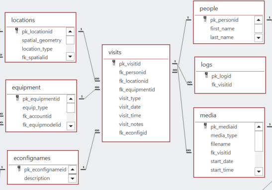
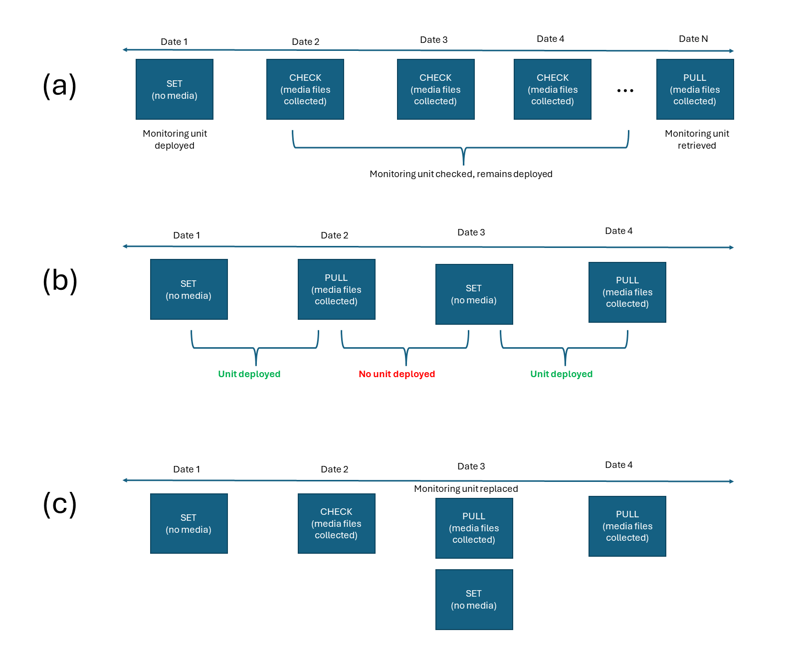
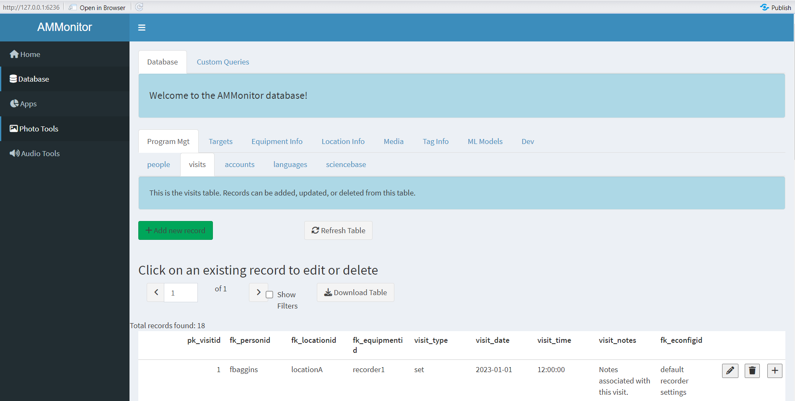

```{r setup, include=FALSE}
source('includes.R')
shiny::addResourcePath("figs", system.file("extdata/figs", package = "AMMonitor"))
```

## {width=100px} AMMonitor visits

In the *AMMonitor* system, raw monitoring files such as recordings and photos are collected by Autonomous Monitoring Units (AMUs).  The practice of using AMUs such as trail cameras or audio recorders to monitor wildlife and other environmental characteristics has grown immensely in the past decade, with monitoring projects spanning species from birds, to bats, amphibians, insects, terrestrial mammals, phenology, and marine mammals.

Monitoring units are deployed at locations during site visits on a given date by a given person.  These site visits are registered in the *visits* table in the *AMMonitor* database, which is the focus of this tutorial.

As with all other tutorials, we used the `ammCreateMiniDemo()` function to create a small demo project named "demoAMM" that is pulled into the tutorial itself, with the file path stored as the R object, "demo_fp". This filepath is stored on your machine and can be found by running the following code:

```{r demofp}
demo_fp
```

The database is already present in the demo project, as shown below:
```{r}
list.files(file.path(demo_fp, "database"))
```

As you can see, the demo database is named "demo.sqlite". Let's set the connection now:

```{r, echo = TRUE, eval = TRUE}
# set a database connection by pointing to the database filepath
conx <- dbSetCon(paste0(demo_fp, "/database/demo.sqlite"))

# look at the class of the connection object
class(conx)
```

Once a connection is made, you can use many functions from the *DBI* package [@DBI] or from *AMMonitor* to work with the database.  For example, DBI's  `dbListTables()` is used below to return an  alphabetical listing of each table in the database

```{r}
# use DBI's dbListTables function to list all tables
DBI::dbListTables(conn = conx)
```

Look for the *visits* table at the end of the list.

## Connected tables

The figure below shows the *visits* table, and also the tables that are linked to it.  A single record in the *visits* table identifies a person visiting a location to deploy/service a monitoring unit on a given date and time.  Let's work our way around the circle of connected tables, beginning with the *people* table.  People can make multiple visits to a monitoring site, as seen by the one-to-many relationship between the visits and people tables. A unit of equipment associated with a visit may produce a performance log, stored in the *logs* table. Monitoring units collect media (e.g., photos and recordings), and many media files may be associated with a single visit, stored in the *media* table.  When a monitoring unit is deployed at a location, it may be associated with a unit configuration, with configurations linked to the *econfignames* table (described in the "equipment" tutorial).  Finally, the monitoring unit and monitoring site associated with the visit are stored in the *equipment* and *locations* tables, respectively.


```{r locer2, eval = T, echo = F, fig.align='center', out.width = "100%", fig.cap = "*Figure 1. Database schema diagram showing relationships between AMMonitor database tables in the visit grouping.*", out.extra='style="background-color: #999999; padding:5px; display: inline-block;"'}

```

As you can see, the *visits* table is loaded with foreign keys. Let's use a PRAGMA call to confirm the foreign key linkages, and to inspect what happens if a primary key is updated or deleted.

```{r, eval = TRUE}
# return foreign key information for the locations table
DBI::dbGetQuery(
  conn = conx, 
  statement = "PRAGMA foreign_key_list(visits);"
)
```

Here, you can confirm the linked tables.  Also note that for all fields, the **on_update** rule is CASCADE, while the **on_delete** rule is RESTRICT.  This means that any updates to primary keys in connected tables will trickle through and update the *visits* table as well.  It also means that if we try to delete a primary key in a connected table, it will only be possible if the *visits* table does not contain that linked key.

## The visits table

Let's have a look at the *visits*  table in the demo database.

```{r}
DBI::dbReadTable(conx, "visits")
```

> &#128073;&#127998; Each record in this table constitutes a visit: a combination of a person, date, location, and equipment.  

The primary key for this table (**pk_visitid**) is an auto-number.

For example, the record for visit 1 indicates that "fbaggins" visited "locationA" and set "recorder1" at that site on 2023-01-01 at noon. 

The column **visit_type** is identified in the *lists* table, with items stored in the *listitems* table.  Let's look at this list now:

```{r visittypes, exercise = TRUE}
DBI::dbGetQuery(
  conn = conx,
  statement = "SELECT * from listitems 
    WHERE fk_listid = 'visit_type';")
```


- set = 	A visit to a monitoring location to set up a monitoring unit.
- check = A visit to a monitoring location to check a monitoring unit that has already been deployed.
- pull =	A visit to a monitoring location to pull down (remove or retrieve) a monitoring device.
- sync = A "virtual" visit to a monitoring location to sync the captured media with the cloud.

> &#128073;&#127995; You may have noticed that the visits table stores the item itself, rather than the pk_listitemid from the visits table. This was a design choice default lists for readability; the keys are enforced by the Shiny app.

> &#128073;&#127997;  Please don't modify this list, as many *AMMonitor* function rely on it.  

> &#128073;&#127996; Logging visits is required, even if they are "virtual" visits (i.e., a monitoring unit automatically sends it files to the cloud).  The reason for this is that each media file (audio or photo) is associated with a visit, which in turn provides the associated location and equipment information.

Visit types are a simple yet easy-to-confuse concept, and an important one to understand well. Having visit types properly defined not only provides a useful tool for project management, but in effort-based surveys, visits may be useful for understanding when a unit was actively deployed and expected to be capturing data. A proper visit sequence will always begin with a "set", followed by any number of "checks" (or "syncs"), and conclude with a "pull" visit when the monitoring equipment is retrieved (Figure 2a). At the end of a monitoring season, a monitoring unit may be "pulled", and then the unit may be re-"set" at the beginning of the next monitoring season (Figure 2b).

> &#128073;&#127997;  When monitoring equiment is moved or swapped out, TWO visits entries are required to capture the change of location/equipment in the database.  

Because each visit is associated with just a single location and monitoring unit (equipment), a visit in which monitoring units are swapped out at the same location will require two entries to the visits table: First, a "pull" visit for the monitoring unit that is being retrieved, and next, a "set" visit for the new monitoring unit that is being deployed (Figure 2c). Likewise, if a monitoring unit is being moved to a new location (even if near the current location), a "pull" visit will be required for the old location and a "set" visit for the new location.

```{r loc_types, eval = T, echo = F, fig.align='center', out.width = "100%", fig.cap = "*Figure 2. Diagram of typical visit type sequences for (a) continuous deployment; (b) seasonal deployment; (c) modified deployment.*", out.extra='style="background-color: #999999; padding:5px; display: inline-block;"'}

```

## Adding user columns

Some database managers may wish to add their own user-defined columns to tables, augmenting the core columns. This is especially true for the *visits* table.  For example, when making site visits to tend monitoring equipment, users may wish to collect and store information about the status of the unit, such as the battery life, the condition of the unit, the time and date fields stored on the unit itself, or how many media files are currently stored on the SD card.

The `dbAddUserCol()` function supports the addition of new, user-defined columns to an *AMMonitor* table, in which the new column's information is passed to the function as a dataframe via the argument, "col_info".  This function  will alternatively accept a filepath to an Excel file that contains the required information, which is useful if there are many user-fields to add and if some fields have entries restricted to a list (described in the "dbdictionary" tutorial).  

```{r}
# look at the arguments to the dbAddUserCol function
args(dbAddUserCol)
```


We will illustrate the simplest case here, and add a single column that does not require a dropdown; we will run the function here by passing in a dataframe for the "col_info" argument.  

For example, if we wish to add a column named **air_temperature** to the *visits* table, we first establish the column's properties in a dataframe as shown below.  We identify the table as "visits", the new column as "air_temperature", and set the core field to 0 (indicating this is not a core AMMonitor column). We further indicate that this column will hold REAL values (numerics in R).  We further specify minimum and maximum valid entries for this field.  

Let's create this dataframe now and look at it:

```{r newcol, exercise = TRUE}
# create a dataframe that stores column information
new_column <-  data.frame(
  pk_tablename = "visits",
  pk_fieldname = "air_temperature",
  core = 0,
  var_type = "REAL",
  not_null_clause = NA_character_,
  default_value = NA_character_,
  max = 40,
  min = -10,
  fk_listid = NA_character_,
  description = "Air temperature at time of visit in Celsius")

# look at the dataframe
new_column

```

Now, let's add the column and confirm it has been added:

```{r addcolumn, exercise = TRUE}
# add the new column to the visits table
dbAddUserCol(
  con = conx, 
  col_info = new_column,
  disconnect = FALSE
)

```

Once again, we'll use *DBI* functions to query the table structure and look for the new column.

```{r getpragma, exercise = TRUE}
# get info about the people table
DBI::dbGetQuery(
  con = conx, 
  statement = "PRAGMA table_info(visits)"
)
```

You should see the new column "air_temperature" in the returned dataframe. Now, your monitoring team can be expected to record "air_temperature" when they visit a site.


## Collecting visit data with cell phone apps

How is the *visits* table to be populated? You can create a field datasheet that stores the information required of the *visits* table, and then manually add them using either R code or the *AMMonitor* Shiny interface. However, this process can be significantly streamlined with the help of a cell phone app, where field technicians download the app on their mobile devices and then use the devices to collect site visit data. The data are then sent to the cloud, where they can be retrieved and pulled into an *AMMonitor* database.

Cell phone apps created by Survey123 (ESRI) or AppSheets (Google) are examples of this approach; both are examples of "no-code" applications.

> &#128073;&#127997;At its simplest, no-code is exactly what it sounds like: Programming without using code---no matter if that means websites, mobile apps, full programs, or even just scripts.  Source: https://www.howtogeek.com/768170/what-is-no-code-and-is-it-the-future-of-tech/

Please see the "mobile_apps" tutorial for more details.

## Built-in queries

*AMMonitor* comes with several built-in queries that may be of interest.  To help find queries related to any of the visits table, use the `help.search()` function, and specify one of the equipment family table names as the "concept" argument, like this:

```{r qry, exercise = TRUE}
help.search(
  package = "AMMonitor", 
  pattern = "visits", 
  fields = "concept")
```

Once you find a potential query of interest, please read the helpfiles of the returned queries; running the examples will illustrate exactly what each query returns.  

For example, the query `qryPeopleActivity()` will return summary information of activities by person by date range (if provided), such as how many field visits were made, along with other information.  If the "dates" argument is NA, the query returns all records in the database.


```{r, eval = T}
# query activities by person, including site visits
results <- qryPeopleActivity(
  conx, 
  m_dates = c(NA, NA), 
  disconnect = FALSE
)

# look at the structure of the returned object
str(results, max.level = 1)
```

This particular query returns a list, and the visit information is stored in the list element named "visits".  Let's have a look:

```{r}
results$visits
```

The query has shown that Frodo is the main person making site visits in Middle Earth. He visited each location 6 times.  Remember that a visit is constituted by a person, location, and equipment unit.  So these 6 visits represent two visits in which both a camera and a recorder were deployed at a location, two visits to check on the units, and two visits to retrieve the units.  


## AMMonitor Shiny

We've been using R code to work with the various tables related to monitoring equipment. You can view these tables through the Shiny interface as well.  It's best if you can see this in action. 

<p class=instructions>
Open a new session of R by going to Session | New Session (so that two instances of R are running on your machine). Then, run the following commands in the new session's console, which uses `ammCreateMiniDemo()` to create the lightweight demo AMMonitor project and `launchApp()` to launch the app.  
</p>

```{r, eval = FALSE}
# load AMMonitor
library(AMMonitor)

# create a demo AMMonitor project in a temporary directory (to be deleted)
demo_fp <- ammCreateMiniDemo(filepath = tempdir())

# launch the Shiny application
launchApp(demo_fp)
```

Assume the role of the default user (sgamgee), and connect to the database.  

```{r shinyimage, eval = T, echo = F, fig.align='center', out.width = "100%", fig.cap = "*Figure 3a. Upon launching the app, you are presented with the option to select a user and connect to the database.*", out.extra='style="background-color: #999999; padding:5px; display: inline-block;"'}
knitr::include_graphics('www/shiny0.PNG')
```
 

Then, click on the "Database" option in the left menu. Here, you will see database tables arranged in different groupings (and populated with demo data).  Then click on the "Program Management" tab, where you will find the *visits* table.

```{r shinyimage2, eval = T, echo = F, fig.align='center', out.width = "100%", fig.cap = "*Figure 3b. The visits table of the demo database.", out.extra='style="background-color: #999999; padding:5px; display: inline-block;"'}

```
 
<p class=instructions>
Please poke around!  Try adding a few hypothetical field visits.
</p>


## Tutorial summary 

This chapter was a brief introduction to the *visits* table.  This table is one that is actively used by any monitoring program, and is vital to keep in shipshape.  

The last step in this tutorial is to disconnect from the database, and then delete the demo database to free up space on your machine.   

```{r, eval = TRUE}
# disconnect from database
DBI::dbDisconnect(conx)

# delete the demo database
unlink(demo_fp, recursive = TRUE)
```


If you are interested in collecting "visit" data with mobile apps, your next stop is the "mobile_apps" tutorial:

```{r , eval = FALSE}
learnr::run_tutorial(
  name = "mobile_apps", 
  package = "AMMonitor"
)
```

If not, skip to the "media" tutorial.  Monitoring units collect media files (photos or recordings) at a given location. Dealing with these files is the subject of our "media" tutorial. 
  

```{r , eval = FALSE}
learnr::run_tutorial(
  name = "media", 
  package = "AMMonitor"
)
```

A list of other *AMMonitor* tutorials is shown below.  

```{r , eval = T}
learnr::available_tutorials("AMMonitor")
```


> &#128073;&#127997; A final FYI:  If you'd like a pdf of this document, use the browser "print" function (right-click, print) to print to pdf.  If you want to include quiz questions and R exercises, make sure to provide answers to them before printing.

## References


